# POC Scenario Contoso Expenses: Deploying to App Service Environment

## Table Of Contents

- [Introduction](#introduction)
- [Learning Objectives](#learning-objectives)
- [Prerequisites](#prerequisites)
- [Deploy App Service Environment](#deploy-app-service-environment)
    + [Create Virtual Network](#create-virtual-network)
    + [Create App Service Environment](#create-app-service-environment)
    + [Create ILB Certificate](#create-ilb-certificate)
- [Deploy Web Apps](#deploy-web-apps)
    + [Create Web Apps](#create-web-apps)
    + [Create SQL Database](#create-sql-database)
    + [Create Storage Account](#create-storage-account)
    + [Configure Web App](#configure-web-app)
- [Deploy Agent VM](#deploy-agent-vm)
    + [Create Agent VM](#create-agent-vm)
    + [Provide DNS Resolution](#provide-dns-resolution)
    + [Test Web App](#test-web-app)
- [Deploy App Gateway](#deploy-app-gateway)
    + [Create App Gateway](#create-app-gateway)
    + [Configure App Gateway](#configure-app-gateway)
- [Setup CI/CD](#setup-ci/cd)
    + [Initial Project Creation](#initial-project-creation)
    + [Create Build Agent](#create-build-agent)
    + [Setup Build](#setup-build)
    + [Setup Release](#setup-release)

## Introduction
The goal of this POC is to deploy an internal line of business application in your intranet environment using Azure App Service Environment service and securely connect to Azure SQL DB over VNet service endpoint. We will work with provisioning an ILB ASE in this POC. Then optionally you can expose this application to internet in a secure manner using Azure Application Gateway service which includes Web Application Firewall. Following that you can optionally setup continuous integration & continuous deployment using VSTS to automate build & release of an application.


## Learning Objectives
After completing this exercise, you will be able to:
* Create Azure App Service Environment and deploy a web app on to it
* Create an Azure SQL Database and deploy a database

* Deploy Azure App Gateway and expose your intranet app to internet
* Setup Continuous Integration & Continuous Deployment pipelines using VSTS to automate build & release of an application

## Prerequisites

* A Microsoft Azure subscription (with Contributor/Owner access)

* Have downloaded the [Contoso Expenses](https://fasttrackforazure.blob.core.windows.net/sourcecode/Contoso.Expenses.zip) source code.

* Have an account on Visual Studio Team Services with permissions to create a project, create an agent pool, modify source code, and create build and release definitions.

## Deploy App Service Environment

#### Create Virtual Network

* Open the Azure Portal and [create a new Resource Group](https://docs.microsoft.com/en-us/azure/azure-resource-manager/resource-group-portal#manage-resource-groups) to hold all Azure resources related to this scenario.
* Use the Azure portal to [create a virtual network](https://docs.microsoft.com/en-us/azure/virtual-network/quick-create-portal)
  * In the marketplace search blade, type **Virtual Network**.
  * Select the **Virtual network** entry in the search results and then click **Create**.
  * In the **Create virtual network** blade fill in the values as shown below, including the default `cicd-snet` subnet with address range `10.0.1.0/24` (to hold our CI/CD agent VM) and then click **Create**.
    > Note: We will want to leave a space in our VNet for the subnet holding the App Service Environment that we will create later.

    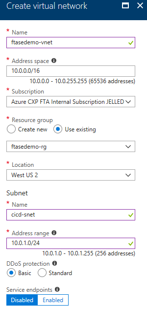
* Once the VNet has been provisioned, open the VNet from the portal again, and click **Subnets**.
* We will need to add a new subnet for the App Gateway. Click **+ Subnet** and provide the name `appgateway-snet` and address range `10.0.2.0/24` for the subnet.

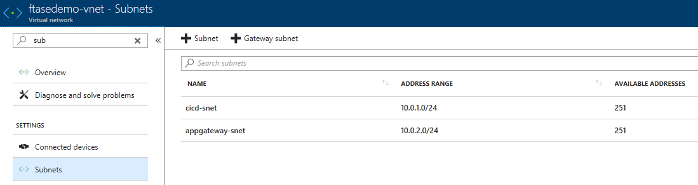

#### Create App Service Environment

* [Create an App Service Environment](https://docs.microsoft.com/en-us/azure/app-service/environment/create-ilb-ase#create-an-ilb-ase) (note that this can take up an hour or more)
  * Select the VNet you created earlier (do not let the ASE deployment create its own VNet as this gives you far less control over the network configuration)
  * Deploy the ASE into a new subnet called `web-snet` with address range `10.0.0.0/24`
  * Set the **VIP Type** to `Internal` to create an Internal Load Balancer (ILB) in front of the ASE
  * Set the **Domain** to `internal.contoso.com`

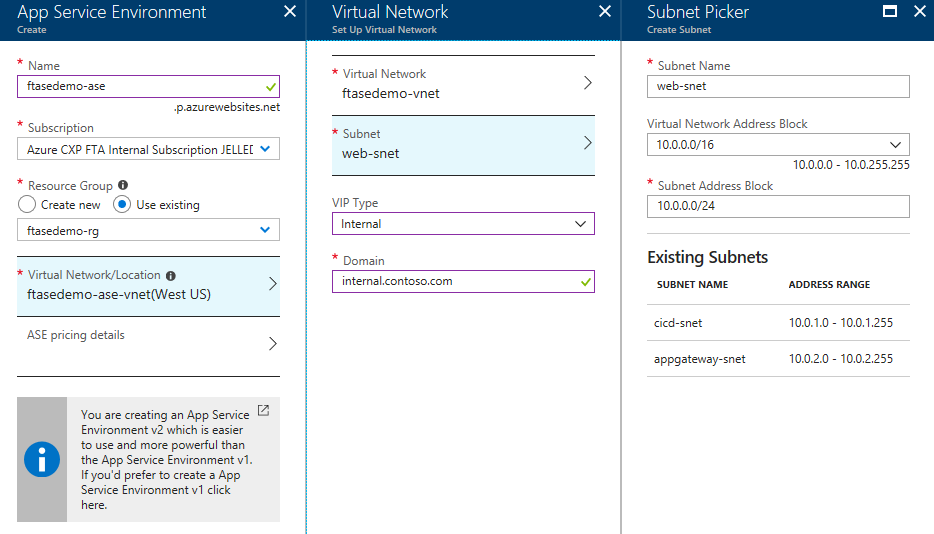

> Note: when the ASE is provisioned it creates a Network Security Group (NSG) preconfigured with all the ports it needs to function fully. However, it does not attach the NSG to the subnet that the ASE is deployed to. You currently have to go back and manually attach the NSG to the subnet otherwise, when the application is deployed you will not be able to have the web app talk to the API app.

* On the NSG that was created, open the **Subnets** blade and **Associate** it with the `web-snet` of the ASE.

#### Create ILB Certificate

* The ASE does not currently have a certificate for the Internal Load Balancer (ILB) yet, which means an SSL connection to any Web App on the ASE will not be valid
* There are many ways to obtain a valid SSL certificate for the domain, but in this walkthrough we'll [create and configure a self-signed certificate](https://docs.microsoft.com/en-us/azure/app-service/environment/create-ilb-ase#post-ilb-ase-creation-validation) in PowerShell as follows (make sure to run PowerShell as an administrator):

````POWERSHELL
$certificate = New-SelfSignedCertificate -certstorelocation cert:\localmachine\my -dnsname "*.internal.contoso.com","*.scm.internal.contoso.com"  
$certThumbprint = "cert:\localMachine\my\" + $certificate.Thumbprint  
$password = ConvertTo-SecureString -String "Test123!" -Force -AsPlainText  
Export-PfxCertificate -cert $certThumbprint -FilePath "exportedcert.pfx" -Password $password
Export-Certificate -cert $certThumbprint -FilePath "exportedcert-public.cer"
````

* Import the `exportedcert.pfx` certificate (which contains the private key) in to ASE
  * In the Portal, navigate to the ASE and open the **ILB Certificate** blade
  * Click **Update ILB certificate** to upload the pfx file (using the same password as in the PowerShell script above)
  * While the certificate is updating, you will see a "Scale Operation In Progress" message in the ASE overview blade
  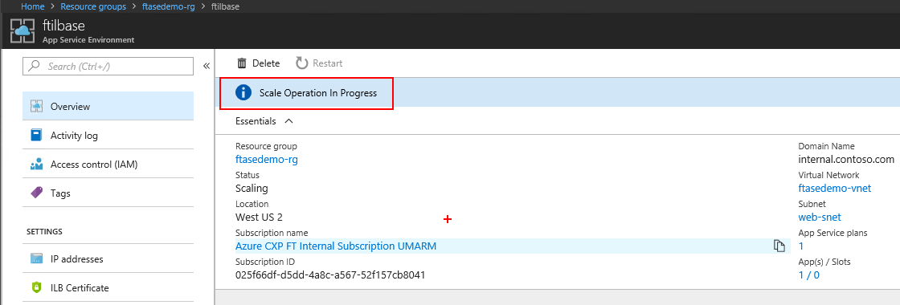
  * It takes a while (possibly an hour or more) to update the ASE with the new cert, so if you would browse to a web app during that time you might still get a certificate mismatch warning
  * Even after the cert goes in to effect, you will still get a Cert Authority (CA Root) warning from the browser, as this is a self-signed cert. If you want to avoid the warning, import the `exportedcert-public.cer` certificate to the Computer account under the **Trusted Root Certification Authorities** folder.

## Deploy Web Apps

#### Create Web Apps

* Using the Azure Portal, [create a new ASE based Web App](https://docs.microsoft.com/en-us/azure/app-service/environment/create-ilb-ase#create-an-app-in-an-ilb-ase) called `expenseweb`
  * For the App Service Plan, create a new one called `expenseweb-plan`, with the location set to the ASE and the pricing tier to `I1 Isolated`

  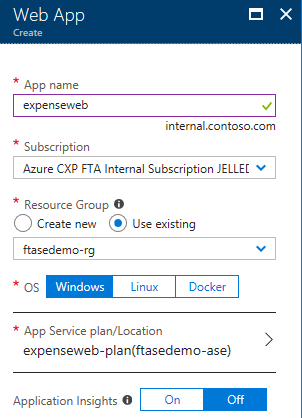

  * When it is created, the Web App has a URL of `https://expenseweb.internal.contoso.com` which can't be accessed from the public internet as it is locked down inside the VNet (i.e. it's an intranet app)
* Follow the same steps to create another Web App called `expenseapi`.

#### Create SQL Database

* Using the Azure Portal, [create a new SQL Database](https://docs.microsoft.com/en-us/azure/sql-database/sql-database-get-started-portal#create-a-sql-database)
  * Open the Azure Portal and click to create a new resource.
  * In the marketplace search blade, type **sql**.
  * Select the **SQL Database** entry in the search results and then click **Create**.
  * In the creation blade, set the database name as **contosoexpensesdb**.
  * In the server configuration, create a new server. Provide a server name and admin credentials. Write this information down for future use. Once done, click **Select**.
  * Under the pricing tier, change the tier to **Basic**. Click **Apply** and finally click **Create** to create the database.
  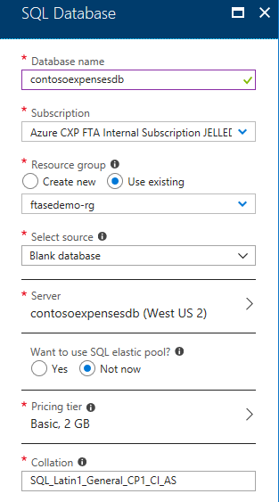
* Once the database has been provisioned, open the database server in the Azure Portal.
* Select the **Firewalls and virtual networks** setting. Turn **Off** the **Allow access to Azure services** setting (since we are accessing it only directly from within the VNet)
* In the **Virtual networks** area, click **Add existing virtual network**. Give the rule a name such as **buildAgentToSQLVnetRule**, provide the subscription, virtual network, and your CI/CD subnet `cicd-snet`. Click **Ok**.
    > Note: If a service endpoint has not been enabled for your subnet, you can use this time to enable it.
* Repeat the previous step to add another virtual network connection to your ASE subnet `web-snet`.
* Once done, click **Save** to keep your changes.
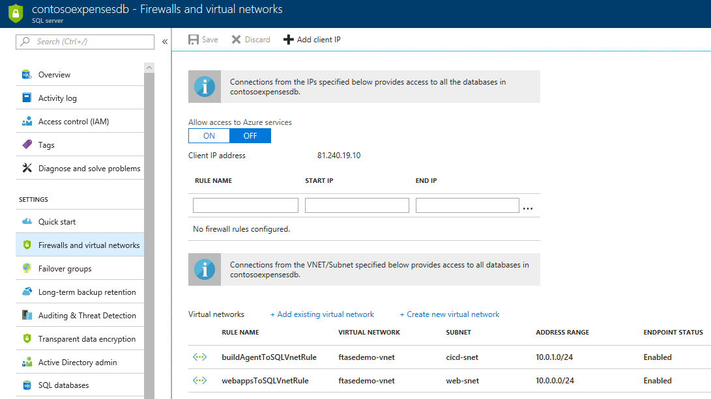

#### Create Storage Account

* Using the Azure Portal, [create a new Storage Account](https://docs.microsoft.com/en-us/azure/storage/common/storage-quickstart-create-account?tabs=portal#create-a-general-purpose-storage-account)
  * Open the Azure Portal and click to create a new resource.
  * In the marketplace search blade, type **storage**.
  * Select the **Storage account - blob, file, table, queue** entry in the search results and then click **Create**.
  * Set the following values of the storage account:
    * **Name**: **{Provide a unique name for the account}**
    * **Account kind**: **StorageV2**
    * **Configure virtual networks**: **Enabled**
        * **Virtual network**: **{VNet being used for this walkthrough}**
        * **Subnets**: **{Subnet holding the ASE setup}**

    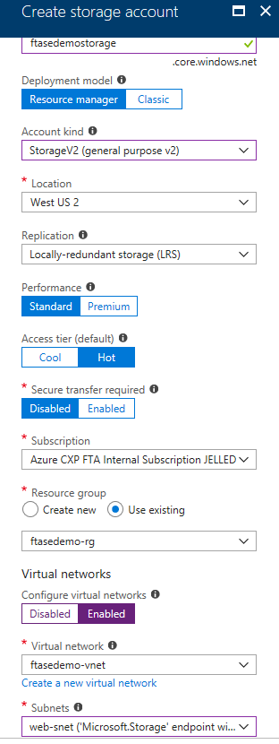
  * Click **Create** which will build the storage account and provide connections to it from the apps we are building.
    > Note: If you want to be able to browse the contents of the storage account from another computer (including through the Azure Portal) you will need to add an additional subnet to the network configuration or provide individual client IPs.
* Once the storage account has been provisioned, open it up in the Azure portal. Click on the **Access keys** tab.
* Copy the **Connection string** for **key1** and save it for later.

#### Configure Web App

* In the Azure portal, open the `expenseweb` application and then click on **Application settings**.
* Under **Application settings**, add the following fields:
    * **EmployeeName**: **Randy**
    * **EmployeeApiUri**: **https://expenseapi.internal.contoso.com**
    * **StorageConnectionString**: **{Connection string for the storage account created earlier}**
* Under **Connection strings** create a new entry with the name **ContosoExpensesDataEntities**. Change the dropdown for type from **SQLAzure** to **Custom** and replace the placeholder values below with settings from your Azure SQL instance:

```
metadata=res://*/Models.ContosoExpensesModel.csdl|res://*/Models.ContosoExpensesModel.ssdl|res://*/Models.ContosoExpensesModel.msl;provider=System.Data.SqlClient;provider connection string="data source=tcp:__YOUR_SQL_SERVER__.database.windows.net;initial catalog=__YOUR_DB_NAME__;Integrated Security=False;User Id=__YOUR_SQL_USER_ID__;Password=__YOUR_SQL_USER_PASSWORD__;MultipleActiveResultSets=True;App=EntityFramework"
```

* Save the changes to your web app.

## Deploy Agent VM

> This part of the walkthrough will create a Virtual Machine inside the CI/CD subnet that we can use for testing. This VM will later be used to run a VSTS Agent that will build and release our application to our App Service Environment. Since the ASE is not publically exposed to the internet and therefore unreachable from VSTS, we will need an agent running inside the VNet that is hosting the application.

#### Create Agent VM

* We will start with [creating a virtual machine](https://docs.microsoft.com/en-us/azure/virtual-machines/windows/quick-create-portal#create-virtual-machine) that will run the build agent.
  * In the Azure Portal, create a new resource.
  * In the marketplace search blade, type **visual studio**.
  * Select the **Visual Studio Enterprise 2017 (latest release) on Windows Server 2016 (x64)** entry in the search results and then click **Create**.
  * In the **Basics** blade, provide the details for the VM. Click **Ok**.
  
  * Select a size e.g. `D2_V3` for the VM and click **Select**.
  * In the **Settings** blade, the options we want to make sure are the networking settings. We want the VM to be placed in the `cicd-snet` we created earlier. We will also want to remove the network security group for the VM (we will create one for the subnet next). Click **Ok**.
  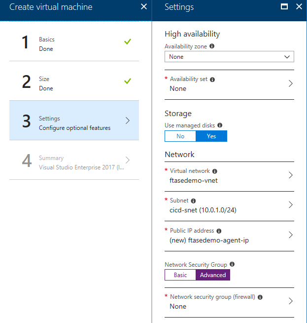
  * In the **Summary** blade, click **Create**.
* Next we need to [create a Network Security Group]() to allow RDP access
  * In the Azure portal, click to create a new resource.
  * In the marketplace search blade, type **network security group**.
  * Select **Network security group** and click **Create**.
  * Provide a name for the NSG e.g. `cicd-snet-nsg` and place it in the same resource group.
* Once the NSG is created, open its settings in the portal to allow RDP access.
  * Click on **Subnets** and then click **Associate**.
  * Choose the VNet we created and then select the `cicd-snet` subnet we placed our VM into. Click **Ok**.
  * Click on **Inbound security rules** and then click **Add**.
  * Click on **Basic** and then in the **Service** field, choose `RDP`. Click **Ok**.
* Finally, we need to [connect to the VM](https://docs.microsoft.com/en-us/azure/virtual-machines/windows/quick-create-portal#connect-to-virtual-machine) and configure it
  * Once the VM has been provisioned, navigate to the **Overview** settings for it from the Azure portal. Click **Connect**.
  * In Server Manager click **Local Server** and ensure the **IE Enhanced Security Configuration** is set to **Off** for administrators. Close Server Manager.

#### Provide DNS Resolution

> The Agent VM is not configured with any DNS service that is aware of the ASE so we will need to provide DNS resolution of the internal Web Apps and their Kudu sites to the IP address of the ASE's Internal Load Balancer (ILB).

There are a number of options to provide DNS resolution:

* The simplest solution for this scenario is to adjust the hosts file on the Agent VM to explicity configure the IP address for the Web Apps
  * In the Azure Portal, navigate to the ASE and open the **IP addresses** blade
  * Copy the **Internal Load Balancer IP address** (e.g. `10.0.0.11`) to the clipboard
  * On the Agent VM, start a Notepad instance as administrator and open the system's host file at `C:\Windows\System32\drivers\etc\hosts`
  * Add an entry for the ILB that serves the Web and API apps, and in both cases also for their Kudu sites. You should have something similar to the following:
    ```
    10.0.0.11	expenseweb.internal.contoso.com
    10.0.0.11	expenseweb.scm.internal.contoso.com
    10.0.0.11	expenseapi.internal.contoso.com
    10.0.0.11	expenseapi.scm.internal.contoso.com
    ```
  * Save the hosts file
* Alternatively, you can host a custom DNS server (e.g. a VM running Windows Server with the DNS Server Role) and [configure that custom DNS server on the VNet](https://docs.microsoft.com/en-us/azure/virtual-network/virtual-networks-name-resolution-for-vms-and-role-instances#specify-dns-servers)
* You can also consider using [Azure DNS for private domains](https://docs.microsoft.com/en-us/azure/dns/private-dns-overview)
  * See [Get started with Azure DNS private zones using PowerShell](https://docs.microsoft.com/en-us/azure/dns/private-dns-getstarted-powershell) for details on how to set this up
  * Note that at the time of writing (May 2018) this feature is still in **preview**
  * One limitation in the current preview is that you cannot start using private DNS zones when there are already resources in the VNet (like the Agent VM we already have deployed):
    ```
    New-AzureRmDnsZone : Virtual networks that are non-empty (have Virtual Machines or other resources) are not allowed during association with a private zone.
    ```

#### Test Web App

* From inside the Agent VM, browse to http://expenseweb.internal.contoso.com, which should now show you a default "Your App Service app is up and running" page.
* Now browse to https://expenseweb.internal.contoso.com (note the `https` connection), which should give you a warning that "There is a problem with this website's security certificate".
* Continue to the site so you can again see the "Your App Service app is up and running" page.
* View the certificate and verify that it was issued to `*.internal.contoso.com` (which is the ILB certificate).
  * Note: if the certificate is issued to `*.ftasedemo-ase.p.azurewebsites.net`, this means that the ILB certificate deployment has not yet completed (and since the cert doesn't match the domain, we get the error in the browser). Wait for the Scale Operation on the ASE to complete before continuing.
* Since this is a self-signed certificate, the Agent VM doesn't trust it yet.
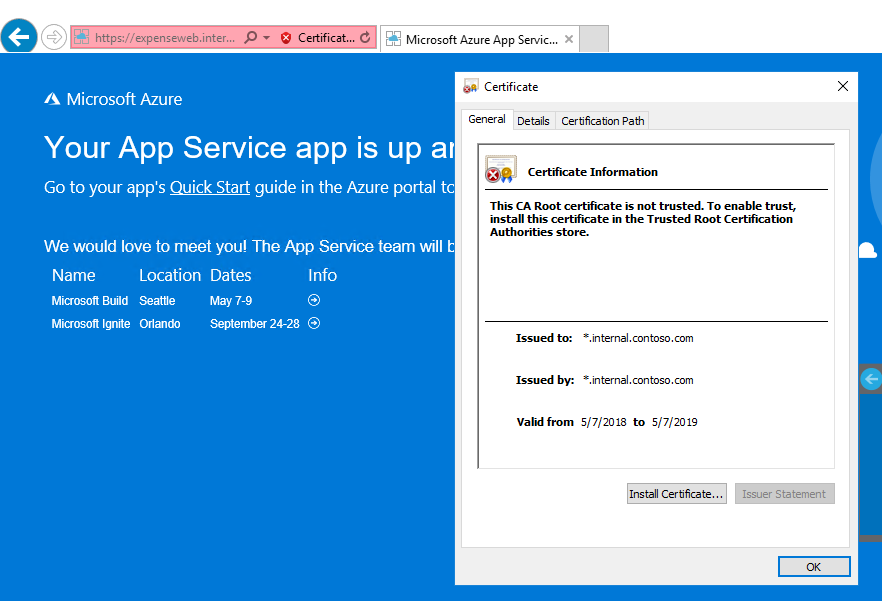
* Copy the `exportedcert-public.cer` file (which contains only the public key) from the computer where the self-signed certificate was created into the Agent VM.
* Import the `exportedcert-public.cer` certificate to the Computer account under the **Trusted Root Certification Authorities** folder.
  * Double-click the .cer file, click **Install Certificate...**, select **Local Machine**, select the **Trusted Root Certification Authorities** store.
* Close the browser and navigate back to https://expenseweb.internal.contoso.com, which should now work without any warnings.
* Navigate to the Kudu site at https://expenseweb.scm.internal.contoso.com (note the `.scm` subdomain), you should get prompted for credentials to access the site.
* The deployment credentials are the same for all web apps on the ASE. If you haven't set up [App Service Deployment Credentials](https://docs.microsoft.com/en-us/azure/app-service/app-service-deployment-credentials#userscope) yet, go to the Web App in the Azure Portal, select **Deployment credentials** and enter a username and password.
* After successful authentication, you should now see the Kudu site for your Web App.

## Deploy App Gateway

#### Create App Gateway

* Use the Azure portal to create a new [Application Gateway](https://docs.microsoft.com/en-us/azure/application-gateway/quick-create-portal#create-an-application-gateway).
* In the marketplace search blade, type **Application Gateway**.
* Select the Application Gateway entry in the search results and then click **Create**.
* In the Basics blade, fill in the values as shown below and then click **OK**.
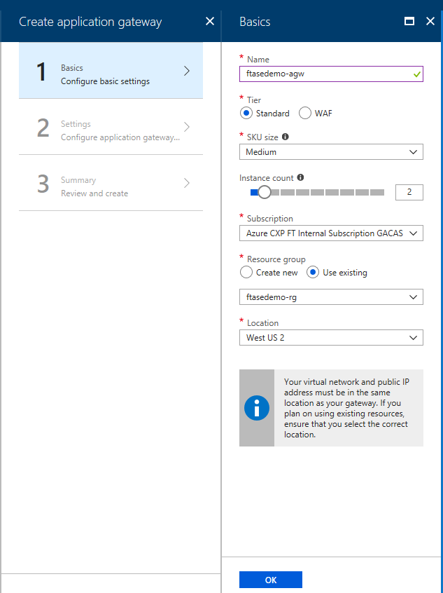

* In the Settings blade select the VNet and subnet from earlier
* Under Frontend IP configuration select public
* Select Create new for the Public IP address
* Click OK and begin creation of the gateway
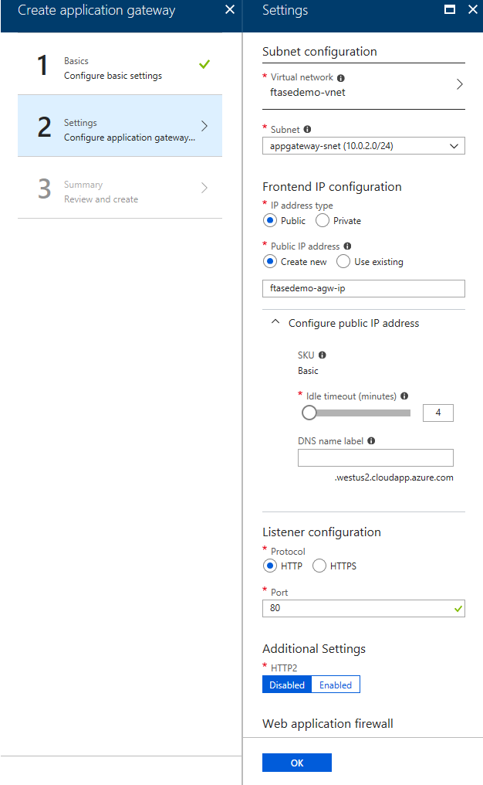

#### Configure App Gateway

* There are a number of components in the App Gateway that need to be configured; see the following diagram for an overview:
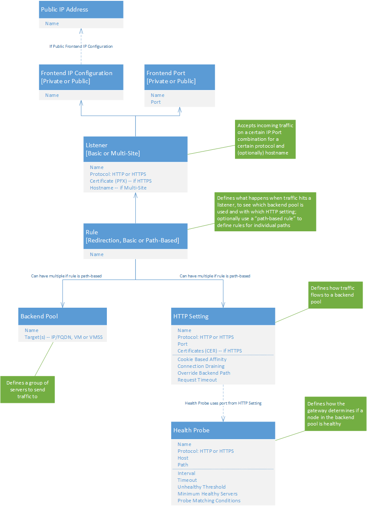
* Once the gateway is provisioned, navigate to the gateway in the portal
* Select `appGatewayBackendPool` after navigating to Settings / Backend Pools
* Enter the internal IP Address of the ILB ASE (e.g. `10.0.0.11`) and save.
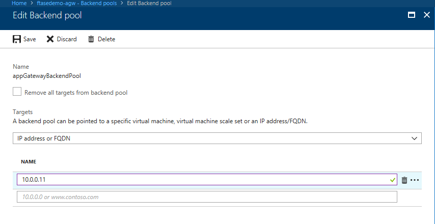

* Add a Multi-site listener under Settings / Listeners
* Fill in the values as shown below and click ok
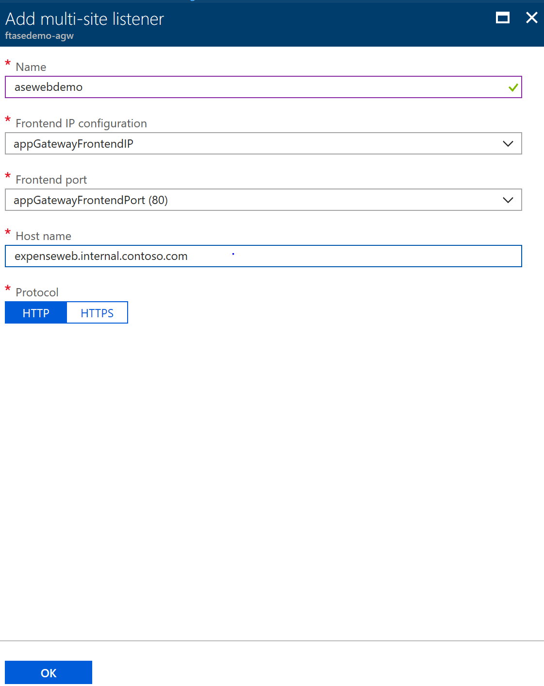

* Update the Rule under Settings / Rules to use the new listener
 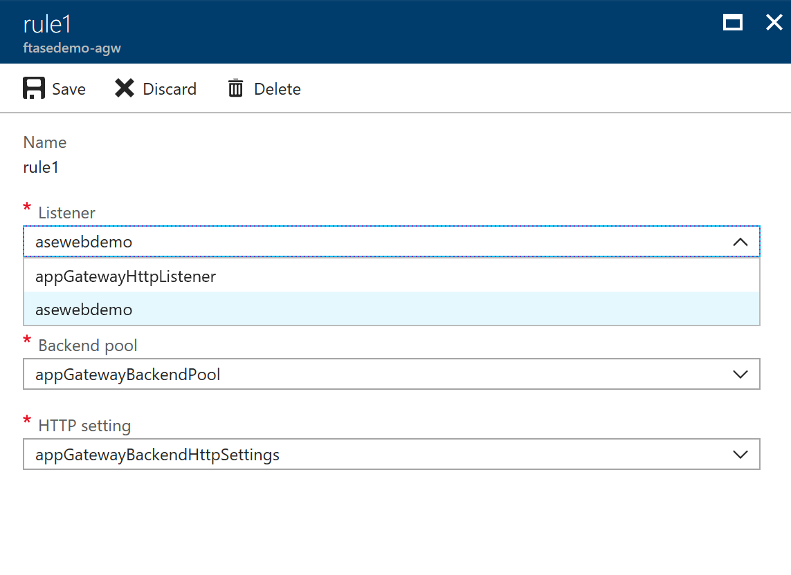* Return to Settings / Listeners and delete `appGatewayHttpListener`
 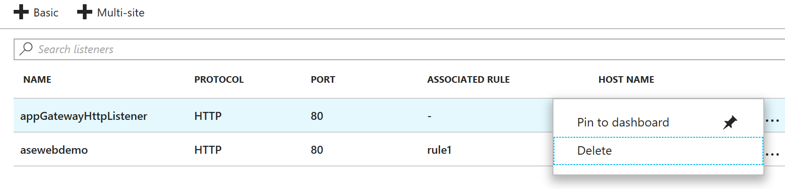
* Add a new probe under Settings / Health Probes
* Fill in the values as shown below and click ok
 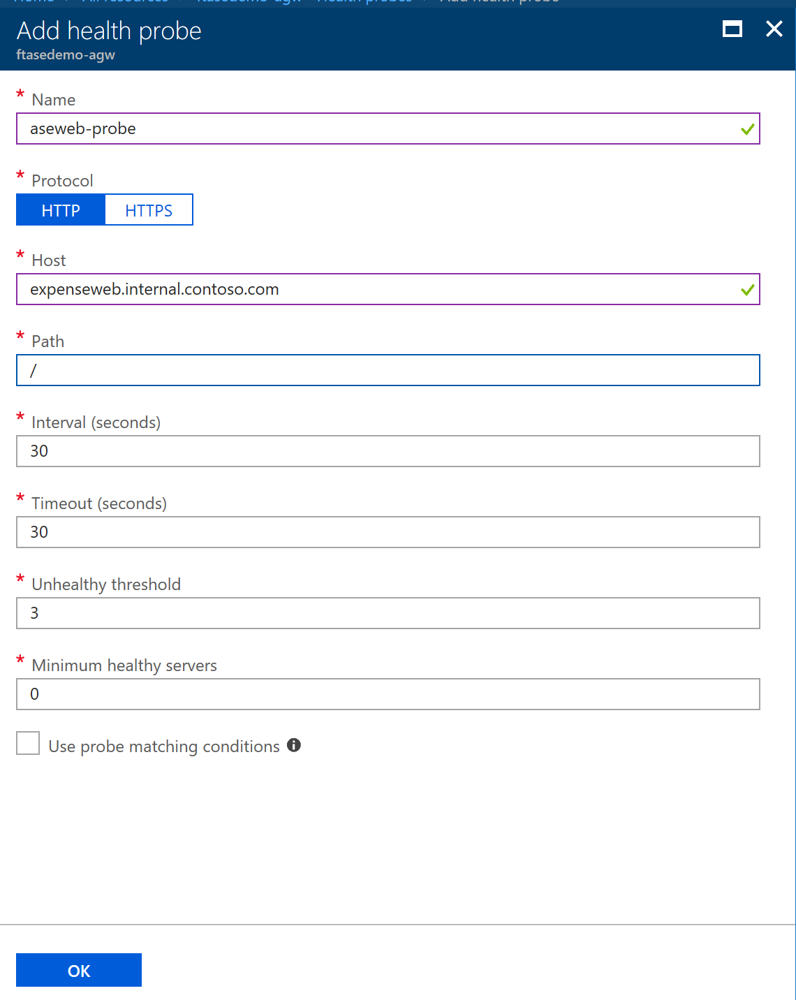
* Update `appGatewayBackendHttpSettings` under Settings / Http settings to use the newly created probe
  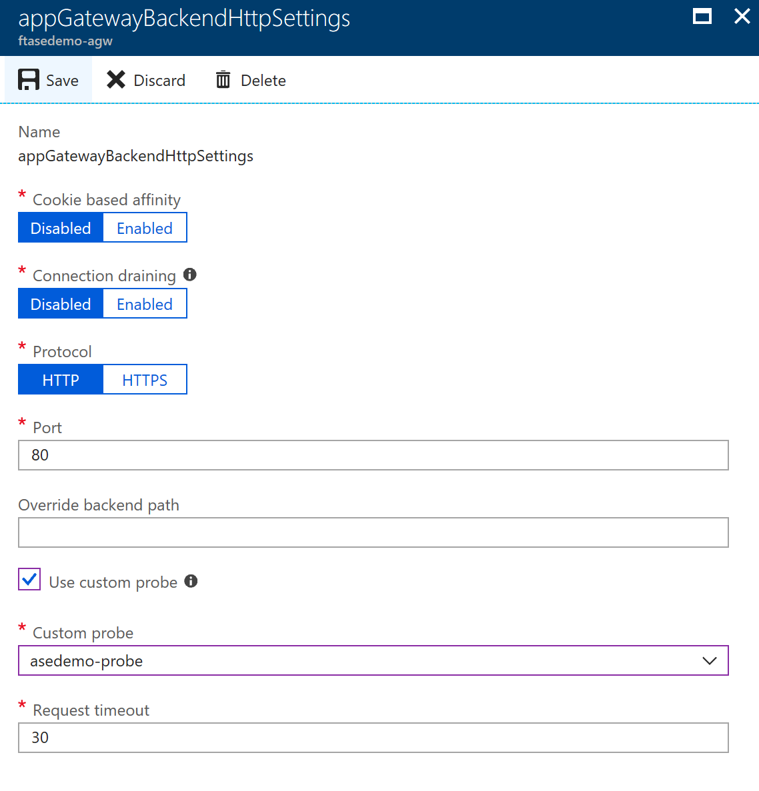

#### Configure DNS to access the webapp using the gateway

* Navigate to the Overview tab and copy the IP part of the `Frontend public IP address` field.
* Create an entry for `expenseweb.internal.contoso.com` in your local hosts file that points to the App Gateway IP address you just copied.
* At this point, you should be able to visit the webapp on your local computer.
* If you are using an internet routable domain in this demo
  * Replace `expenseweb.internal.contoso.com` with your domain name in the Health probe and listener.
  * Add your domain as a custom domain in the webapp
  * There is no need to create the hosts entry at this point


## Setup CI/CD

> In this part of the guide we will be creating a project in VSTS, adding source code to the project, creating a build agent, and then setting up a CI / CD build and release pipelines.

#### Initial Project Creation

* Navigate to your VSTS account.
* Click **New Project**. Provide a project name e.g. FTA-ASEExpenses, leave version control as Git and click **Create**.

  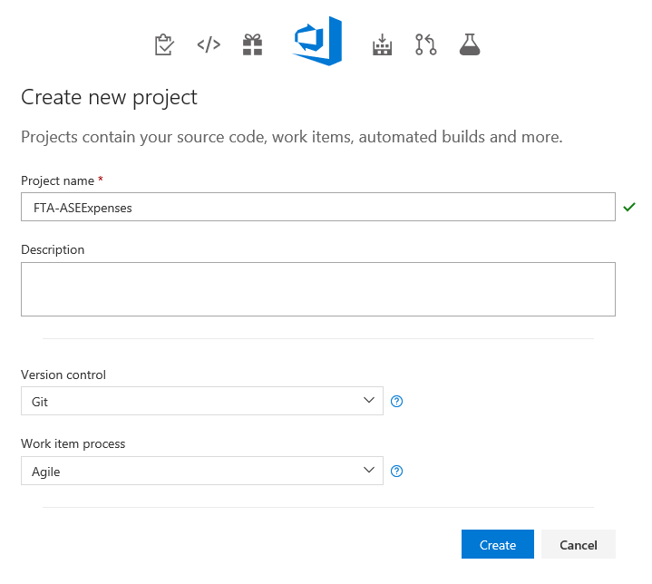

* Once the project is created, navigate to the **Code** hub. Since the repository is empty, we will need to load our Contoso Expenses source code in place. In the initialize section, click the dropdown for *add a .gitignore* and select **VisualStudio**. Click **Initialize**. Finally, click **Clone in Visual Studio**.

  

* Once Visual Studio opens, select the local path that you want the repository cloned to and then click **Clone**.
* Once the repository has been cloned to your computer, open that folder in Windows Explorer and copy the contents of the Contoso Expenses application the cloned folder.
* Open Team Explorer and click **Changes**. Type in a commit message, and then select **Commit All and Sync**.
* Refresh the code hub in VSTS and you should see your source files.

  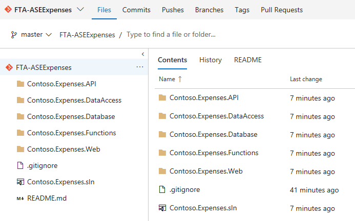


#### Create Build Agent

* From the previously built virtual machine, follow the steps to [create a personal access token](https://docs.microsoft.com/en-us/vsts/git/_shared/personal-access-tokens?view=vsts). Keep this token as you will not be able to retrieve it again.
* In the VSTS settings, select **Agent Pools**. Click **New pool** and give it the name **ASE Internal** and click **Ok**.

  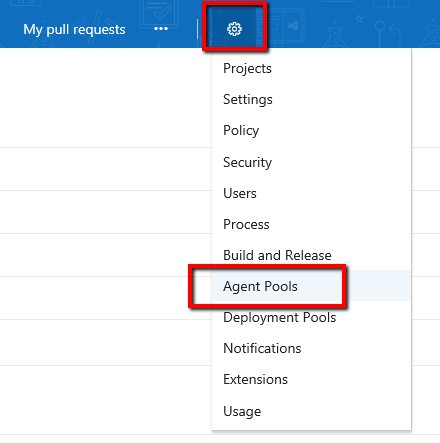

  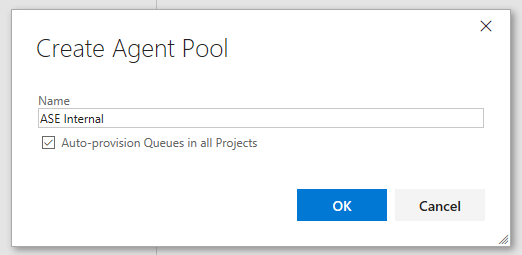

* Click **Download agent**. In the dialog that pops up, click **Download** and save it in your downloads folder.

  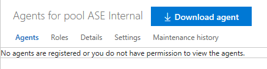

  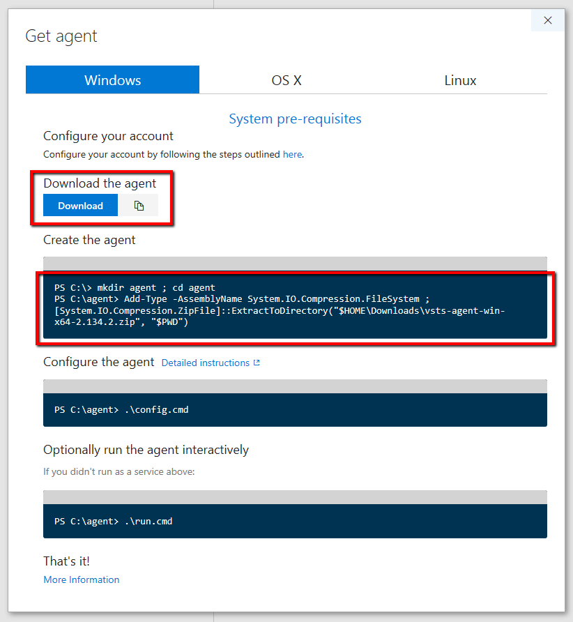

* Open a PowerShell prompt, navigate to your C:\ directory and then type the commands shown in the dialog into PowerShell e.g.

```powershell
cd c:\
mkdir agent ; cd agent
Add-Type -AssemblyName System.IO.Compression.FileSystem ; [System.IO.Compression.ZipFile]::ExtractToDirectory("$HOME\Downloads\vsts-agent-win-x64-<current-version>.zip", "$PWD")
.\config.cmd
```
  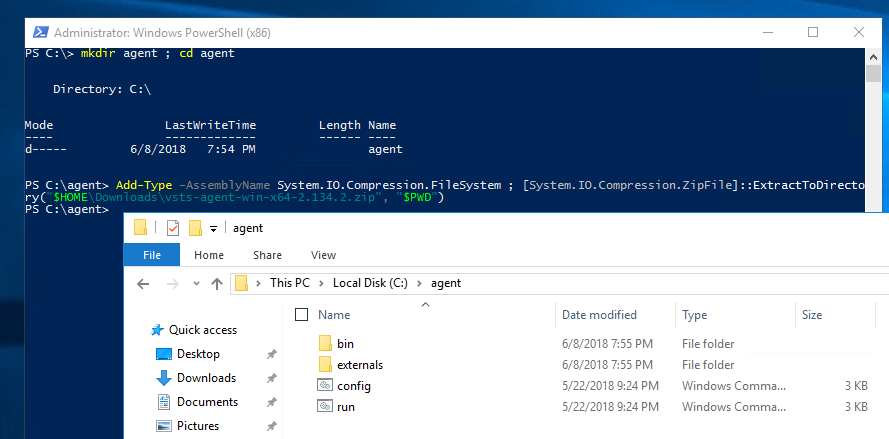

* Provide the details for your agent as you configure it:
    * *Enter server URL*: **https://{youraccount}.visualstudio.com**
    * *Authentication type*: **PAT**
    * *Personal access token*: **{Value you saved earlier}**
    * *Agent pool*: **ASE Internal**
    * *Agent name*: **{your vm name}-01**
    * *Work folder*: **{Leave as default}**
    * *Run agent as a service*: **Y**
    * *User account for the service*: **{Leave as default}**

    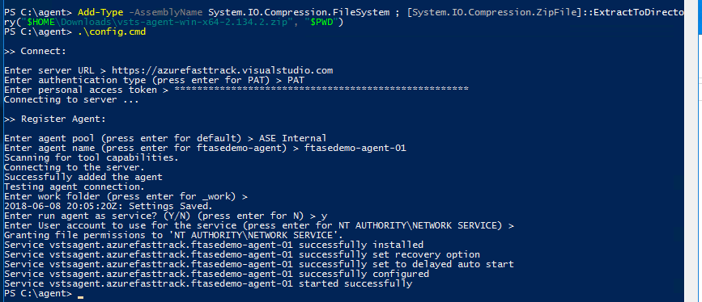

* Back in VSTS, check the **ASE Internal** pool and you should see your agent as a green color.

  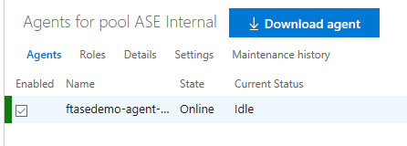

#### Setup Build

* In VSTS, navigate to the **Build and Release** hub of your project. Under **Builds**, create a new definition. Leave the default options and click **Continue**.

  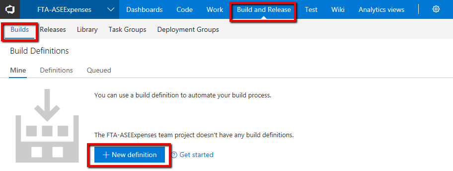

  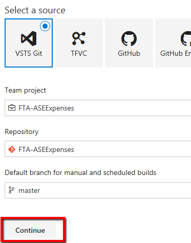

* In the *Select a template* view, choose **ASP.NET Core (.NET Framework)**, and click **Apply**.
* Once the build steps are added, click the **Build solution** task, and change the *MSBuild Arguments* to the following:

```
/p:DeployOnBuild=true /p:WebPublishMethod=Package /p:PackageAsSingleFile=true /p:SkipInvalidConfigurations=true /p:PackageLocation="$(build.artifactstagingdirectory)\\"
```

* In the build phase, add a new **Copy Files** task and place it after the *Build Solution* task.

  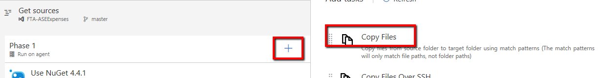

* Set the following parameters:
    * *Display Name*: **Copy Database Files**
    * *Source Folder*: **Contoso.Expenses.Database**
    * *Contents*: **\*\*\bin\\$(BuildConfiguration)\\*\***
    * *Target Folder*: **$(build.artifactstagingdirectory)**

  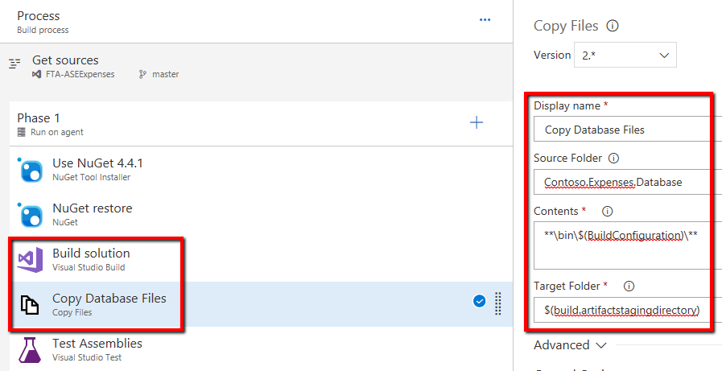

* Under **Triggers**, click to **Enable continuous integration** and click **Save and queue**. Wait for the build to complete.

  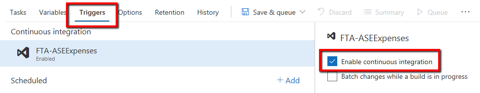

#### Setup Release

* In VSTS, navigate to *Releases* under the **Build and Release** hub, and click **New definition**.

  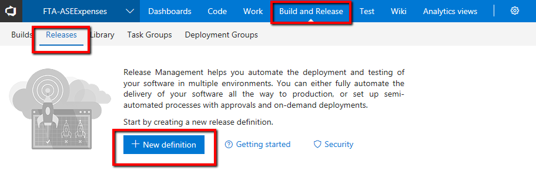

* Select **Azure App Service Deployment** and then **Apply**.

  

* Rename the environment to something more descriptive e.g. **Development**.

  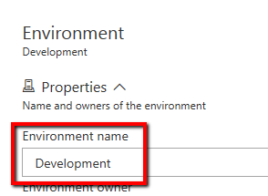

* In the tasks list for the development environment, click **Run on agent** and change the agent queue to our **ASE Internal** queue.

  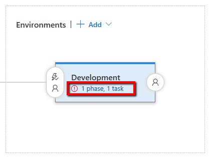

  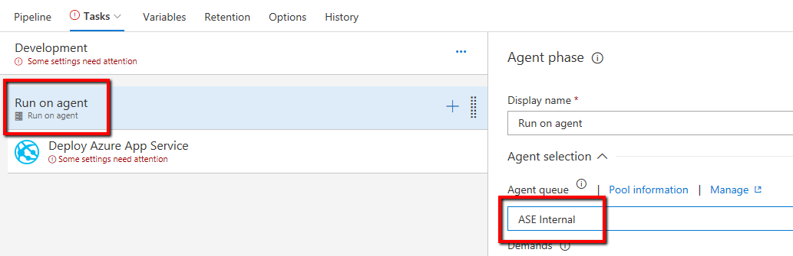

* At the top of definition, rename the definition from **New Release Definition** to **ContosoExpenses-ASE-CD**.

* Select **Pipeline** and click **Add artifact**. Change the *Source* to the build definition you created in the previous step and then click **Add**.

  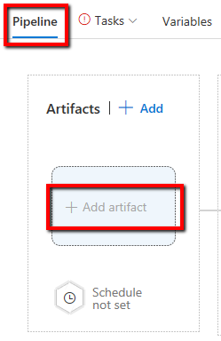

  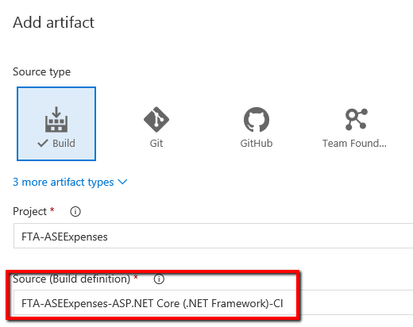

* In the artifacts section, click the **Continuous deployment trigger** icon and then toggle the switch to enabled.

  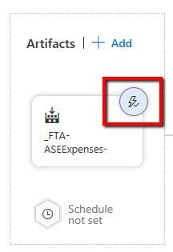

* Select **Tasks** and then add a new **Azure SQL Database Deployment** task before the App Service task and make the following changes:
    * *Display name*: **Deploy SQL Dacpac**
    * *Azure subscription*: **{Select Manage}**
        * Click **New Service Endpoint**
        * Select **Azure Resource Manager**
        * Provide a value for connection name and select the appropriate subscription
        * (Optional) Select the resource group the environment is deployed into
    * *Azure SQL Server Name*: **{FQDN of the SQL Server you created earlier}**
    * *Database name*: **contosoexpensesdb**
    * *Server admin login*: **{username to SQL server you created}**
    * *Password*: **{password to the SQL server you created}**
    * *DACPAC File*: **{Artifact Path}\bin\Release\Contoso.Expenses.Database.dacpac**
    > Note: The password here should ideally be protected by at least a secret variable in VSTS or something more secure such as Azure KeyVault.

  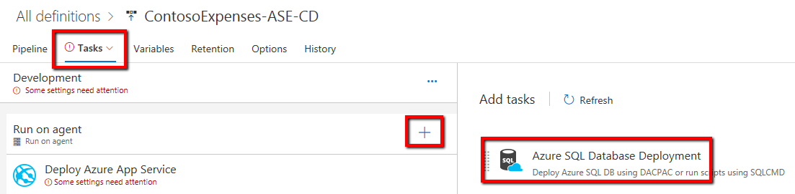

  

  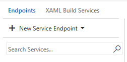

  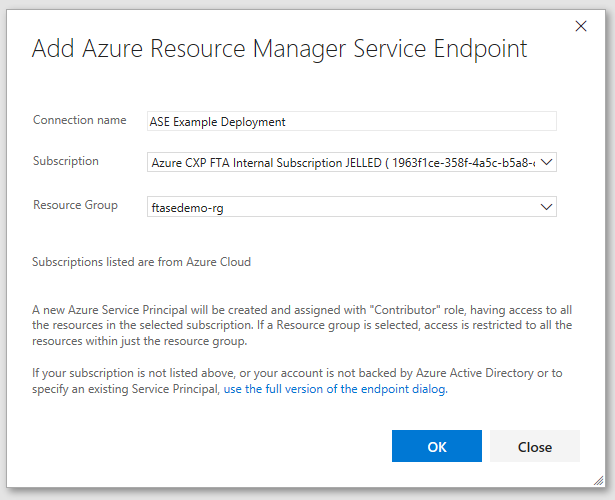

  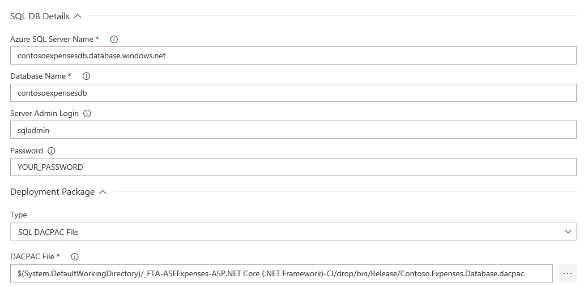

* In the Deploy Azure App Service task, make the following changes: 
    * *Display name*: **Deploy Contoso Expenses API**
    * *Azure subscription*: **{Connect to the subscription you just created}**
    * *App type*: **API App**
    * *App Service name*: **expenseapi**
    * *Package or folder*: **{Artifact Path}\Contoso.Expenses.API.zip**
 
    Under *Additional Deployment Options* set the following values:
    * *Take app offline*
    * *Publish using Web Deploy*
    * *Additional arguments*: **-allowUntrusted**

  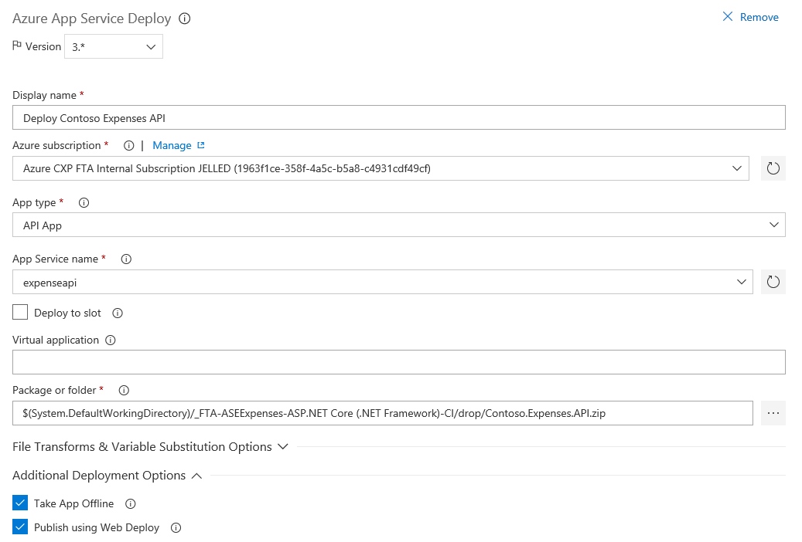

* Right click the *Deploy Contoso Expenses API* task and select **Clone task**.

  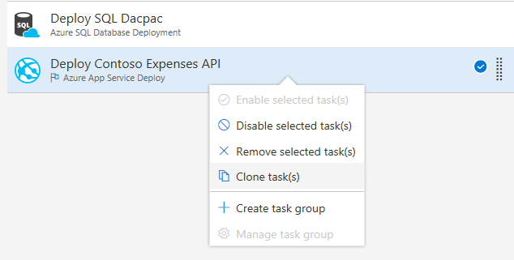

* Make the following changes:
    * *Display name*: **Deploy Contoso Expenses Web**
    * *Azure subscription*: **{Connect to the subscription you just created}**
    * *App type*: **Web App**
    * *App Service name*: **expenseweb**
    * *Package or folder*: **{Artifact Path}\Contoso.Expenses.Web.zip**
  
  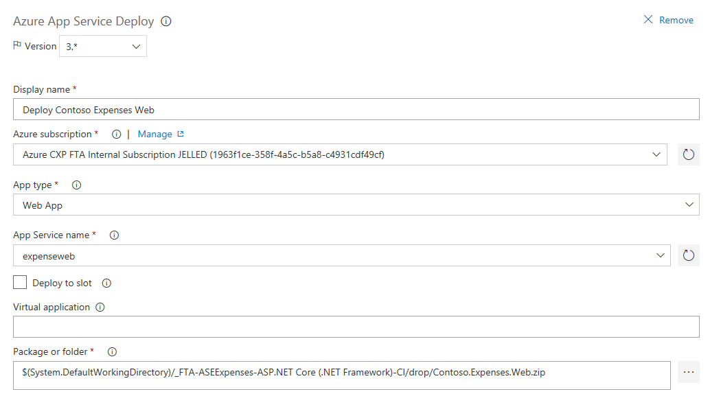

* Click **Save** and then **Ok**.
* Click **Release** and then **Create release** to start a new release deployment.
* Once the release has completed, return to your VM and open https://expenseweb.internal.contoso.com/

  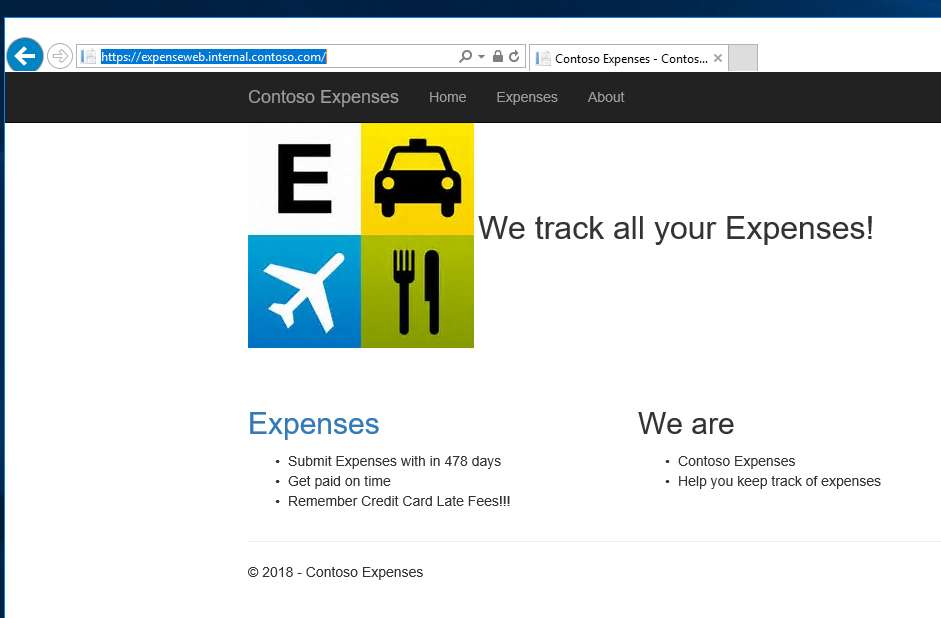
