# POC Scenario Contoso Expenses: Deploying Website on Azure PaaS in Microsoft Azure Government

# Abstract

During this module, you will learn about bringing together PaaS App Services components to build a sample application, Contoso Expenses, and making it scalable, highly available and secure.

# Learning objectives
After completing the exercises in this module, you will be able to:
* **Azure PaaS Fundamentals** – Understand base PaaS concepts, as well as features and frameworks for creating enterprise line-of-business applications on Azure or modernizing existing apps using Azure App Service (Web Apps and API Apps). 
* **Building on Azure App Service** - Apply design best practices and core principles for building new applications on Azure or moving existing applications to App Service. During this session, we will also build a web app reference PoC.

## Pre-Requisites
* To complete this PoC, you will need:
     * A Microsoft Azure subscription (with Contributor access)

    * Install latest version of [Visual Studio 2017](https://www.visualstudio.com/downloads/) Enterprise with following Workloads:
      * .NET desktop development 
      * ASP.NET and web development 
      * Azure development  
      * Data storage and processing 
    
    * [Azure Environment Selector Visual Studio Extension](https://marketplace.visualstudio.com/items?itemName=SteveMichelotti.AzureEnvironmentSelector)
    
    * Download Proof-of-concept project from [here](https://fasttrackforazure.blob.core.windows.net/federalhol/Contoso.Expenses.zip)


# Estimated time to complete this module
2 hours

# High level process
* Create Azure SQL DB and publish database project from Visual Studio to Azure SQL DB
* Deploy an ASP.Net MVC project from Visual Studio to Azure Web App
* Connect the Web App to Azure SQL DB
* Deploy the API app project from Visual Studio to Azure API App
* Create a storage account to hold the messages using Queue
* Create a function to pick up the message from the Queue and auto approve it if the amount is under a certain threshold

## Switch Visual Studio to work with Azure Government
* Open Visual Studio.

* From the *Tools* menu, select **Azure Environment Selector**

  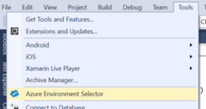

* In the dialog that pops up, select **Azure Government** and then restart.

  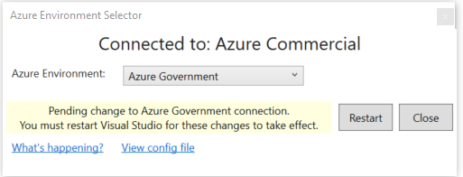.

* Once Visual Studio restarts, open the cloud explorer window and log into your Azure Government credentials.

## Open application with Visual Studio
* Unblock the file in Windows Explorer properties (Right Click on the zip file in explorer and select 'Properties', then click 'unblock')
* Extract the zip file to a working folder.
* From the working folder, open **Contoso.Expenses.sln** with Visual Studio.

  

* Build the Project in Visual Studio.
  * **Right-Click** on the Solution **Contoso.Expenses**, select **Build Solution**.

  

  * There are 4 projects that are in Visual Studio.
  * **Contoso.Expenses.API** - This is a Web API project that provides helper logic to the main web app.
  * **Contoso.Expenses.DataAccess** - This is a Class Library that utilizes Entity Framework.
  * **Contoso.Expenses.Database** - This is a Database project that contains the SQL to create the Expenses table and SQL to initially seed default data.
  * **Contoso.Expenses.Web** - This is the Internal Business Web App.

## Create the SQL Database
* Navigate to the Azure portal.
* Click on **+ New**, type in **Resource Group** in the search area, press **Enter**.
* Click on **Resource Group**, click on **Create**.
* Enter a descriptive name (e.g. **fta-contosoexpenses-govva**) as the **Resource group name**.
* Select your **Subscription**.
* Select your **Resource Group Location** (e.g. USGov Virginia).
* Click **Create**.

  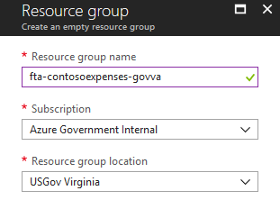

* Navigate to the resource group **fta-contosoexpenses-govva**.

* Click **+Add**, type in **SQL Database** in the search area, press **Enter** and click on **SQL Database**.

  

* Click **Create**.
* Enter **contosoexpensesdb** as the **Database Name**.
* For **Resource Group**, select **Use Existing**, then select the **Resource Group** created earlier (e.g. fta-contosoexpenses-govva).
* For **Server**, click **Configure required settings**.
* Click **Create a new Server**.
* For **Server Name**, enter **contosoexpensesdbserver1**.
  * Note: The server name needs to be globally unique, so add a number to the end of name.
* Enter a **Server admin login** and **Password**.
  * Note: Save the **Login name** and **Password**, as you’ll need it later.
* For Location select any value that you have available to you.
* Click **Select** to save the server settings.

  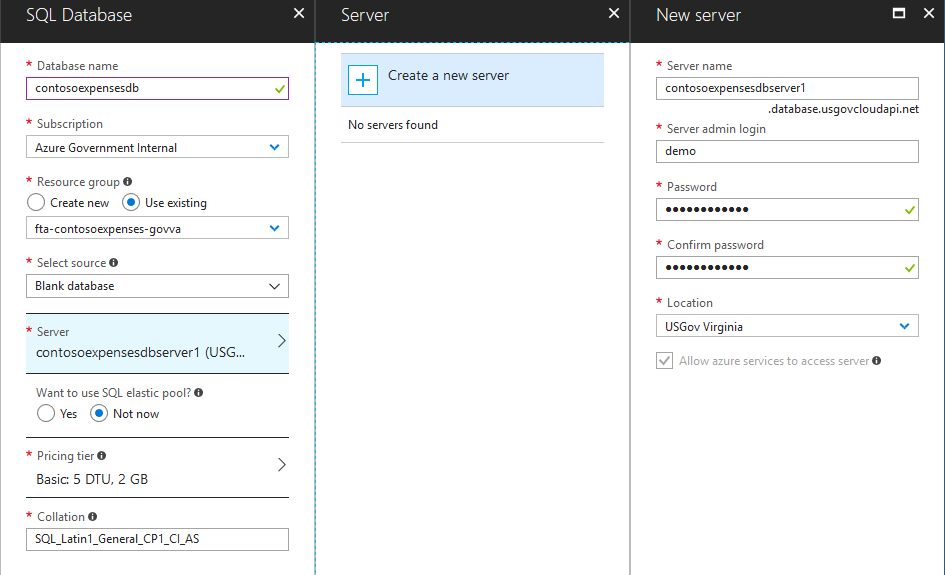

* Click on **Pricing Tier**.
* Move the **DTU** slider to **20**.
  * Note: DTU's are Database Transaction Units and measure database performance with a blended measure of CPU, memory, I/O.  For more information on DTU's, see [Explaining Database Transaction Units](https://docs.microsoft.com/en-us/azure/sql-database/sql-database-what-is-a-dtu).

* Move the **Storage** slider to **5GB**.
* Click **Apply**.
* Click **Create** to create a new SQL Database Server & Database.

  

  * Note: The Azure alert bell will indicate that the deployment is in progress.

  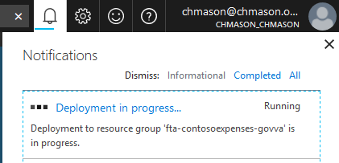

## Client IP in Firewall Settings for SQL Server
To add the **IP address** of the client you access the database from, do the following steps:
* Under the SQL Server Settings, click on **Firewall**.
* Click on **Add client IP** and click **Save**. This will add your current IP as a new rule on the Firewall.

  

## Get SQL Connection String
* Open the contosoexpensesdb resource in the Azure portal.

* Click on **Connection strings** and copy the value from the **ADO.NET** setting and save this value for later.

  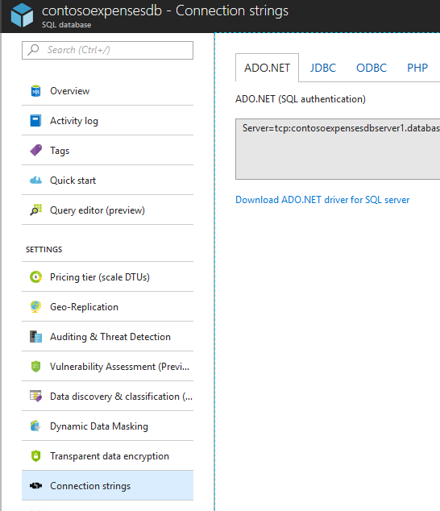

## Publish the Database into Azure SQL DB
* From Visual Studio, expand the project **Contoso.Expenses.Database**.
* Click on the **Seed.sql** file under the **Scripts folder**, and look at content in the preview window.
  * Note: This file will get executed post-deployment and add test data to the database.

  

* **Right-click** on the project **Contoso.Expenses.Database** and select **Publish** to publish the database.

  
  
  
* On **Target database connection** click **Edit**, then click **Browse**.

* From the list presented, expand **Azure**.
* Select the **Database** created on the SQL Server in the previous steps.

  

* For the **Server Name**, confirm or enter the server name previously saved to the clipboard (e.g. **contosoexpensesdbserver1.database.usgovcloudapi.net**).
* Set **Authentication** to **SQL Server Authentication**.
* Enter the database server **User Name** and **Password**. Select the checkbox **Remember Password**.
* Select the database name **contosoexpensesdb**.
* Click **Test Connection**.
* You may get prompted to add a firewall rule so that your computer is allowed to access the database server. If so, click **Ok** to allow the firewall rule to be created.

  
* The result should be **Test connection succeeded**, then click **Ok**.
* Click **Ok** to close the connect window.

* Click on **Publish** to publish the database to Azure.
  * The database will be published to Azure and give you the results.

  

* The status and progress will be displayed in the Data Tools Operations window.

  

## View the database using Visual Studio Tools
* From **Visual Studio**, select **View** | **SQL Server Object Explorer**.
* Expand the **SQL Server** node to view the connection.
* Expand the connection **contosoexpensesdbserver1.database.usgovcloudapi.net**, and then **Databases | contosoexpensesdb | Tables**. Confirm the existence of the **dbo.Expense** table.

  

## Publish the Web App

* From Visual Studio, **right-click** on the Web Project, **Contoso.Expenses.Web**.
* Select **Publish** from context menu, to pick a new App Service publish target.

  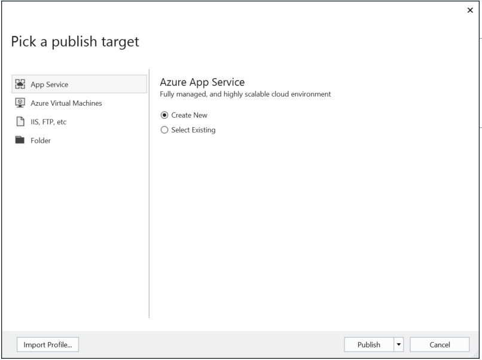

* Click on the **Publish** drop down and select **Create Profile**.

## Create App Service
* Login into the correct **Subscription** from the dropdown list.
* Set the **Web App Name** to any name, e.g. **ContosoExpenesesWeb20170710012420**
* Select the correct **Subscription** from the dropdown list.
* Select the correct **Resource Group** from the dropdown list, e.g. **ContosoExpenses-RG-WestUS2**.

  

* For the App Service Plan, click **New**.
* To configure the app service plan, enter a name or use the default. e.g. **ContosoExpensesWeb20170710012420Plan**.
* For **Location**, select your location. e.g. **USGov Virginia**.
* For **Size**, select **S1 (1 core, 1.75 GB RAM)**.
* Click **Create**.

  

* Make sure the correct **App Service Plan** is selected in the dropdown list. e.g. **ContosoExpensesWeb20170710012420Plan**.
* Click **Create**.

* Once the **App Service Plan** is created, click on **Publish**.

  

  * The output window will give you progress of the deployment.

  
  
  * At the end of the deployment, Visual Studio should automatically launch your default browser to show your published web app.

## Launch the website from the Azure Portal
* Navigate to the **Azure portal**.
* Click on **Resource Group**, select **fta-contosoexpenses-govva**.
* Click on the **App Service name** you deployed, e.g. **ContosoExpensesWeb20170710012420**.

  

* Click on **Overview** then the **URL** to launch the website.

  
  
  

## Update the Connection String in App Settings
* First, let's capture the database server name to the clipboard.
  * Go back to the list of **Resource Groups**.
  * Click on **fta-contosoexpenses-govva**.
  * Click on **contosoexpensesdbserver1**.
  * Click on **Properties**.
  * Highlight the database Server Name and **right-click** to select **Copy** to save it on the clipboard.

  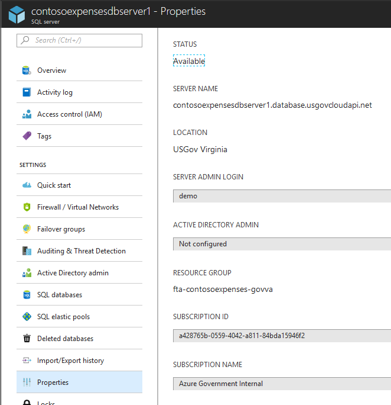

* Navigate back to your **Resource Group**.
* Click on the **App Service name** you deployed, e.g. **ContosoExpensesWeb20170710012420**.
* From the Settings area, click on **Application settings**.
* On the **Connection strings** area, type **ContosoExpensesDataEntities** as the connection string name.

  

* Provide the connection string value in Connection Strings in the portal for the WebApp.
  * Note: Modify the following <\_\_MARKED\_\_> items with your server name, database name and login credentials, used in above steps.
  * Hint: **Copy** the following connection string into **Notepad**, then replace the 4 bolded areas with your information.
  
   ```
    metadata=res://*/Models.ContosoExpensesModel.csdl|res://*/Models.ContosoExpensesModel.ssdl|res://*/Models.ContosoExpensesModel.msl;provider=System.Data.SqlClient;provider connection string="data source=tcp:__YOUR_SQL_SERVER__.database.windows.net;initial catalog=__YOUR_SQL_DB__;Integrated Security=False;User Id=__YOUR_USERNAME__;Password=__YOUR_PASSWORD__;MultipleActiveResultSets=True;App=EntityFramework"
   ```

* **Copy** the new connection string from Notepad into the clipboard.
* **Paste** into the **Value** textbox, alongside of the name **ContosoExpensesDataEntities** entered above.
* Select **Custom**, from the dropdown list.
* Click on **Save**.

    

## Deploy the API app
* From Visual Studio, **right-click** on the Web Project, **Contoso.Expenses.API**.
* Select **Publish** from context menu, to pick a new publish target.

* Click on **Create Profile** from the **Publish dialog**.

* Create a new **Microsoft Azure App Service**, click **Ok**.

* Login into the correct **Subscription** from the dropdown list.

* Set the **API App Name** to any name, e.g. **contosoexpensesapi20170711011807**

* Select the correct **Subscription** from the dropdown list.

* Select the correct **Resource Group** from the dropdown list, e.g. **fta-contosoexpenses-govva**.

* Select the previously created **App Service Plan** from the dropdown list, e.g. **ContosoExpensesWeb20170710012420Plan** from a previous step.

* Click **Create**.

* Once the **App Service Plan** is created, click on **Publish**.

  

  * The output window will give you progress of the deployment.

  
  
  * At the end of the deployment, Visual Studio should automatically launch your default browser to show your published web app.

## Update the App Service Settings
* From the Azure Portal, click on **Resource Groups**.
* Click on **fta-contosoexpenses-govva**.
* Click on the **App Service** you deployed for the API app, e.g. **ContosoExpensesAPI20170711011807**.
* Click on **Overview** and copy the URL to the clipboard.

  

* Go back to the **Resource Group** and now select the **App Service** for the Expense web app, e.g. **ContosoExpensesWeb20170710012420**.
* From the **Settings area**, click on **Application Settings**.
* Under **App settings**, add two new entries in the first and second textboxes.
  * Type **EmployeeName** and **Randy** as the employee name.
  * Type **EmployeeApiUri** and paste in the URL of the API app, e.g. **http://contosoexpensesapi20170711011807.azurewebsites.net**
* Click **Save**.

  

## Create a Storage Account
* From the Azure Portal, click on **Resource Groups**, **fta-contosoexpenses-govva**.
* Click on the **+ Add**, type **Storage** and press **Enter**.
* Click on **Storage Account  - blob, file, table, queue**.
* Click on **Create**.

  

* Type in **contosoexpensesUNIQUEIDsa** (e.g. **contosoexpenses123sa**) for the **Name**. The name of a storage account needs to be globally unique.

* Change **Acount kind** to **StorageV2**.

* Change **Replication** to **Locally-redundant storage (LRS)**.

* Make sure you select the correct **Resource Group** and **Location** as before.

* Leave other fields with default options.
* Click on **Create**.

  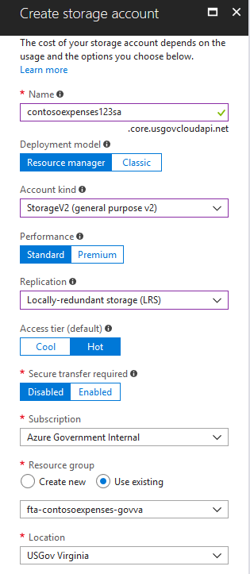

## Update the web app to use the storage account
* From the Azure Portal, click on **Resource Groups**, **fta-contosoexpenses-govva**.
* Click on the **Storage Account** you deployed, e.g. **contosoexpenses123sa**.
* Under **Settings**, click on **Access keys**.

  

* From **Key1**, copy the **Key** to the clipboard, paste into a Notepad.
* From **Key1**, copy the **Connection string** to the clipboard, paste into a Notepad.

  
  
* Open the web application's application settings from the Azure portal.

* Add a new entry called **StorageConnectionString**, then paste the connection string from the clipboard between the quotes. Save the changes to the app service.

## Create an Azure Function

* From Visual Studio, **right-click** on the project, **Contoso.Expenses.Functions**.
* Select **Publish** from context menu, to pick a new publish target.

* Click on **Create Profile** from the **Publish dialog**.

* In the **Pick a publish target** dialog, select **Create New** and click **OK**

* In the **Create App Service** dialog box, enter the following:
  * Unique function App Name, for instance the default function name similar to **FunctionApp20180319040610**
  * Select your subscription
  * Resource Group: Select appropriate existing Resource Group
  * Hosting Plan: Use the same app service plan we have been using.
  * Storage account: Use the storage account created previously.
  
  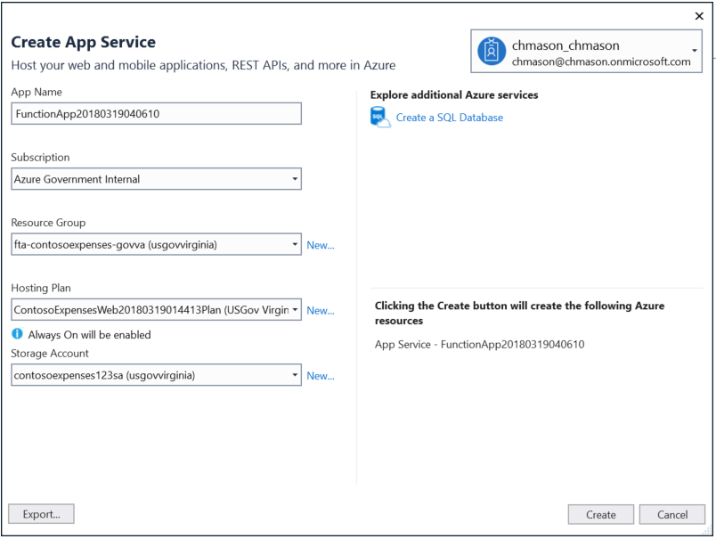  

  * Click **Create**

* Once the **App Service Plan** is created, click on **Publish**.

  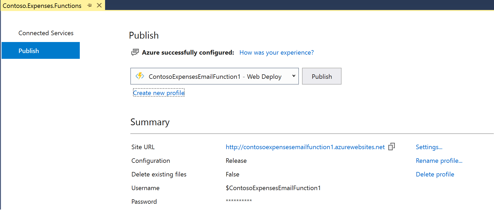

* The output window will give you progress of the deployment. Make sure its successfully published.

* Launch Azure Portal and navigate to **Function Apps**

* Select your function and click on **Application Settings**
  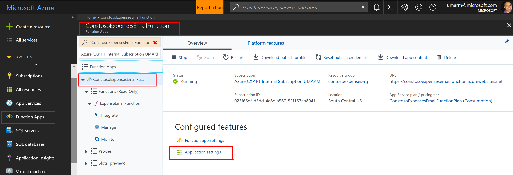

* Under **Applications Settings**, add a key called **StorageConnectionString** and put in storage account connection information.

* Under **Connection strings**, add a new entry and set the name as **SQLConnection** and the value as the ADO.NET connection string we stored earlier.

* Save the changes and restart the function
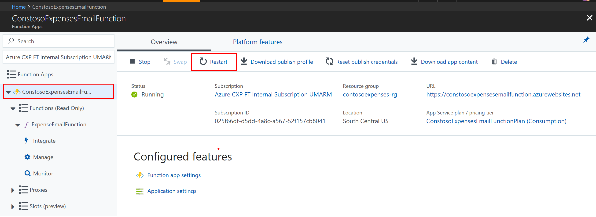

## Testing

* If you have an expense message already sitting in the storage queue, the function will automatically trigger and determine the payment status. Refresh the page on the application and see if a status has changed.

* Alternatively you can also create a new expense by going through the web app. 


* Once you create an expense successfully, if your function is stopped, you can head to the **Storage account** and check the **Queue**, a message will be sitting there. 
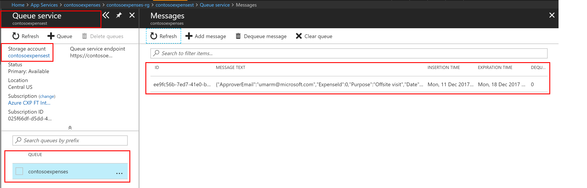


## Review the Contoso.Expenses.API app
* In Visual Studio, select the project **Contoso.Expenses.API**.
* Expand the **Controllers folder**, click on **EmployeeController.cs** file.
  * On line **#35** you will see name **Randy**.
  * Feel free to modify this for your own user name that you have entered in the web app's application settings before.
* Right-click on the project **Contoso.Expenses.API**, select **Publish**.
* Verify the publish profile is the one previously created (e.g. **contosoexpensesapi20170711011807**), and click **Publish**.
* Once published, copy the URL in the output folder and paste it into a browser. e.g. **http://contosoexpensesapi20170711011807.azurewebsites.net**.

## Testing out the API with Swagger
* In the browser, add **/swagger** to the end of the URL, and press enter.
  * e.g. **http://contosoexpensesapi20170711011807.azurewebsites.net/swagger**
  * This will load the Swagger page that will allow you to explore and test your APIs.
* Click on **Employee**, and then click on **GET**.
* Under **Parameters,** type in **Randy** for the **employeeName** parameter and then click **Try it Out!**

  

  * The response body will return **ManagerName** with a response code of 200.

  

## Test out the Website
* From Visual Studio, right-click on the Web Project, **Contoso.Expenses.Web**.
* Select **Publish** from context menu, to pick a new publish target.
* Select the previously used Profile from the Publish dialog and click on **Publish**.
  * This publishes the change to the **Web.config** file to use the correct **StorageConnectionString**.
  * Alternatively, you could update the setting directly in the Azure portal for the web app, under the **Application settings** as before.
* From the Azure Portal, click on **Resource Groups**.
* Click on **fta-contosoexpenses-govva**.
* Click on the **App Service** you deployed, e.g. **ContosoExpensesWeb20170710012420**.
* Click on URL to launch the website. e.g. **http://contosoexpensesweb20170710012420.azurewebsites.net/**.
* From the website, click on **Expenses**.
* Click on **Create New**.

  

* Type in values for a test record and click **Create**.
  
  

## View the Queue from Visual Studio
* From Visual Studio, select the menu item **View** | **Cloud Explorer**.
* Select the correct subscription, and click **Apply**.

  

* Expand the nodes to **Storage Accounts** | YourStorageAccountName (e.g. contosoexpensessa) | **Queues**.
* Right-click on **contosoexpenses** and select **Open Queue Editor**.
  * Note: The email message has been processed and de-queued.

    

## Useful References
* [Visual Studio Team Services, Getting Started](https://www.visualstudio.com/)
* [Visual Studio Team Services, Product Updates](https://www.visualstudio.com/team-services/updates/)
* [Visual Studio Team Services, Support](https://www.visualstudio.com/team-services/support/)
