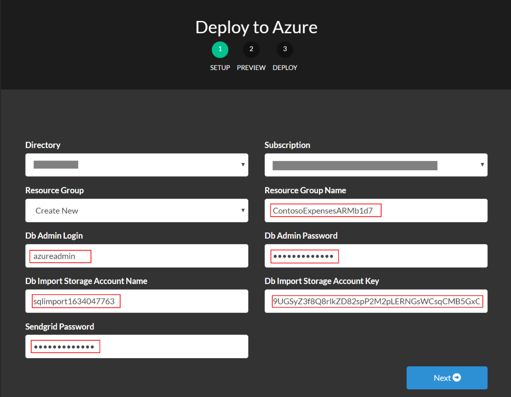
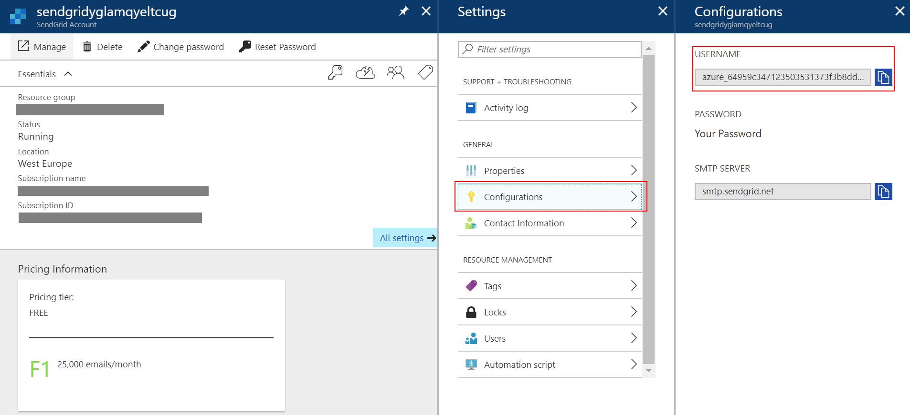
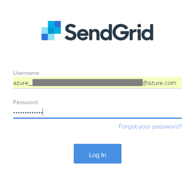
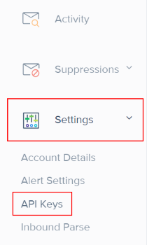
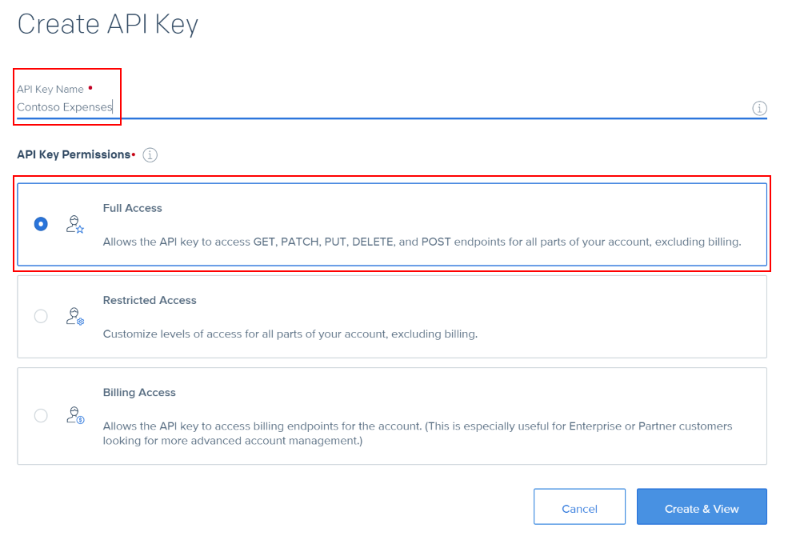
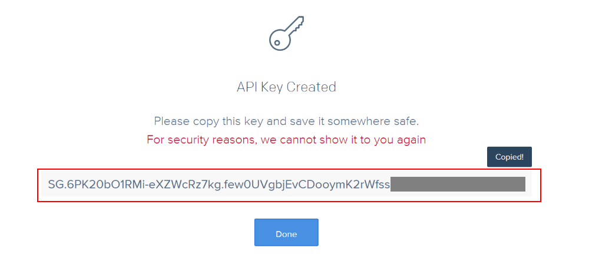
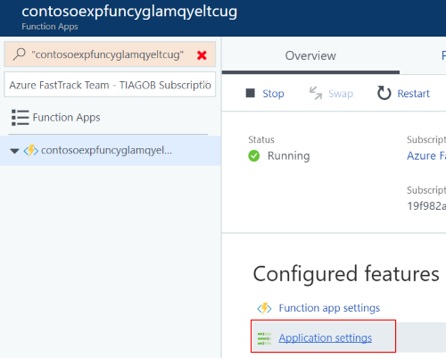
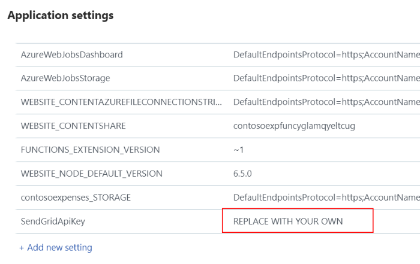

# Deploy ContosoExpenses using ARM template
The purpose of this template is to deploy the complete Contoso Expenses aplication to Azure App Services. The following resources will be deployed.
* 2 Web Applications (Web and API)
* 1 Function App
* 2 Storage Accounts
* 1 SQL Database
* 1 SendGrid Email 

> NOTE: You can find the detailed architecture design [here](https://github.com/Azure/fta-internalbusinessapps/blob/master/appmodernization/app-service/articles/media/app-service/appmod-pic-poc-visio.png).

This template uses GitHub integration to deploy to the Azure WebApps and Azure Function. It will also restore the database using a _.bacpac_ file.

> NOTE: If you wish to go through the step-by-step guide go [here](https://github.com/Azure/fta-internalbusinessapps/blob/master/appmodernization/app-service/articles/app-service.md) instead.

# Steps to deploy
1. [Run requirements script](#run-requirements-script)
2. [Deploy the template](#deploy-the-template)
3. [Configure SendGrid](#configure-sendgrid)


## Run requirements script
1. Clone the [Repository].(https://github.com/Azure/fta-internalbusinessapps)
2. Navigate to **/appmodernization/app-service/src/Contoso.Expenses.ARM/pre-reqs** folder.

    This folder contains a PowerShell script that you need to run in order to copy the database to a storage account in your subcription.

3. **Run the script and make sure to copy the output** somewhere since it will be used in the template deployment phase.

````POWERSHELL
C:\..\ContosoExpensesARM\pre-reqs> .\Create-Storage-Account-And-Copy-DB.ps1

Successfully Signed-in
Created resource group
Created storage account
Created storage container
Successfully uploaded .bacpac to storage account

 ----                  OUTPUT                  
 - RESOURCE GROUP NAME: ContosoExpensesARM12345671
 - STORAGE ACCOUNT NAME: sqlimport4516281
 - STORAGE ACCOUNT KEY: sZ+1FFaHRvoHJYsSlvv1T3F3OIetCPWY8LiGLM0hjmwfJWPke5LHz5d2vHc5Q9EOPRmeXp+4AADVAUq5UG7HKkWA==
 - KEEP THIS INFORMATION AS IT WILL BE REQUIRED FOR DEPLOYING -
````


## Deploy the template
To deploy the ARM template click the **_Deploy to Azure_** button below. Fill in the required fields.

> Make sure the information copied previously is used in this deployment phase for the **Resource Group Name**, **Db Import Storage Account Name** and **Db Import Storage Account Key**. **DB Admin Login**, **DB Admin Password** and **Sendgrid Password** should be defined here.

<a href="https://azuredeploy.net/?repository=https://github.com/Azure/fta-internalbusinessapps/tree/master/appmodernization/app-service/src/Contoso.Expenses.ARM" target="_blank">
    
</a>



After the deployment is complete, make sure you have the following resources:


## Configure SendGrid
After deploying the template successfuly the SendGrid resource is already deployed in Azure but we need to generate an API Key and add it to the Azure Function Settings.

1. Go to the [Azure Portal](https://portal.azure.com) and navigate to your SendGrid resource.
2. Go to _Configurations_ and **copy the username** that was automatically created.



2. Go to [http://app.sendgrid.com/](http://app.sendgrid.com/) and log in using the username copied just now and the password created during the template deployment step.



3. **Expand the Settings tab** on the left menu and click **API Keys**.



4. Click **Create API Key**.
5. Fill in the name of the key and select **Full Access** for the type of key.



6. **Copy the API Key** that was generated by SendGrid.
> Make sure you save the API Key somewhere as this is the only time you will be able to see it.



7. Go to the [Azure Portal](https://portal.azure.com) once again and navigate to your Azure Function.

8. Open your Azure Function and click **Application Settings**.



9. Update the **SendGridApiKey** with the value you copied from the SendGrid portal and **Save** at the top.




That's it, you are ready to start!
