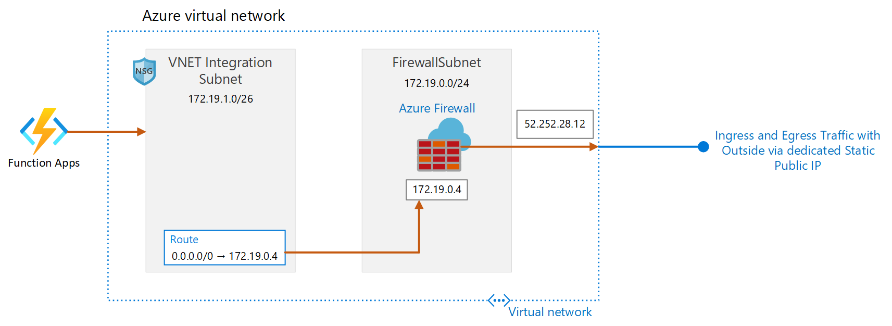

# Abstract

Demonstrate how to assign a dedicated static out bound IP to a Function App hosted on Standard or Premimium App Service Plan and assign one dedicated static IP. At the moment this 
can done only when a Function App is delployed/hosted on an ASE. This is on the roadmap to be made avaialble as a feature in the Premimium Plan. Rapid scale out is often of importance to customers 
when hosting their Functions and at the moment on ASE V2, scaling out can take up to 45 minutes, which become a blocker for many customers. 
Thus they want to use App Service Plan instead. 

With App Services Plan, Function Apps or Web Apps get a list of possible outbound IP addresses. If they want external systems to consume their functions, they need to share the list of outbound IPs assigned.
At the moment, there is not a way to have just one dedicated static IP. Also, it should be noted that everytime a change in App Service Plan occurs from scale up and down perpsective,
the list of outbound IPs assigned changes.

If custoerms want to expose with security in place their Function Apps to other 3rd Party Vendors to consume, the third party consumers often require a single dedicated static IP,
that can be shared with them for them to whitelist. 

This pattern created below solves for this use case.



## Create an HTTP Trigger Function
- Create an HTTP Triggger C# function with a nmae of your liking.
- Use an App Service Hosting Plan SKU or Standard or Premimium, both support VNET integration. You may use Standard plan for this set up, as it is cheaper.
- Replace the out of the box code for the HTTP Trigger with the folowing code.

```` C#
#r "Newtonsoft.Json"
#r "System.Text.Json"
using System.Net;
using Microsoft.AspNetCore.Mvc;
using Microsoft.Extensions.Primitives;
using Newtonsoft.Json;
using System.Collections.Generic;
using System.Net.Http;
using System.Net.Http.Headers;
using System.Text.Json;
using System.Threading.Tasks;
using System.Globalization;
using System.Text.Json.Serialization;
//using System.Exception;
public class Repository
{
[JsonPropertyName("name")]
public string Name { get; set; }
[JsonPropertyName("description")]
public string Description { get; set; }
[JsonPropertyName("html_url")]
public Uri GitHubHomeUrl { get; set; }
[JsonPropertyName("homepage")]
public Uri Homepage { get; set; }
[JsonPropertyName("watchers")]
public int Watchers { get; set; }
[JsonPropertyName("pushed_at")]
public string JsonDate { get; set; }
public DateTime LastPush =>
DateTime.ParseExact(JsonDate, "yyyy-MM-ddTHH:mm:ssZ", CultureInfo.InvariantCulture);
}
public static async Task<IActionResult> Run(HttpRequest req, ILogger log)
{ 
log.LogInformation("C# HTTP trigger function processed a request.");
string name = req.Query["name"];
string requestBody = await new StreamReader(req.Body).ReadToEndAsync();
dynamic data = JsonConvert.DeserializeObject(requestBody);
name = name ?? data?.name;
string responseMessage = string.IsNullOrEmpty(name)
? "This HTTP triggered function executed successfully. Pass a name in the query string or in the request body for a personalized response."
: $"Hello, {name}. This HTTP triggered function executed successfully.";
// Testing this...disregard for demo
// ReadTextFile();
log.LogInformation("Performing ProcessRepositories code section...");
var repositories = await ProcessRepositories();
foreach (var repo in repositories)
{
if (repo == null)
{
continue;
}
log.LogInformation($"Repo Name: {repo.Name}");
log.LogInformation($"Repo Description: {repo.Description}");
}
return new OkObjectResult(responseMessage);
}
// Ref URL: https://github.com/dotnet/samples/blob/master/csharp/getting-started/console-webapiclient/Program.cs
private static async Task<List<Repository>> ProcessRepositories()
{
var client = new HttpClient();
client.DefaultRequestHeaders.Accept.Clear();
client.DefaultRequestHeaders.Accept.Add( new MediaTypeWithQualityHeaderValue("application/vnd.github.v3+json") );
client.DefaultRequestHeaders.Add("User-Agent", ".NET Foundation Repository Reporter");
var streamTask = client.GetStreamAsync("https://api.github.com/orgs/dotnet/repos");
var repositories = await System.Text.Json.JsonSerializer.DeserializeAsync<List<Repository>>(await streamTask);
return repositories;
}
// Ref URL - https://docs.microsoft.com/en-us/dotnet/csharp/programming-guide/file-system/how-to-read-from-a-text-file
private void ReadTextFile(ILogger log)
{
try
{
// Example #1
// Read the file as one string.
string text = System.IO.File.ReadAllText(@"\\10.10.2.5\test\testfile.txt");
// Display the file contents to the console. Variable text is a string.
log.LogInformation("Contents of WriteText.txt = {0}", text);
}
catch(Exception ex)
{
log.LogInformation("Exception = {0}", ex.Message);
}
}

````
 - Run the HTTP Trigger and see the Function run successfully

## Configure Function's Application Setting
- Create a Config Variable **WEBSITE_VNET_ROUTE_ALL** in Application settings for the function and set the value to **1**.


## Create a VNET and required subnets


- Ensure a subnet **AzureFirewallSubnet** is created, dedicated for the Azure Firewall.
- In the subnet for VNET integratin, set the **Delegate subnet to a service** to **Microsoft.Web/serverFarms**

## Create Simple NSG

- Create an out of the box NSG rule and associate that to the VNET Integration Subnet


## Create an Azure Firewall
- Using the **AzureFirewallSubnet** subnet, create an Azure Firewall. Once provisioned, note down the **Firewall private IP**


- Click on the public IP name listed under **Firewall public IP** and note down the **Firewall public IP**, in this case **52.252.28.12**. The name is provided during Azure Firewall creation. 


- Click on Rules under Settings for the Firewall. Navigate to Application Rules and create an application rule collection as below. **Note:** to test the scenario, rule Action will be set to **Deny** or **Allow**. 


- Set the values as shown above
   - Set the target FQDN to **api.github.com**
   - Protocol:Port **Https:443**
   - Set the source to the CIDR of the subnet for VNET integration, this is the easiest way. Alternatively, you may set the source to the IP assigned by the VNET integration subnet to the function app. This can be done by enabling the logs and seeing the details for the logs for AzureFirewall, the assigned IP address is listed. 

## Create Route Table


- Create a route such that the next hop is for the **private IP** of the virtual appliacnce, in this case the private IP of the Azure Firewall


## Test the scenario
- Set the application rule to Deny, and run the Azure Function. You will see the Function will respond with an error in the output window. This is because the Firewall is blocking the traffic via the outbound public static IP.

- Now set the Application Rule in the Azurefirewall to Allow and run the Azure Function. The call is now successful, retrieving the GitHub repositories per the logic in the HTTP Trigger function, this is viewable in the output window. 

- The public static outbound IP address is **Firewall public IP**, in this case **52.252.28.12**. This is the IP to be shared with the Vendors or 3rd Party Software providers such that it can be whitelisted and calls can be made to the function via this public static IP.
