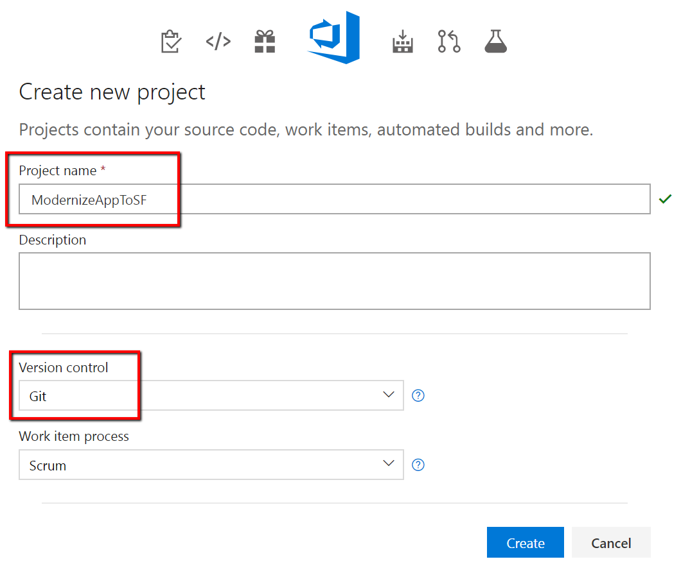
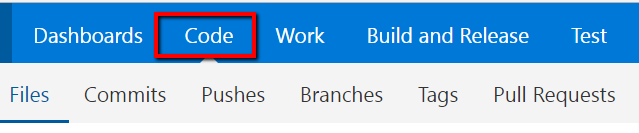
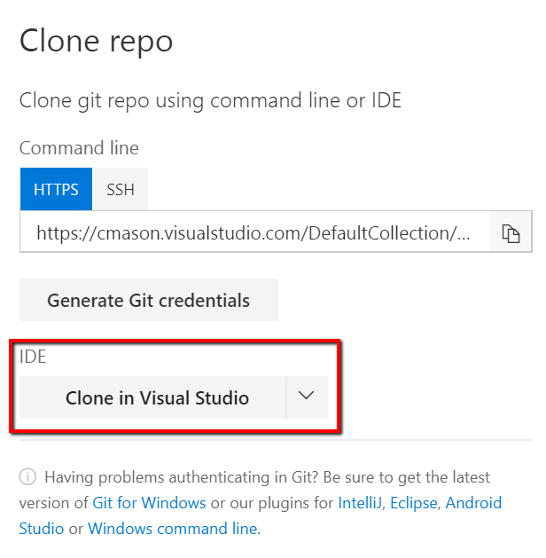
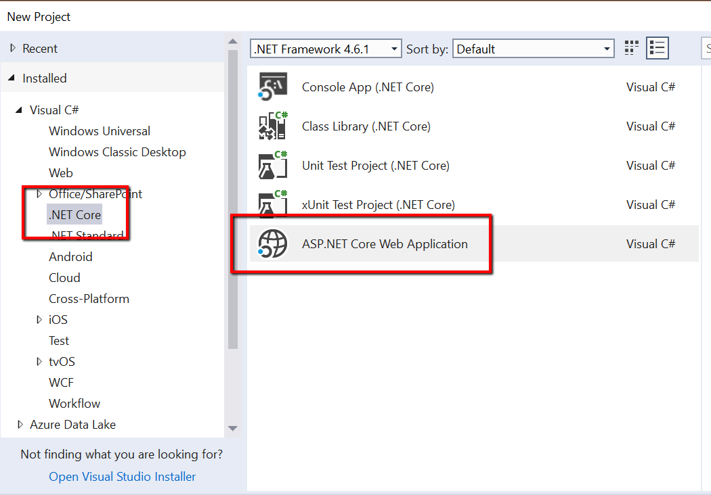
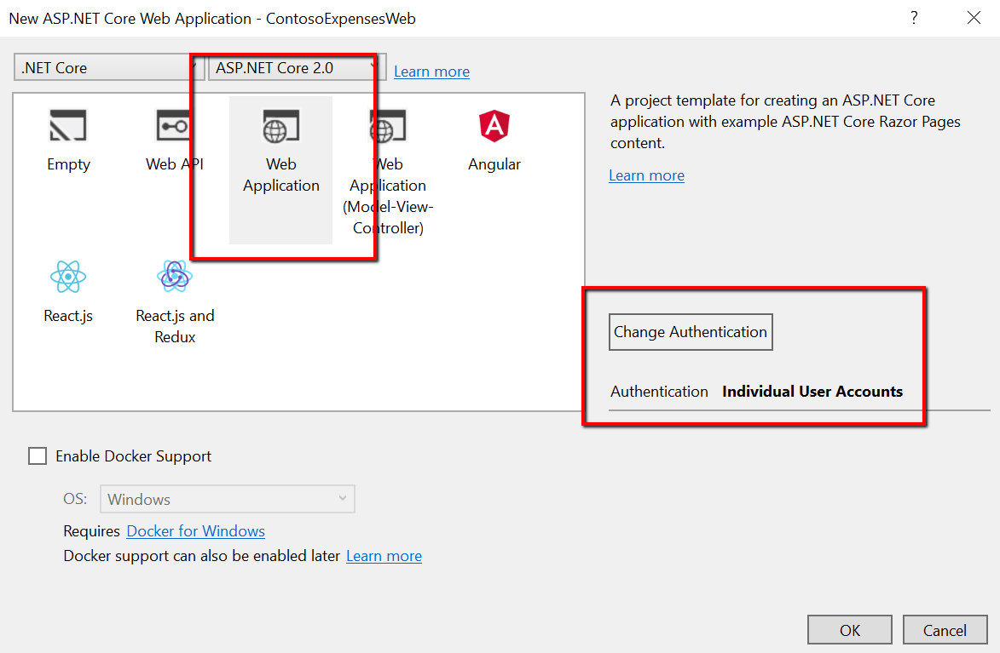
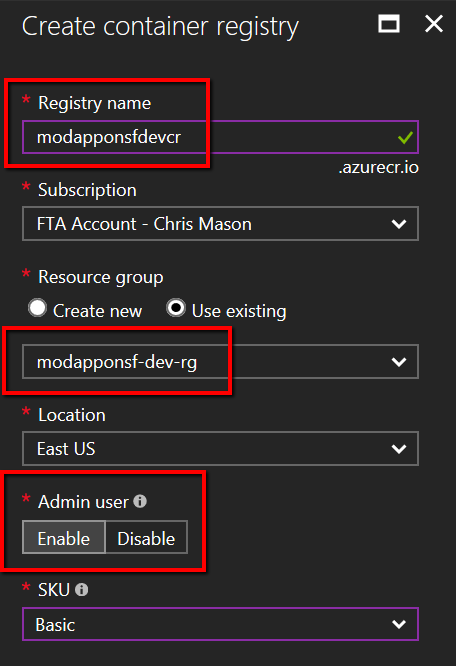
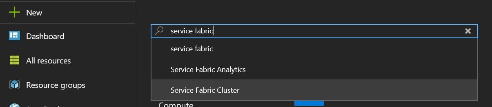
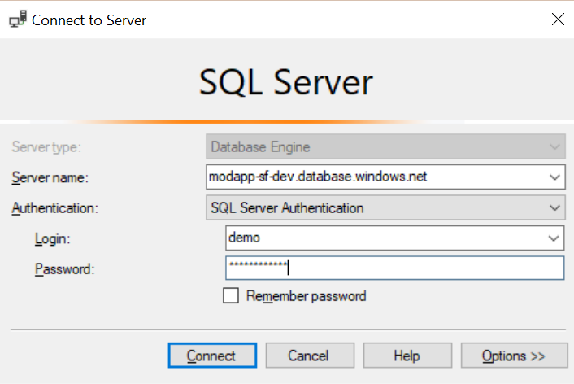
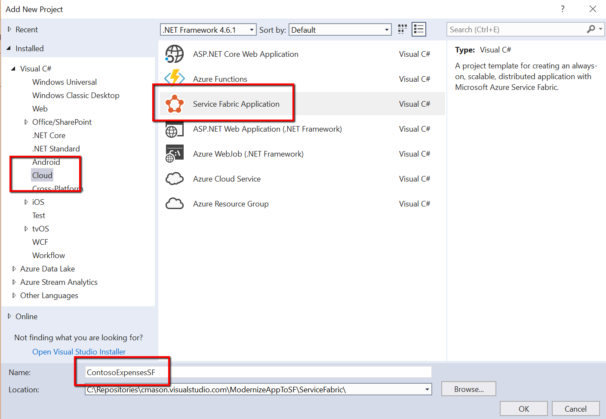

# POC Scenario Contoso Expenses: Modernizing an Application to Windows Containers on Service Fabric

* [Introduction](#introduction)
* [Learning Objectives](#learning-objectives)
* [Prerequisites](#prerequisites)
* [Create a Team Project and Repository](#create-a-team-project-and-initial-code)
* [Configure Container Register](#configure-container-registry)
* [Create Service Fabric Cluster](#create-service-fabric-cluster)
* [Create a SQL Azure database](#create-a-sql-azure-database)
* [Containerize the Application](#containerize-the-application)
* [Create Service Fabric Solution](#create-service-fabric-solution)

## Introduction
The goal of this POC is to walkthrough the process you would follow when it comes to migrating an existing application running on-premise to run in a Service Fabric cluster. You will start by creating a new .NET Core application, converting it to a containerized instance, deploying it to a registry, and then running the application within Service Fabric.

## Learning Objectives
After completing this exercise, you will be able to:
* Create a container registry and Service Fabric cluster in Azure
* Wrap an existing application into a container
* Use Visual Studio to publish your app to a container registry
* Configure Service Fabric to use your container

## Prerequisites
To complete this POC, you will need
* You must have access and be able to deploy into a Microsoft Azure Subscription
* Visual Studio 2017
* [.NET Core 2.0 SDK](https://www.microsoft.com/net/download/core)
* [Docker for Windows](https://www.docker.com/docker-windows)
* You should have access to a Visual Studio Team Services Account. In particular, you should have access to a Team Project, where you can commit code, create and maintain Build / Release Definitions Find more information about [creating a VSTS account](https://docs.microsoft.com/en-us/vsts/accounts/create-account-msa-or-work-student)
* You will need the [Service Fabric SDK](http://www.microsoft.com/web/handlers/webpi.ashx?command=getinstallerredirect&appid=MicrosoftAzure-ServiceFabric-CoreSDK) installed
  > Note: In order for Visual Studio to be able to deploy to your local cluster, you will need to run the following from an elevated command prompt:
  > ```
  > powershell Set-ExecutionPolicy -ExecutionPolicy Unrestricted -Force -Scope CurrentUser
  > ```
* [SQL Server Management Studio](https://docs.microsoft.com/en-us/sql/ssms/download-sql-server-management-studio-ssms)

## Create a Team Project and Initial Code
1. From the VSTS portal, click **New Project**

    

2. Give it a project name and make sure *Version Control* is set to **Git**, then click **Create**.

    
    
3. On the welcome page, click on the down arrow to initialize the Git repository with a gitignore file and set the gitignore type to VisualStudio. Click **Initialize**.

    
    
4. Click the **Code** hub at the top of the page and then click **Clone** at the top right.

    
    
    
5. In the *Clone repo* dialog, click **Clone in Visual Studio**

    
    
6. Complete the clone dialog in Visual Studio and click **Clone**.
7. In Visual Studio, click **File** -> **New Project** and select **ASP.NET Core Web Application**.

    
    
8. Give a name for your project e.g. *ContosoExpensesWeb* and set the location to be the folder you cloned your repository to. Click **Ok**.
9. In the project template dialog, select **Web Application**, and then click **Change Authentication** and select **Individual User Accounts** and then click **Ok** and then **Ok** again.

    
    
10. Build and run your application to make sure everything is ready to go.
    > Note: Make sure you try creating an account as well to verify the identity pieces are working.

## Configure Container Registry
We will need a place to store the containers that we are creating for this application. For this example we will be creating an Azure Container Registry.

1. Log into the [Azure portal](https://portal.azure.com).
2. Create a new resource and search the marketplace for **Azure Container** and select **Azure Container Registry**.

    

3. Give the registry a name and assign it to a resource group. Click **Create**.

    

## Create Service Fabric Cluster
In order to run the application now, we will need to create a cluster to deploy to.

1. In the Azure portal, click **New**, search for **Service Fabric**, and then select **Service Fabric Cluster**. Click **Create**.

    
2. On the *Basics* blade, fill in the appropriate information for the cluster and assign it to the resource group we have already created. Click **Ok**.
    > Note: Make sure for *Operating system*, you choose **WindowsServer 2016-Datacenter- with-Containers**

    
3. On the *Cluster configuration* blade, leave **Node type** as 1, then click to configure the node type. Provide the following details:
    * **Node type name** - BaseNode
    * **Durability tier** - Bronze
    * **Virtual machine size** - Standard_D1_v2
    * **Single node cluster** - Select check box
    * **Custom endpoints** - 80,8080
    * **Enable reverse proxy** - Select check box
    
    Click **Ok** then **Ok** again.
4. On the *Security* blade, select **Unsecure** and then click **Ok**.
5. On the *Summary* blade, click **Create**.
    > Note: This will take several minutes and even once the creation of the cluster is complete, it will still need a few more minutes to perform some internal updates.

## Create a SQL Azure database
When we deploy the application to Azure, we will want our existing database to be moved over as well. There are a number of ways to approach this problem and we are going to take a simplistic approach here which will use SSMS to export our database directly to SQL Azure.

1. In the Azure Portal, click **New**, search for **SQL Server** and then select **SQL Server (logical server)**. Click **Create**.

    

2. Fill out the details for the server and click **Create**.
3. Once the server is created, we will need to allow for your local computer to access it. In the SQL server settings blade in the portal, go to the **Firewall** settings and then click **Add Client IP**. Click **Save**.

    
4. In SQL Server Management Studio, connect to your local database that was used when testing the application earlier.
5. In the *Object Explorer*, expand **Databases**, right-click on the database that was created, select **Tasks** and then **Deploy Database to Microsoft Azure SQL Database**. Click **Next** on the *Introduction* page.
6. On the *Deployment Settings* page, click **Connect** and fill in the details for the server you just created.

    
7. Give the database the name that it will have in SQL Azure and then click **Next**.
8. On the *Summary* page, click **Finish** and the database will begin migrating to SQL Azure. Once it is done, click **Close**.
9. In the Azure portal, navigate to the database that was just created and in the settings, grab the current connection string and save for later.

## Containerize the Application
The application as it exists today would be considered a traditional "monolithic" application. We now need to containerize the application so it can work on Docker. With the Docker Tools for Windows, we can do some basic Docker scaffolding of our project.

1. In Visual Studio, right click the project, click **Add** and then **Docker Support**. Select **Windows** for the Target OS and then click **Ok**.
2. Visual Studio will create a Dockerfile for the application along with a docker-compose file.
    > Note: Attempting to run the application again will not currently work because the application will not be able to connect to the SQL instance running on *localhost*.
3. In Visual Studio, Right-click the web application and click **Publish**. In the publish dialog, select **Container Registry** and then **Select Existing Container Registry**. Click **Publish** and fill out the connection information to your subscription and container registry created in the previous step. Click **Ok**.

    


    

## Create Service Fabric Solution
We will now create a Service Fabric project for our solution and configure it to pull the Docker image we just published.

1. In Visual Studio, right-click the solution and click **Add** and then **New Project**. Choose **Service Fabric Application**, give it an appropriate name and click **Ok**.

    

2. In the *New Service Fabric Service* dialog, give the image name based on your full container registry: e.g. *modapponsfdevcr.azurecr.io/contosoexpensesweb:20171030081652*. Provide a service name of **ContosoExpensesWeb**. Click **Ok**.

    

3. In the *ServiceManifest.xml* file under *ContosoExpensesWebPkg*, edit the endpoint called *ContosoExpensesWebTypeEndpoint*.
    ```xml
    <Endpoint Name="ContosoExpensesWebTypeEndpoint" UriScheme="http" Port="8080" Protocol="http" />
    ```
4. In the *EnvironmentVariables* section, add the following using the connection string you saved earlier.
    ```xml
    <EnvironmentVariables>
      <EnvironmentVariable Name="ConnectionStrings__DefaultConnection" Value="Server=tcp:modapp-sf-dev.database.windows.net,1433;Initial Catalog=ContosoExpenses;Persist Security Info=False;User ID=__YOUR_USERID__;Password=__YOUR_PASSWORD__;MultipleActiveResultSets=False;Encrypt=True;TrustServerCertificate=False;Connection Timeout=30;"/>
    </EnvironmentVariables>
    ```
    > Note: Make sure you update the server, user id, and password for your database.
4. In the *ApplicationManifest.xml* file make the following changes:
    * Edit the *ServiceManfiestImport* block to add the following element:
        ```xml
        <Policies>
            <ContainerHostPolicies CodePackageRef="Code">
                <RepositoryCredentials AccountName="modapponsfdevcr" Password="__YOUR_PASSWORD__" PasswordEncrypted="false"/>
                <PortBinding ContainerPort="80" EndpointRef="ContosoExpensesWebTypeEndpoint"/>
            </ContainerHostPolicies>
        </Policies>
        ```
        > Note: The password you use here comes from password listed in the *Access Keys* section of the Azure Container Registry.
    
    
5. Right-click the Service Fabric project in Visual Studio and select **Publish**.
6. In the *Publish Service Fabric Application* dialog, select the Service Fabric instance you created earlier and then click **Publish**.

    
7. Once the publish is complete, you can check the status of the deploying in the Service Fabric explorer (e.g. [http://modapponsf-dev-sf.eastus.cloudapp.azure.com:19080/Explorer/index.html#/](http://modapponsf-dev-sf.eastus.cloudapp.azure.com:19080/Explorer/index.html#/)).
8. When the application is deployed you should be able to navigate to your URL (e.g. [modapponsf-dev-sf.eastus.cloudapp.azure.com:8080/](modapponsf-dev-sf.eastus.cloudapp.azure.com:8080/))