# Cross Component Correlation Playground

The Cross Component Correlation Playground is a setup which allows for testing a variety of distributed tracing scenarios across a number of components in Azure, amongst which:

- Functions
- Logic Apps
- Azure Service Bus
- Event Grid

It does so by providing real working examples and associated instructions for a number of distributed tracing scenarios.

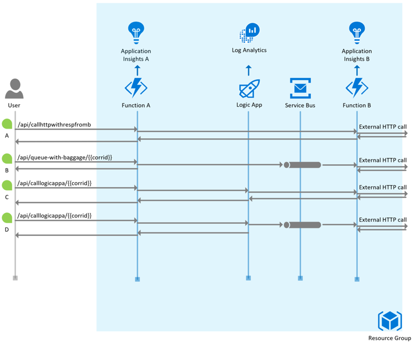

## Scenarios

### **Scenario A: Function A calling Function B over HTTP**

Use either Function App A, or B with an HTTP invocation. The body of the function method then makes a GET call to an external url. 

> In the correlation playground setup by the ARM template this external url is a Azure Container Instance hosting a version of [`anyproxy`](https://github.com/alibaba/anyproxy) which serves as a proxy returning a static HTTP 200 response while logging the request.  This allows us to observe the additional HTTP headers added for the purposes of correlation, by the App Insights SDK, to the outgoing HTTP call from the Azure function.
> In order to observe the call being made towards anyproxy, find the ip address for the ACI instance (Example: `51.124.59.80`) and visit it on port `8002`, like this: `http://51.124.59.80:8002`.  
> Any requests that have been made on port `8080` will have been logged and visible on this admin page.
>
> **WARNING: This is for demonstration / convenience purposes ONLY, in the context of this playground setup!  Do not use this in production.**

The interesting properties that appear as headers on the outbound HTTP call from Function A to Function B are:

| Header                   | Value                                                       | Comment                                          |
| ------------             | -----------------------------------                         | ------------------------------------             |
| **TraceParent**          | **00-82f645b4d9b3884dba25016062a4652b-5ff3aa304adc3449-00** | is the new W3C trace context                     |
| **Request-Id**           | **\|82f645b4d9b3884dba25016062a4652b.5ff3aa304adc3449.**    | is the older "request-id" mechanism              |
| **Request-Context**      | **appId=cid-v1:6b06625e-3d1f-4bb4-8b50-b22b20b5a6d6**       | represents the app id for App Insights A         |
| X-Request-Id             | c39043fc-5693-4ca6-ba3c-56cf059acbad                        | NOT important to the discussion - IGNORE THIS    |

> Note: `X-Request-Id` is an older concept, originally intended to flow custom correlation id between client and server for HTTP calls.  It is not important to the discussion here.  Please ignore.
>
> An Application Id value is also returned in the response header `Request-Context` to caller.  None of this is unique to Azure Functions.
> Because this value is obtained (non blocking) by the runtime, note that the first few calls may not return it.
> Ref https://github.com/microsoft/ApplicationInsights-dotnet-server/issues/504

... and what we see on App Insights is two telemetry items for Function A: 

- one for the Request and 
- one for the Dependency being called within the request

Callers Request telemetry item (which we find back in App Insights A):

| Property                 | Value                                                   |  Comments
| ------------             | -----------------------------------                     | -----------------
| **Operation Id**         | **82f645b4d9b3884dba25016062a4652b**                    |
| Parent Id                | 82f645b4d9b3884dba25016062a4652b                        | ParentId is same as OperationId for root activity
| Request Id               | **e47cce764c811a41**                                    | Unique identifier for this request

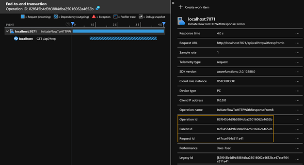

Callers Dependency telemetry item (which we find back in App Insights A):

| Property                 | Value                                                    |
| ------------             | -----------------------------------                      |
| Operation Id             | 82f645b4d9b3884dba25016062a4652b                         |
| **Parent Id**            | **e47cce764c811a41**                                     | ParentId is same as Request Id of the req telemetry item
| **Dependency Id**        | **5ff3aa304adc3449**                                     | Unique identifier for this outbound dependency

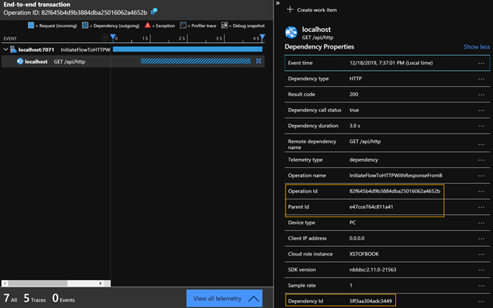

In addition there will be telemtry emmited by the receiver of this HTTP call:

Receiver Request telemetry item (which we find back in App Insights B):

| Property                 | Value                                                   |  Comments
| ------------             | -----------------------------------                     | -----------------
| Operation Id             | 82f645b4d9b3884dba25016062a4652b                        |
| **Parent Id**            | **5ff3aa304adc3449**                                    | Parent Id is same as Dependency Id for dependency telemetry item in App Insights A
| **Request Id**           | **a812130c075b7646**                                    | Unique identifier for this request

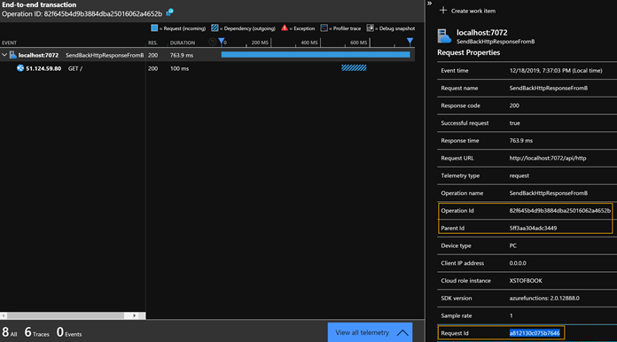

Receiver Dependency telemetry item (which we find back in App Insights B):

| Property                 | Value                                                    |
| ------------             | -----------------------------------                      |
| Operation Id             | 82f645b4d9b3884dba25016062a4652b                         |
| **Parent Id**            | **a812130c075b7646**                                     | ParentId is same as Request Id of the req telemetry item
| **Dependency Id**        | **53967077806ccc4f**                                     | Unique identifier for this outbound dependency

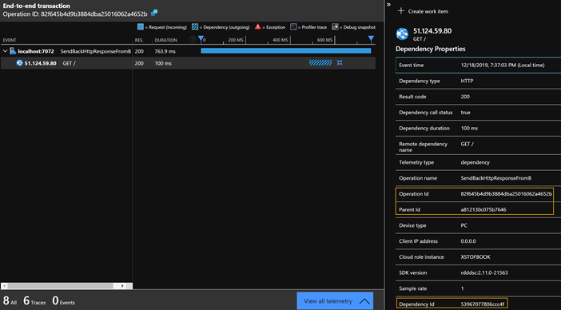

#### **How this works**

This means that the dependency telemetry item's `Dependency Id` is set on the outbound HTTP call's `TraceParent` and `Request Id` so it can be picked up by the receiver and set as its parent.  In addition to this parent/child relation, the identifier for the caller's App Insights resource (**appId**) is passed back in the HTTP response `Request-Context` header.  This is to enable cross-workspace discovery to power tooling with like the App Insights App Map experience.

> Note This mechanism for flowing App Insights Resource information (AppId) only works for solicit response calls (e.g. HTTP) and will not work for calls which have Service Bus, or Event Grid in between to de-couple. 
> Additional App Insights work will land somewhere around Q1CY20 to address this.  So please consider this an implementation detail which is bound to change.

#### How to run this scenario yourself

Please go into folder `./scenarios/scenario-a-function-a-to-function-b-over-http.http` and using the VS Code `REST Client` extension, run the scenario by clicking `Send Request`.

### **Scenario B1: Function A calling Function B over Azure Service Bus**

`Function A` enqueues a message to `Azure Service Bus`, which in turn gets picked up by `Function B`.

> Note: We have intentionally added an additional App Insights Resource for Function B to send its telemetry to. Today the App Insights view would be clearer if our multiple components sent to the same instrumentation-key (Resource) but some customers would see Service Bus as a logical boundary between different parts of an application (for example) so it's perfectly common for customers to use more than one Application Insights Resource across a distributed systems architecture.
Today this is not well supported in App Insight - [as documented here](https://docs.microsoft.com/en-us/azure/azure-monitor/app/custom-operations-tracking#queue-instrumentation). Work should land by Q1CY20 to ensure that App Insights can more easily detect where related Telemetry spans more than one App Insights Resource.

Similar to scenario A, we'll see both a:

- request telemetry for Function A
- dependency telemetry for Function A

Request telemetry for the function submitting the msg onto the queue:

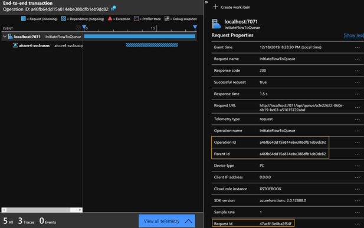

Dependency telemetry for the function submitting the msg onto the queue:

Dependency telemetry for the function submitting the msg onto the queue:

Note how:

- the parent id on the dependency telemetry item is the same as the request id on the request telemetry item
- the operation id is the same on the service bus message, the request telemetry item and the dependency telemetry item
- the dependency id is the same on the service bus message and the dependency telemetry item

When Function B picks up the message from Azure Service Bus, it in turn will generate telemetry on App Insights B.

Request telemetry for the function picking up the message:

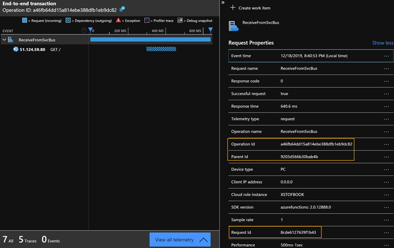

Dependency telemetry for the function picking up the message:

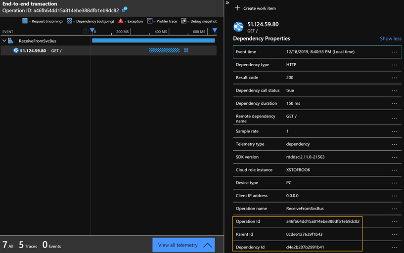

Note how the receiving function:

- has its parent id on the request telemetry item equal to the dependency id of the calling function's dependency telemetry item
- has its operation id the same as the calling function's operation id

#### How this works

The message when it enters the queue will have metadata stamped on top of it, like this:

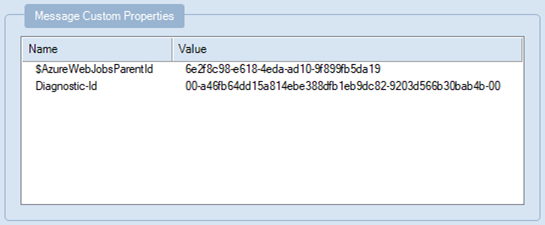

As you can see, the `Diagnostic-Id` is the Service Bus equivalent of the `traceparent` header which is used with HTTP calls.  It allows the Service Bus SDK to flow the correlation context (`Operation Id` and `Dependency Id` of the caller) onto whoever will be receiving this message.

For more information on how Azure Service Bus supports distributed correlation, [please see here](https://docs.microsoft.com/en-us/azure/service-bus-messaging/service-bus-end-to-end-tracing).

#### How to run this scenario yourself

Please go into folder `./scenarios/scenario-b-function-a-to-function-b-over-svcbus.http` and using the VS Code `REST Client` extension, run the scenario by clicking `Send Request` on the first POST item.

### Stamping custom metadata on telemetry items (.NET Core)

Before moving on to scenario 2b, this section explains in more detail how custom metadata can be flown through the telemetry using .NET Core.

#### Introducing the Activity Framework
.NET Core features a very consistent way to model how logical "activities" call each other in sequential and hierarchical ways.  By means of the [`System.Diagnostics.Activity`](https://docs.microsoft.com/en-us/dotnet/api/system.diagnostics.activity?view=netcore-3.1) framework .NET code keeps track of the currently executing activity.  The currently executing `Activity` can be accessed through `Activity.Current` and provides the logging framework with the context required to log information with all the metadata which one would expect:
- an activity has a unique identifier
- an activity knows about it's parent activity
- an activity knows when it was started, stopped and what its duration was
- an activity can keep track on context needed for logging ([`Tags`](https://docs.microsoft.com/en-us/dotnet/api/system.diagnostics.activity.tags?view=netcore-3.1#System_Diagnostics_Activity_Tags))
- an activity knows about context which should be propagated onto external dependencies ([`Baggage`](https://docs.microsoft.com/en-us/dotnet/api/system.diagnostics.activity.addbaggage?view=netcore-3.1#System_Diagnostics_Activity_AddBaggage_System_String_System_String_))

For more guidance on how to use the `Activity` framework, please see the [Activity User Guide](https://github.com/dotnet/corefx/blob/master/src/System.Diagnostics.DiagnosticSource/src/ActivityUserGuide.md)

#### TODO: enrich content on Activity Framework with Diagnostic Listeners

#### TODO: when to use TelemetryInitializer vs System.Diagnostics.Activity

### **Scenario B2: revisiting scenario 2 and adding custom metadata to the telemetry**

`Function A` enqueues a message to `Azure Service Bus`, which in turn gets picked up by `Function B`.  In the process we'll be adding a custom correlation identifier which gets stamped on all telemetry.

Building onto the previous sample, now we will be using a `SubmissionId` when we call into Function A.  (This is an identifier passed as a parameter on the url when calling Function A.) This `SubmissionId`, which in the sample scenario is a guid, represents an identifier for the function activity. An example might be a shopping-cart-Id for an Azure function that performs stock check availability for an e-commerce application shopping cart.  In general the `SubmissionId` in the sample represents a meaningful identifier to the business upon which telemetry can be filtered upon later in the process.

The function logs the Submission Id, adds it to the payload of the Service Bus Queue Message which will be output and finally tracks it against the Application Insights Request telemetry.  When Function B receives the message, it will see the `SubmissionId` and will record that, just like Function A, as custom properties on on the App Insights telemetry items.

#### Recording custom context on a function invocation's telemetry

Recording custom properties on the telemetry created during a function invocation is as easy as:

~~~cs
using System.Diagnostics;
// ...
Activity currActivity = Activity.Current;
currActivity.AddTag("MySubmissionId", submissionId);
~~~

This records the custom property on the `request` telemetry item in Function A, but NOT on any dependency items generated during the function invocation. (You can verify this by checking that this property does not appear on the dependency telemetry representing the Service Bus Enqueue call).

Any `Tags` added like this within a function translate into custom properties on the request telemetry in App Insights, like this:

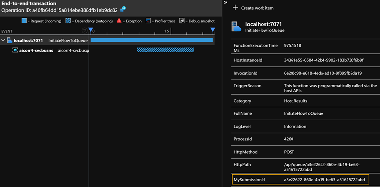

#### Flowing custom context onto downstream dependencies

Improving upon the previous scenario, we also want to make sure to record our `MySubmissionId` as custom context onto any downstream dependencies (and their dependencies in turn).  Within Function A there is code like the below which adds `Baggage` onto the current `Activity`:

~~~cs
Activity currActivity = Activity.Current;

currActivity.AddTag("MyCustomCorrId", submissionId);
currActivity.AddBaggage("MyCustomCorrId", submissionId);
~~~

By adding this baggage, we're indicating that we want to flow this custom context onto any downstream dependencies.  This will reflect within App Insights as `MyCustomCorrId` being stamped as a custom property on any downstream telemetry items in BOTH App Insights A and App Insights B.  For example, have a look at the dependency telemetry item in App Insights B (which represents an external HTTP dependency which Function B is calling after receiving the Service Bus message):

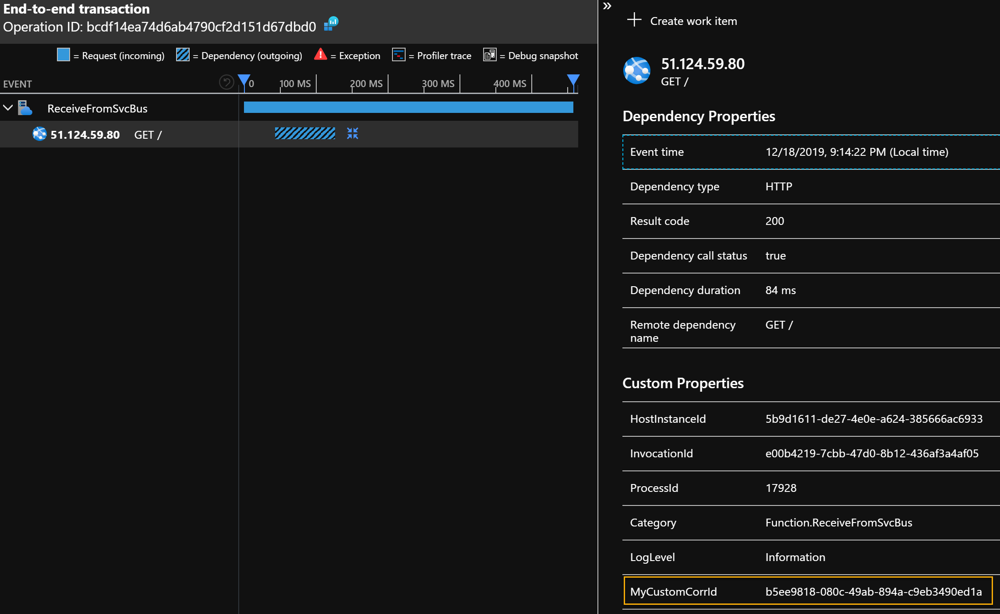

Note how our `MyCustomCorrId` is stamped even on that dependency item (while there is _no code within Function B to add this context context explicitly_.)

#### How to run this scenario yourself

Please go into folder `./scenarios/scenario-b-function-a-to-function-b-over-svcbus.http` and using the VS Code `REST Client` extension, run the scenario by clicking `Send Request` on the **second** POST item.

### **Using Kusto to correlate items with a custom correlation ID**

Now that we know how to add custom correlation context to our telemetry, we can write a Kusto query as below to find telemetry with a given custom correlation ID, within a single App Insights component/workspace:

~~~kusto
(requests | union dependencies | union pageViews)
| extend MyCustomCorrId = tostring(customDimensions.MyCustomCorrId)
| where  MyCustomCorrId == "b5ee9818-080c-49ab-894a-c9eb3490ed1a"
~~~

The "app()" keyword allows you to union and join data across workspaces, [see the documentation for this](https://docs.microsoft.com/en-us/azure/azure-monitor/log-query/cross-workspace-query#identifying-an-application).  

> Note The LA workspace behind App Insights has not historically been exactly the same as the run-of-the-mill LA workspace you create. See [here](https://docs.microsoft.com/en-us/azure/azure-monitor/log-query/unify-app-resource-data#application-insights-and-log-analytics-workspace-schema-differences) for more info.

This could look something like:

~~~kusto
let allApps = union app('aicorr-fn-appinsights-a').requests, app('aicorr-fn-appinsights-b').requests,
              app('aicorr-fn-appinsights-a').dependencies, app('aicorr-fn-appinsights-b').dependencies,
              app('aicorr-fn-appinsights-a').exceptions, app('aicorr-fn-appinsights-b').exceptions,
              app('aicorr-fn-appinsights-a').traces, app('aicorr-fn-appinsights-b').traces,
              app('aicorr-fn-appinsights-a').customEvents, app('aicorr-fn-appinsights-b').customEvents;
allApps
| extend MyCustomCorrId = tostring(customDimensions.MyCustomCorrId) 
| where  MyCustomCorrId == "b5ee9818-080c-49ab-894a-c9eb3490ed1a"
| order by timestamp asc
~~~

# TODO: REVISIT DOWN FROM HERE

### **Scenario C: Logic Apps Receiving inbound call from Function A and calling Function B in turn**

TODO

### **Scenario E: Event Grid**

Unlike the scenario with Service Bus, Event Grid does not flow distributed component correlation for App Insights or any other APM today. However, the preview [CloudEvents Schema](https://github.com/cloudevents/spec/blob/v1.0/spec.md) does support an [extension for trace properties](https://github.com/cloudevents/spec/blob/v1.0/extensions/distributed-tracing.md).

The Sample for Event Grid has the following components:

- Azure Event Grid Topic
- Net Core Console App to enqueue Events (this could have been a straight HTTP call but this misses information added by App Insights)
- ASP Net Core Web App which will host a Web Hook to receive the [CloudEvent (preview)](https://github.com/cloudevents/spec/blob/v1.0/spec.md) and is capable of showing both the incoming request headers and also provides the required HTTP OPTIONS verb implementation for the Event Grid validation Handshake (which differs from the usual Event Grid validation sequence).
- Event Grid Subscription for the Web Hook
- App Insights Resource for the Sender Console App and the Subscriber ASP Net App.

> Note: Event Grid requires [special configuration for Cloud Events](https://docs.microsoft.com/en-us/azure/event-grid/cloudevents-schema); a CLI extension and a specific Topic, Subscription and CloudEvent-Schema Message-payload with the receiving app implementing the HTTP Options based validation handshake.
>
> The ASP Net core App Event webhook used here is derived from this [Azure Event Viewer Sample](https://docs.microsoft.com/en-us/samples/azure-samples/azure-event-grid-viewer/azure-event-grid-viewer/).
> A proxy with scripting could also be used.

The console app begins by submitting a request telemetry item within an AI operation context (this is a console app so there is no request pipeline for the AI SDK). The request context is created with a new System Diagnostics Activity so we can more easily add explicit context.

The request telemetry item therefore represents the console app start.

~~~cs
// create root activity
var rootActivity = new Activity("Console Root");
// this value represents our context
var submissionId = Guid.NewGuid().ToString();
// we add our context for the request but also with the intention that it is propagated (baggage!)
rootActivity.AddTag("MyCustomCorrId", submissionId);
rootActivity.AddBaggage("MyCustomCorrId", submissionId);
// request telem created with the activity as context
var reqOp = _telemClient.StartOperation<RequestTelemetry>(rootActivity);
~~~

Because the console app is configured with App Insights and the http dependency module, and because the post to the Topic is Http, we'll get a dependency (representing the event being sent to the topic) from the AI SDK auto-magically.

The context values are passed into the cloud event body using the correct schema extension fields.

~~~cs
  var cloudEvent = new CloudEvent<dynamic>(){
      SpecVersion = "1.0",
      Type="com.example.someevent",
      Source="MyContent",
      Id ="A234-1234-1234",
      Time = DateTime.UtcNow.ToString("o"),
      DataContentType = "application/json",
      Data=null,
      TraceParent = Activity.Current.Id,   // 00-1cf1ce214f4cc741877ddb1f73168c02-f6eda692ff18f64b-00
      TraceState=$"MyCustomCorrId={submissionId}"
  };

~~~

As AEG does not yet natively support App Insights correlation we have to ensure the operation and baggage are transmitted in the event body using the cloud event schema extension properties that exist for this reason. You can see the "submission id" guid is mapped ot the "TraceState" (this can be a comma delimited list of key=values). You can also see that the "TraceParent" is set from the current activity. This in turn is set from the AI operations scope we've created (with the start operations calls).

> Note the form of the "traceparent" payload (an example of which is in the code comment above). 
> Ignoring the first and last part (which are flags) the first, longer value , is the operation id, the send the request id for the current activity.

Here's the Telemetry for the Console App as traced in App Insights

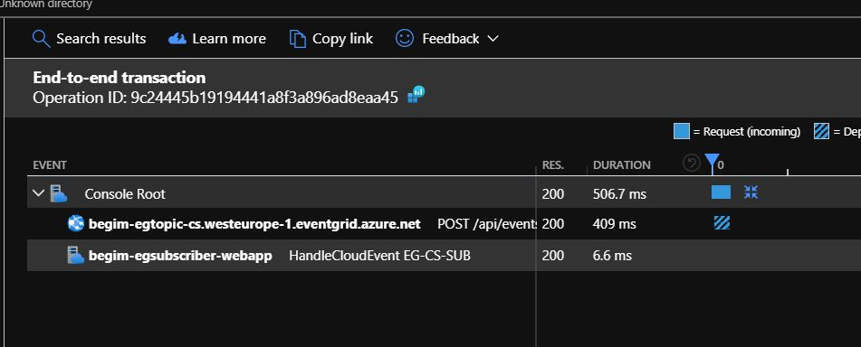

The automatic dependency, for writing the event to the topic is a sibling of the console app invocation (represented by the request) and the final item "HandleCloudEvent" is from the event being received from the subscription. This is written from the receiving application.

It appears in the AI end to end experience in context of the console app for two reasons
(1) Its created with the context we sent with the event
(2) Both sender and subscriber apps report to the same AI resource

Here's how the custom AI dependency was written, note this is from the event trace parent field as per the value shown above:

~~~cs
var op = _telemClient.StartOperation<RequestTelemetry>($"HandleCloudEvent {AEGSubscriptionName}", details.TraceParent.Split('-')[1], details.TraceParent.Split('-')[2]);
~~~

### << begim TO EDIT below this point >>

Fn A -> Service Bus -> Fn B (with custom code to correlate across workspaces using a custom correlation id)

When using the `Activity` class to add custom properties to the recorded telemetry, one can also use the `Activity Baggage` to indicate any information to be passed on to all dependencies.  To pass on a custom property to a dependency:

~~~cs
  using System.Diagnostics;
  // ...
  Activity currActivity = Activity.Current;
  currActivity.AddBaggage("MySubmissionIdThroughBagage", submissionId);
~~~

Note how the call to `Activity.AddTag(..)` did _not_ result in anything being recorded on the dependency telemetry item.  Also, when used in our Function to enqueue an item, the metadata on that item would not show those tags.  This is different for `Activity.AddBagage`.  The enqueued message in this case, shows metadata like

| Property                 | Value                                                               |
| ------------             | -----------------------------------                                 |
| Correlation-Context      | MySubmissionIdThroughBagage=bec20faa-9fa1-4dfc-a081-9b32a52dbdac    |

This mechanism works because the information in the headers is flowed through service bus and collected by the receiver: The Functions ServiceBus binding does not call into App Insights directly (it just uses the Service Bus SDK). The Service Bus SDK does not know anything about our application context.

On the side of App Insights, for the request telemetry item nothing will have changed but the following is what we see for the dependency telemetry item:

| Property                                  | Value                                   |
| ------------                              | -----------------------------------     |
| (custom) MySubmissionIdThroughBagage      | bec20faa-9fa1-4dfc-a081-9b32a52dbdac    |

What if FunctionB now picks up this message from the queue?  This mechanism will propagate this property to the receiving invocating for FunctionB, which (thanks to the Service Bus SDK) will record the very same property in its request telemetry item:

| Property                                  | Value                                   |
| ------------                              | -----------------------------------     |
| (custom) MySubmissionIdThroughBagage      | bec20faa-9fa1-4dfc-a081-9b32a52dbdac    |

Even beyond this... if FunctionB does an outbound HTTP calls, that custom metadata will also travel in the headers of such outbound call. "Baggage" because the data travels!

> **Note**: the App Insights treeview and app map will still _not_ show a consolidated view out of the box when _just_ doing Fn A -> SvcBus -> Fn B.  It has no idea which workspaces to link up.  However, as soon as one does an HTTP call from Fn A to Fn B, the **appId** of both workspaces are exchanged and App Insights will start lighting up the consolidated experience!  Like this:
>
> 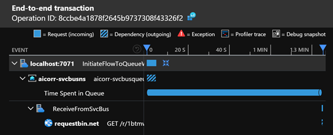
>
> This gap will be mitigated in the near to medium term future.

### Function -> Logic App (no custom modifications)

When function A makes a call to logic App A, the logic app manual trigger (called through an HTTP POST) will have access to the inbound headers, which it will see like:

~~~json
{
    "headers": {
        "Host": "prod-105.westeurope.logic.azure.com",
        "Request-Context": "appId=cid-v1:fe4dae78-eae7-4f13-b3d3-110cc0753f65",
        "traceparent": "00-bb375af0c4f6a24ab36915f13be7d08d-334f3f2baa66b042-00",
        "Request-Id": "|bb375af0c4f6a24ab36915f13be7d08d.334f3f2baa66b042.",
        "Content-Length": "0"
    }
}
~~~

Out of box, the logic app does nothing to put a valid correlation in Log Analytics which is usable to tie both the Function and Logic App traces together.

### Function -> Logic App (custom property tracking)

We can modify the logic app so that a custom property gets tracked.  
For more information, see here: https://docs.microsoft.com/en-us/azure/logic-apps/logic-apps-monitor-your-logic-apps#azure-diagnostics-event-settings-and-details

#### Querying Log Analytics for custom tracked properties

In Log Analytics, you can query for `ActionCompleted` events where the tracked properties are stored:

~~~kusto
AzureDiagnostics
| where OperationName == "Microsoft.Logic/workflows/workflowActionCompleted" 
~~~

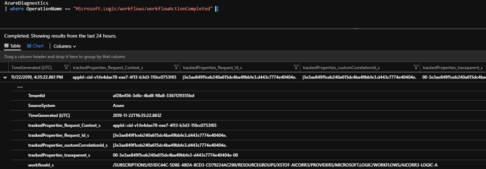

#### Extracting custom tracked properties in a column using Log Analytics

In order to extract tracked properties, a query like the below can be used:

~~~kusto
workspace('{logAnalytics}').AzureDiagnostics
| where OperationName == "Microsoft.Logic/workflows/workflowActionCompleted"
| parse kind = regex trackedProperties_Correlation_Context_s with * "MyCustomCorrId=" CustomCorrId:string
| project-reorder  CustomCorrId, trackedProperties_Correlation_Context_s
~~~

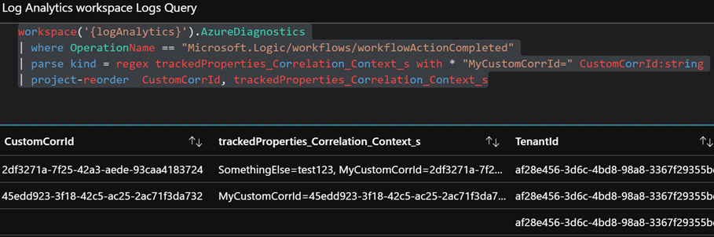

#### Correlating all Logic Apps Actions when correlation ids are just tracked on a single Action

In the end, one will want to retrieve the telemetry for all Logic Apps action that belong to the same run, even if custom tracked (correlation) properties were just tracked on a single action.

The raw logic apps diagnostics table looks like this:

~~~kusto
let LogicAppsDiagsRaw = 
  workspace('{logAnalytics}').AzureDiagnostics
  | project-reorder startTime_t, status_s, OperationName, trackedProperties_Correlation_Context_s, trackedProperties_Request_Id_s, resource_runId_s;
LogicAppsDiagsRaw
~~~

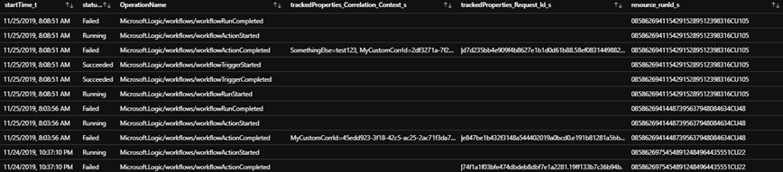

As demonstrated by above picture, there is only some entries that have a `trackedProperties_Correlation_Context_s` or `trackedProperties_Request_Id_s`.  Eventually though, one will want to be able to query for all the Logic Apps Actions that belong to the same run which is associated with a given correlation id.  In this example, that correlation id however is only tracked by a single activity within the run.  This means we'll need to find a way to "stamp" those correlation identifiers on all action telemetry.

First, we'll need to:
- look at the `workflowActionCompleted` entries which are the only ones which have tracked properties stored upon them
- then extract our custom correlation id from the Correlation Context column
- we'll also want to have an `id` column which uniquely identifies each Action
- finally we'll want to have a `operation_ParentId` similar to the output we typically see from App Insights so it becomes easier to union these tables later on

Like this:

~~~kusto
let LogicAppsActionCompletedDiag = 
  LogicAppsDiagsRaw
  | where OperationName == "Microsoft.Logic/workflows/workflowActionCompleted"
  | parse kind = regex trackedProperties_Correlation_Context_s with * "MyCustomCorrId=" MyCustomCorrId:string
  | extend id=resource_runId_s
  | project-rename operation_ParentId=trackedProperties_Request_Id_s
  | project-reorder  MyCustomCorrId, operation_ParentId, trackedProperties_Correlation_Context_s;
LogicAppsActionCompletedDiag
~~~

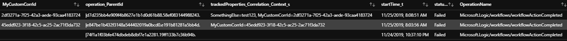

Now, we first create a lookup table, which maps each Logic App Run identifier to our custom correlation id and the `operation_ParentId` (which is coming from `trackedProperties_Request_Id_s`).  As follows:

~~~kusto
let MyCustomCorrIdMappingToResourceRunId = 
  LogicAppsActionCompletedDiag | where MyCustomCorrId != '' | distinct MyCustomCorrId, resource_runId_s, operation_ParentId;
MyCustomCorrIdMappingToResourceRunId
~~~

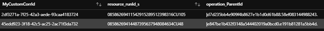

If we now have a `resource_runId_s` (which is available on every Action telemetry row), we can easily look up both the associated custom correlation id _and_ the `operation_ParentId`.  We can easily do this using the `lookup` function, for every single row in the raw Logic Apps Diagnostics table:

~~~kusto
let LogicAppsDiagsWithCustomCorrIdStamped = 
  LogicAppsDiagsRaw
  | lookup kind=leftouter MyCustomCorrIdMappingToResourceRunId on resource_runId_s
  | project-reorder MyCustomCorrId, resource_runId_s, trackedProperties_Correlation_Context_s, operation_ParentId, trackedProperties_Request_Id_s;
LogicAppsDiagsWithCustomCorrIdStamped
~~~

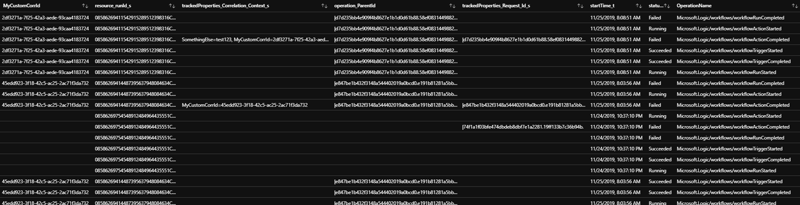

With a bit more ordering and cosmetics the entire query looks like this:

~~~kusto
let LogicAppsDiagsRaw = 
  workspace('{logAnalytics}').AzureDiagnostics
  | project-reorder startTime_t, status_s, OperationName, trackedProperties_Correlation_Context_s, trackedProperties_Request_Id_s, resource_runId_s;
let LogicAppsActionCompletedDiag = 
  LogicAppsDiagsRaw
  | where OperationName == "Microsoft.Logic/workflows/workflowActionCompleted"
  | parse kind = regex trackedProperties_Correlation_Context_s with * "MyCustomCorrId=" MyCustomCorrId:string
  | extend id=resource_runId_s
  | project-rename operation_ParentId=trackedProperties_Request_Id_s
  | project-reorder  MyCustomCorrId, operation_ParentId, trackedProperties_Correlation_Context_s;
let MyCustomCorrIdMappingToResourceRunId = 
  LogicAppsActionCompletedDiag | where MyCustomCorrId != '' | distinct MyCustomCorrId, resource_runId_s, operation_ParentId;
let LogicAppsDiagsWithCustomCorrIdStamped = 
  LogicAppsDiagsRaw
  | lookup kind=leftouter MyCustomCorrIdMappingToResourceRunId on resource_runId_s
  | project-reorder MyCustomCorrId, resource_runId_s, trackedProperties_Correlation_Context_s, operation_ParentId, trackedProperties_Request_Id_s;
let AllLogicActionsWithFilledCorrelationIds =
  LogicAppsDiagsWithCustomCorrIdStamped
  | extend id=resource_runId_s
  | project-reorder  MyCustomCorrId, operation_ParentId, resource_runId_s, operation_ParentId, trackedProperties_Correlation_Context_s;
AllLogicActionsWithFilledCorrelationIds
~~~

## Visualization using Log Analytics Workbooks

Where the built-in visualization and default queries of both Log Analytics and App Insights might fall a bit short for doing end to end correlation across a variety of resource types, Log Analytics Workbooks might be able to help.

### Using a treeview to visualize distributed traces across App Insights resources

Using a query like this:

~~~kusto
let allApps = union app('{appInsightsA}').requests, app('{appInsightsB}').requests,
              app('{appInsightsA}').dependencies, app('{appInsightsB}').dependencies,
              app('{appInsightsA}').exceptions, app('{appInsightsB}').exceptions,
              app('{appInsightsA}').traces, app('{appInsightsB}').traces,
              app('{appInsightsA}').customEvents, app('{appInsightsB}').customEvents;
allApps 
  | extend MyCustomCorrId = tostring(customDimensions.MyCustomCorrId) 
  | extend message_or_name = strcat(message, name)
  | extend id = iif(id == '', tostring(new_guid()), id) // make sure id is unique (if not table will not be displayed correctly)
  | where  MyCustomCorrId == "{corrid}"
  | project-reorder timestamp, itemType, id, operation_ParentId, message_or_name, appId
  | project-away problemId, handledAt, assembly, method, outerType, outerMessage, outerAssembly, outerMethod, innermostType, innermostMessage, innermostAssembly, innermostMethod, client_City, client_StateOrProvince, client_CountryOrRegion, client_Browser, cloud_RoleName, cloud_RoleInstance, client_Model, client_OS, operation_SyntheticSource, session_Id, user_Id, user_AuthenticatedId, user_AccountId, application_Version, client_Type, message, name
  | order by timestamp asc;
~~~

and configuring the workbook to visualize the table columns as follows:

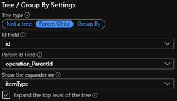

will provide us with the ability to see a full treeview of our distributed trace.  In this particular case, we're looking at a trace that spans:
- a request coming in on Function App A
- which sends a message to Service Bus
- which gets picked up by Function App B
- which does an HTTP call to some external system

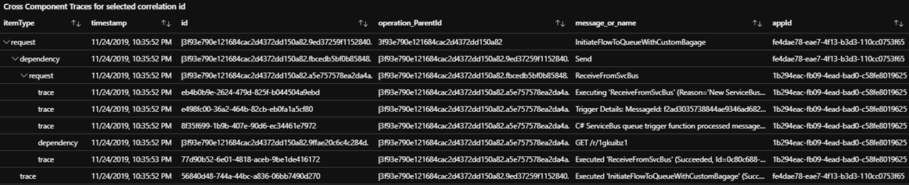

### Extending a distributed trace treeview with Action telemetry from Logic Apps

Building upon the previous treeview, we can extend our query to include data from Logic Apps.

~~~kusto
let allApps = union app('{appInsightsA}').requests, app('{appInsightsB}').requests,
              app('{appInsightsA}').dependencies, app('{appInsightsB}').dependencies,
              app('{appInsightsA}').exceptions, app('{appInsightsB}').exceptions,
              app('{appInsightsA}').traces, app('{appInsightsB}').traces,
              app('{appInsightsA}').customEvents, app('{appInsightsB}').customEvents;
let LogicAppsDiagsRaw = 
  workspace('{logAnalytics}').AzureDiagnostics
  | project-reorder startTime_t, status_s, OperationName, trackedProperties_Correlation_Context_s, trackedProperties_Request_Id_s, resource_runId_s;
let LogicAppsActionCompletedDiag = 
  LogicAppsDiagsRaw
  | where OperationName == "Microsoft.Logic/workflows/workflowActionCompleted"
  | parse kind = regex trackedProperties_Correlation_Context_s with * "MyCustomCorrId=" MyCustomCorrId:string
  | extend id=strcat(resource_runId_s, Resource, OperationName)
  | project-rename operation_ParentId=trackedProperties_Request_Id_s
  | project-reorder  MyCustomCorrId, operation_ParentId, trackedProperties_Correlation_Context_s;
let MyCustomCorrIdMappingToResourceRunId = 
  LogicAppsActionCompletedDiag | where MyCustomCorrId != '' | distinct MyCustomCorrId, resource_runId_s, operation_ParentId;
let LogicAppsDiagsWithCustomCorrIdStamped = 
  LogicAppsDiagsRaw
  | lookup kind=leftouter MyCustomCorrIdMappingToResourceRunId on resource_runId_s
  | project-reorder MyCustomCorrId, resource_runId_s, trackedProperties_Correlation_Context_s, operation_ParentId, trackedProperties_Request_Id_s;
let AllLogicActionsWithFilledCorrelationIds =
  LogicAppsDiagsWithCustomCorrIdStamped
  | extend id=strcat(resource_runId_s, Resource, OperationName), timestamp=startTime_t
  | project-reorder  MyCustomCorrId, operation_ParentId, resource_runId_s, trackedProperties_Correlation_Context_s;
let fullTreeView =
  allApps 
  | extend MyCustomCorrId = tostring(customDimensions.MyCustomCorrId) 
  | extend message_or_name = strcat(message, name)
  | union (
     AllLogicActionsWithFilledCorrelationIds
     | extend itemType = 'workflowAction'
     | extend message_or_name = strcat(trim_start('Microsoft.Logic/workflows/workflow', OperationName), ' - ', Resource, ' ', error_message_s)
  )
  | where  MyCustomCorrId == "{corrid}"
  | extend id = iif(id == '', tostring(new_guid()), id) // make sure id is unique (if not table will not be displayed correctly)
  | project-reorder timestamp, itemType, id, operation_ParentId, message_or_name, appId
  | project-away problemId, handledAt, assembly, method, outerType, outerMessage, outerAssembly, outerMethod, innermostType, innermostMessage, innermostAssembly, innermostMethod, client_City, client_StateOrProvince, client_CountryOrRegion, client_Browser, cloud_RoleName, cloud_RoleInstance, client_Model, client_OS, operation_SyntheticSource, session_Id, user_Id, user_AuthenticatedId, user_AccountId, application_Version, client_Type, message, name
  | order by timestamp asc;
fullTreeView
~~~

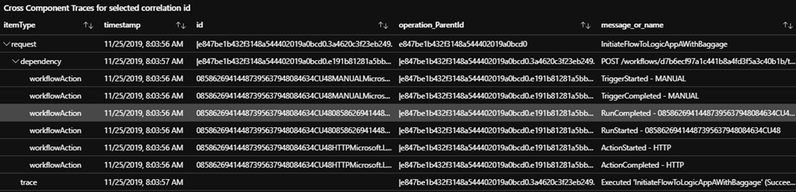

## Reference - how does correlation work

See:

- https://docs.microsoft.com/en-us/azure/azure-monitor/app/auto-collect-dependencies
- https://docs.microsoft.com/en-us/azure/azure-monitor/app/correlation
- http://apmtips.com/blog/2017/10/18/two-types-of-correlation/
- https://dev.applicationinsights.io/
- https://devblogs.microsoft.com/aspnet/improvements-in-net-core-3-0-for-troubleshooting-and-monitoring-distributed-apps/
- https://docs.microsoft.com/en-us/azure/logic-apps/logic-apps-monitor-your-logic-apps#azure-diagnostics-event-settings-and-details
