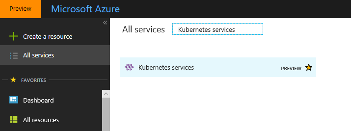
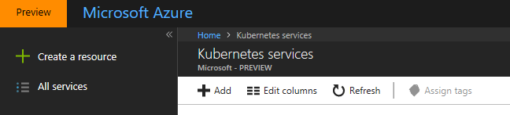
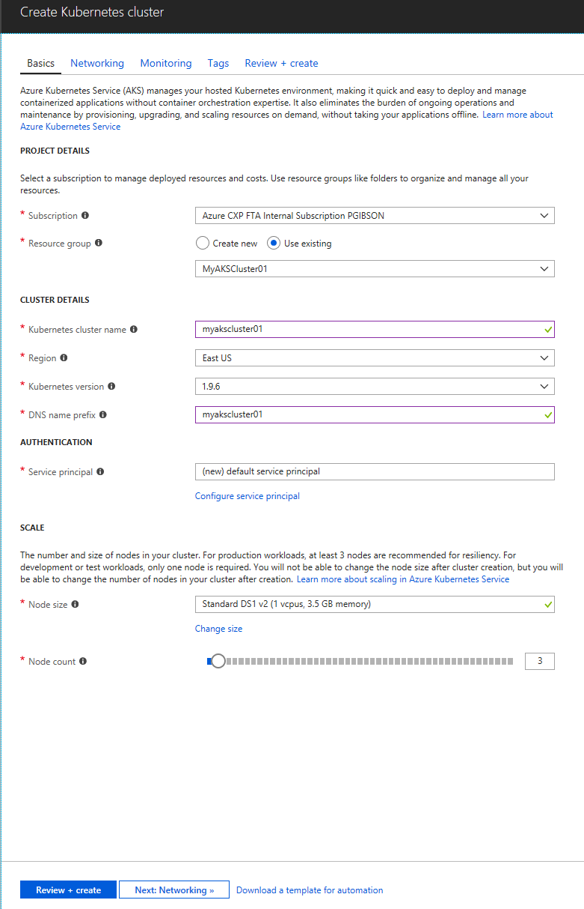
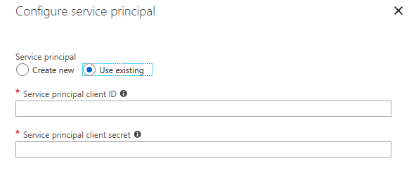
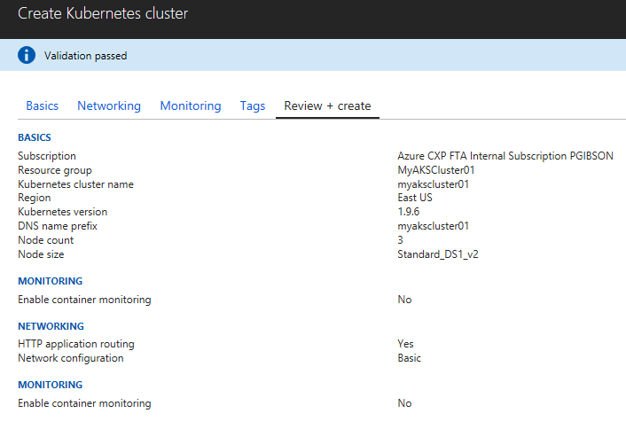

# POC Walkthrough - AKS: Deploy a Managed AKS Preview Service (Portal and CLI) - Jun2018

## Introduction
In this walkthrough, we will deploy the managed AKS Preview service showing both the portal and CLI experience of setting up the managed Azure Container Services (AKS) Kubernetes cluster. The CLI experience will utilize the same prerequisite information needed for the deployment. 

AKS offers customers a managed experience for running Docker containers using the Kubernetes orchestration. All of the necessary infrastructure needed will be provisioned and configured automatically. 

This walkthrough is a streamlined compilation of the Microsoft Azure Container Service (AKS) documentation found on the Microsoft docs site [here](https://docs.microsoft.com/en-us/azure/aks/intro-kubernetes), and has more step-by-step details to help facilitate and lead a POC.

## Prerequisites
This POC will utilize the Azure CLI to make the experience as similar as possible whether you are using a Windows or Linux system. For Windows 10 systems, the Microsoft Windows Subsystem for Linux (WSL) will need to be installed. WSL will provide native tools, such as SSH support, and will limit the use of requiring additional tools to interact with the Docker/Kubernetes cluster.
* [Windows Subsystem for Linux](https://docs.microsoft.com/en-us/windows/wsl/install-win10) ( Only if using Windows 10 )
* [Azure CLI 2.0](https://docs.microsoft.com/en-us/cli/azure/install-azure-cli?view=azure-cli-latest) ( If using the Windows Subsystem for Linux, please follow the installation instructions for the Debian/Ubuntu version located [here](https://docs.microsoft.com/en-us/cli/azure/install-azure-cli-apt?view=azure-cli-latest) )
* Install the kubectl binary via curl. Follow the Linux tab on the instructions [here](https://kubernetes.io/docs/tasks/tools/install-kubectl/#install-kubectl-binary-via-curl). 
* The ability to register an application with your Azure AD tenant. Please follow the instructions [here](https://docs.microsoft.com/en-us/azure/azure-resource-manager/resource-group-create-service-principal-portal#required-permissions) to see if you have the necessary permissions to create Service Principles in your Azure AD.

## Walkthrough
The following steps 1 though 4 are needed whether you are deploying via the portal or the CLI. 

1. In the Linux or WSL terminal, log into Azure using the **az login** command.

   > Note: The **az login** command will provide a code for you to enter at the [microsoft.com/devicelogin](https://microsoft.com/devicelogin) address. Once the code has been entered and accepted, the terminal will be authenticated to your Azure account.

2. **Create a Azure AD Service Principle**
     > Note: For this POC, we have two options for creating the service principle. In later steps for the deployment, we will allow the deployment to create the service principle automatically for the AKS cluster so this step can be skipped. If the POC environment needs you to create the service principle first, then proceed with the following for generating the service principle to be referenced by the deployment later. In a real world deployment, you will want to scope the service principle to a specific resource group with only the role access required for the application, as well as utilizing a service such as Azure KeyVault to store your store and retrieve your certificates.
     
     ```
     az ad sp create-for-rbac --name "MyAKSCluster01"
     ```
     
     
     Once the service principle is created successfully, you will have the output of the appId and the password GUIDs. Please make note of them as you will need them for parameters when deploying the AKS managed service.
     
     
     
 3. **Create Azure Resource Group**. Before you create your resource group, check to see which regions the AKS preview services is available for. Use the **az acs list-locations** command to get a list of the current available regions. Only choose from the preview regions. It is documented that only the following regions are currently supported in preview: eastus, westeurope, centralus, canadacentral, canadaeast.
 
      > Note: The **az acs list-locations** command may return regions not yet listed in the portal. You may want to choose a region listed in the portal so that you can continue deploying via the portal.
      
      Once you have identified the region for the resource group, run the az group-create command to create your resource group for the AKS service deployment location.
      ```
         az group-create <name> --location <location>
      ```
  
  ### AKS Portal Deployment Experience
  1. Log into the Azure portal and search for **Kubernetes services**. You should see the Kubernetes services service with the **PREVIEW** tag denoting it is a preview service.
      
      
 
      Once you're in the Kubernetes services blade in the portal, either click the **Add** button to begin the setup and deployment.
      
      
      
  2. For the first step to configure basic settings, choose your subcription, use the existing resource group created earlier, add a name for the Kubernetes cluster, the region should be populated to match the region of the resource group, choose the version of Kubernetes to deploy, and add a DNS name prefix for the FQDN of the Kubernetes API server.
  
      
      
      If you do choose to use a specific service principle, click on the **Configure service principle** link and enter the client ID and the client secret of the service principle.
      
      
      
      Click the **Networking** tab next.
      
  3. In the Networking tab, we will just enable **HTTP application routing** for the POC. This will allow services created on the cluster to be routed through the internet as well as the ability to utilize a custom DNS zone.
      
      
      
      Click the **Monitoring** tab next.
      
 
  4. In the Monitoring tab, click **No** to disable monitoring for the POC. We will have seperate guidance on how to use the Azure Monitor container health solution for AKS. If you customer has an existing Azure Monitor workspace available, feel free to choose yes and specify the Log Analytics workspace to setup. Reference the seperate POC walkthrough for AKS monitoring. 
   
      
  
   5. Since we will not be adding any Tags for the POC AKS deployment, you can click the **Review + create** button located below. The validation should have passed. Please review the information. If everything has been verified, click the **Create** button below to submit for deployment.
      
      
      
      Once the deployment completes, you will now have access to your managed AKS cluster from your terminal. You can now begin to deploy service workloads.
 
  ### AKS CLI Deployment Experience    
  The CLI deployment of AKS is a much more simplified process. You can deploy the managed AKS cluster with one command, that will create your service principle and SSH keys. You can also add specific information to customize the deployment as well. Run **az aks create --help** to explore all the additional options. Deploy AKS with the following command.
  
  ```
      az aks create --resource-group <Your AKS Cluster Resource Group> --name <MyAKSCluster01> --node-count 3 --generate-ssh-keys
  ```
  
  Once the deployment is completed, you will be able to run the get credentials command that adds the context and credentials of the cluster to the Kubernetes config file.
   
  ```
       az aks get-credentials --resource-group <Your AKS Cluster Resource Group> --name <Your AKS Cluster Name>
  ```
  
