# POC Walkthrough - ACS: Deploy a Managed AKS Preview Service (Portal and CLI)

## Introduction
In this walkthrough, we will deploy the managed AKS Preview service showing both the portal and CLI experience of setting up the managed Azure Container Services (AKS) Kubernetes cluster. The CLI experience will utilize the same prerequisite information needed for the deployment. 

AKS offers customers a managed experience for running Docker clusters using the Kubernetes orchestration. All of the necessary infrastructure needed, will be provisioned and configured automatically. 

This walkthrough is a streamlined compilation of the Microsoft Azure Container Service (AKS) documentation found on the Microsoft docs site [here](https://docs.microsoft.com/en-us/azure/aks/intro-kubernetes), and has more step-by-step details to help facilitate and lead a POC.

## Prerequisites
This POC will utilize the Azure CLI to make the experience as similar as possible whether you are using a Windows or Linux system. For Windows 10 systems, the Microsoft Windows Subsystem for Linux (WSL) will need to be installed. WSL will provide native tools, such as SSH support, and will limit the use of requiring additional tools to interact with the Docker/Kubernetes cluster.
* [Windows Subsystem for Linux](https://docs.microsoft.com/en-us/windows/wsl/install-win10) ( Only if using Windows 10 )
* [Azure CLI 2.0](https://docs.microsoft.com/en-us/cli/azure/install-azure-cli?view=azure-cli-latest) ( If using the Windows Subsystem for Linux, please follow the installation instructions for the Debian/Ubuntu version located [here](https://docs.microsoft.com/en-us/cli/azure/install-azure-cli-apt?view=azure-cli-latest) )
* Install the kubectl binary via curl. Follow the Linux tab on the instructions [here](https://kubernetes.io/docs/tasks/tools/install-kubectl/#install-kubectl-binary-via-curl). 
* The ability to register an application with your Azure AD tenant. Please follow the instructions [here](https://docs.microsoft.com/en-us/azure/azure-resource-manager/resource-group-create-service-principal-portal#required-permissions) to see if you have the necessary permissions to create Service Principles in your Azure AD.

## Walkthrough
The following steps 1 though 4 are needed whether you are deploying via the portal or the CLI. 

1. In the Linux or WSL terminal, log into Azure using the **az login** command.

   > Note: The **az login** command will provide a code for you to enter at the [microsoft.com/devicelogin](https://microsoft.com/devicelogin) address. Once the code has been entered and accepted, the terminal will be authenticated to your Azure account.

2. **Create a SSH key** to connect to the Linux VMs deployed as part of the AKS service. In the Linux or WSL terminal, run the following command using the -f parameter to provide a name for the public and private key. It may be recommended to name the file the same name as the AKS cluster.
   > Note: Leave the passphrase blank, for the purposes of the POC.
    ```
      ssh-keygen -t rsa -b 2048 -f ./<key file name>
    ```
    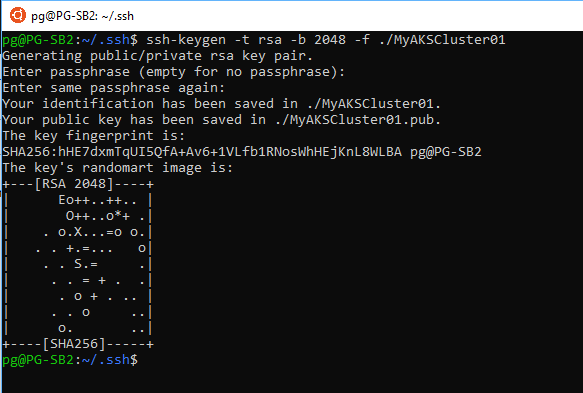
    
    If you list the .ssh directory you should now see your public and private keys created.
    
    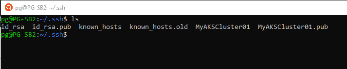
    
3. **Create a Azure AD Service Principle**
     > Note: For this POC, we are generating this service principle specifically for this exercise. In a real world deployment, you will want to scope the service principle to a specific resource group with only the role access required for the application, as well as utilizing a service such as Azure KeyVault to store your store and retrieve your certificates.
     
     ```
     az ad sp create-for-rbac --name "MyAKSCluster01"
     ```
     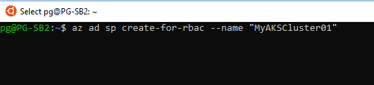
     
     Once the service principle is created successfully, you will have the output of the appId and the password GUIDs. Please make note of them as you will need them for parameters when deploying the AKS managed service.
     
     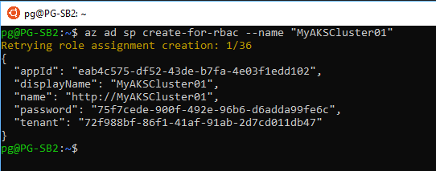
     
 4. **Create Azure Resource Group**. Before you create your resource group, check to see which regions the AKS preview services is available for. Use the **az acs list-locations** command to get a list of the current available regions. Only choose from the preview regions. It is documented that only the following regions are currently supported in preview: eastus, westeurope, centralus, canadacentral, canadaeast.
 
      > Note: The az acs list-locations command may return regions not yet listed in the portal. You may want to choose a region listed in the portal so that you can continue deploying via the portal.
      
      Once you have identified the region for the resource group, run the az group-create command to create your resource group for the AKS service deployment location.
      ```
         az group-create <name> --location <location>
      ```
  
  ### AKS Portal Deployment Experience
  1. Log into the Azure portal and search for **Container services (managed)**. You should see the AKS service with the **PREVIEW** tag denoting it is a preview services.
      
      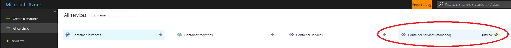
 
      Once your in the Container services (managed) blade in the portal, either click the **Add** or the **Create Container services (managed)** button to begin the setup and deployment.
      
      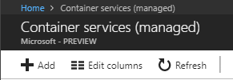  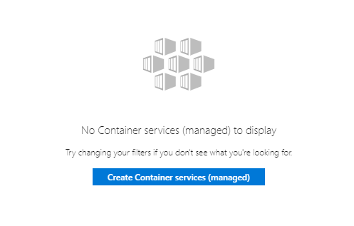
      
  2. For the first step to configure basic settings, enter the AKS cluster name, a DNS prefix if needed, choose the Kubernetes version, and choose the existing resource group created earlier. The resource group will automatically adjust the location.
  
      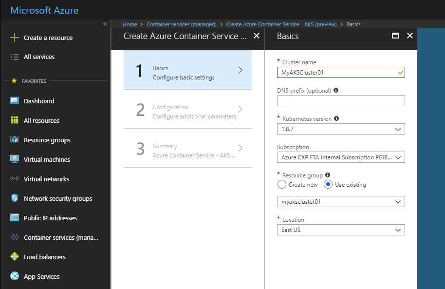
      
  3. For the second step to configure addtional parameters, we will need to get the SSH public key information from the key file we created earlier. Return to your terminal and navigate back to the **.ssh** directory. List the directory to view the files. We will need to open the **.pub** key we created for the AKS cluster. Open the .pub file the **cat** utility to view the file.
  
      ```
         cat <My SSH Public Key File>.pub
      ```
      
      Once the file is shown in the terminal, copy the whole key information to your clipboard.
      
      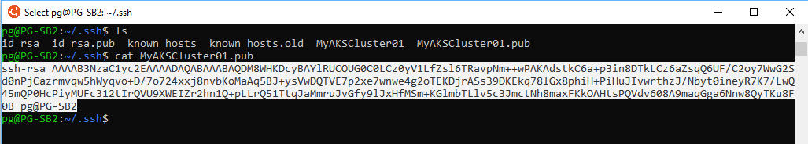
      
      Returning back to the portal on the second step, enter a username, paste from your clipboard the SSH public key information, enter the Service principle client ID (which is the appID property from the service principle created earlier), and enter the Service principle client secret (which is the password property of the service principle created earlier). You can choose to adjust the node count or the node virtual machine size, but for the purposes of the POC we will use the default settings.
      
      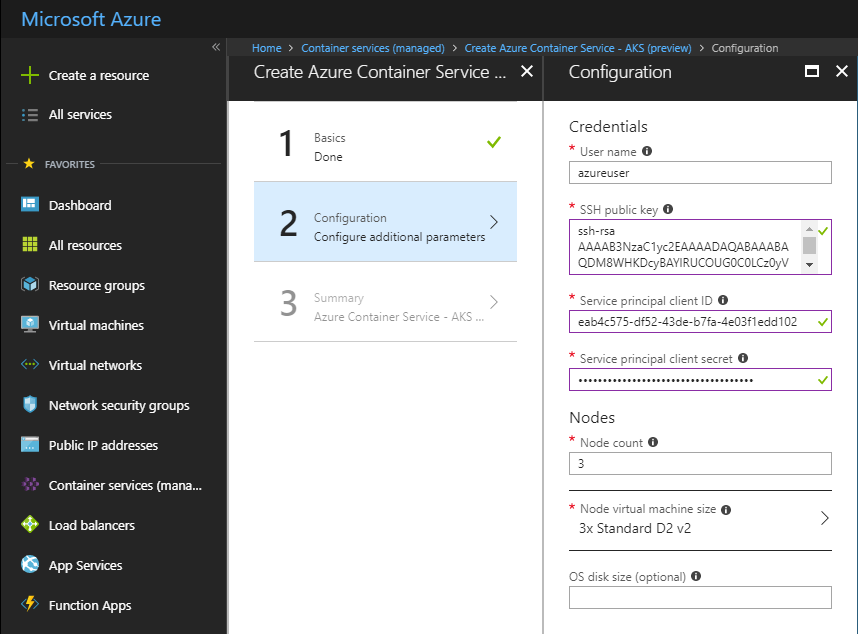
      
   4. The third and final step is to just confirm all the information entered. Once you've validated the information you can click ok to deploy the AKS cluster. 
   
      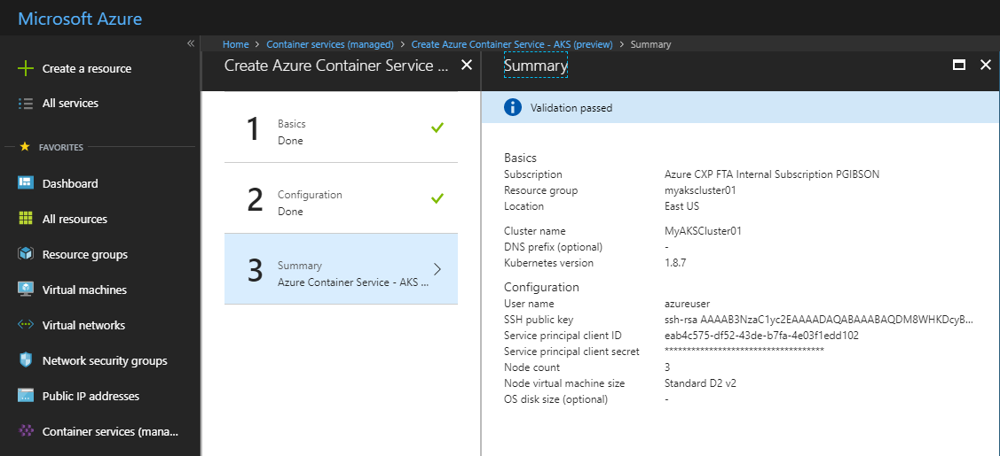
  
   5. Once the deployment is completed, we can return back to the terminal session and get the credentials and add the new context of the cluster to the Kubernetes config file. Run the following command.
   
      ```
         az aks get-credentials --resource-group <Your AKS Cluster Resource Group> --name <Your AKS Cluster Name>
      ```
      
      Once the command completes, you will now have access to your managed AKS cluster from your terminal. You can now begin to deploy service workloads.
      
      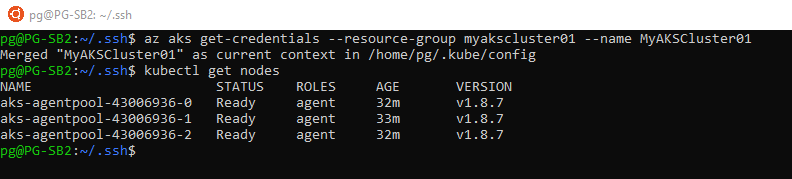
      
 
  ### AKS CLI Deployment Experience    
  The CLI deployment of AKS is a much more simplified process. You can deploy the managed AKS cluster with one command, that will create your service principle and SSH keys. You can also add specific information to customize the deployment as well. Deploy AKS with the following command.
  
  ```
      az aks create --resource-group <Your AKS Cluster Resource Group> --name <MyAKSCluster01> --node-count 3 --generate-ssh-keys
  ```
  
  Once the deployment is completed, you will be able to run the get credentials command that adds the context and credentials of the cluster to the Kubernetes config file.
   
  ```
       az aks get-credentials --resource-group <Your AKS Cluster Resource Group> --name <Your AKS Cluster Name>
  ```
  
