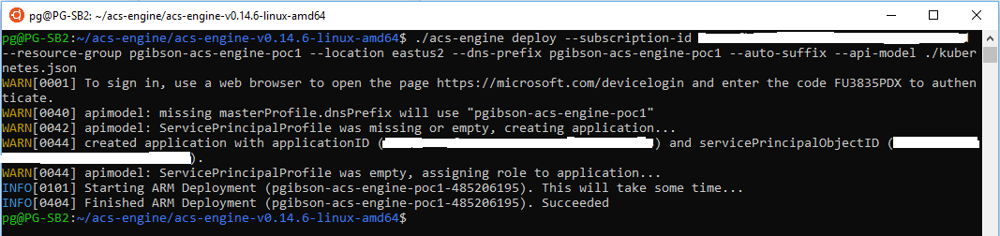
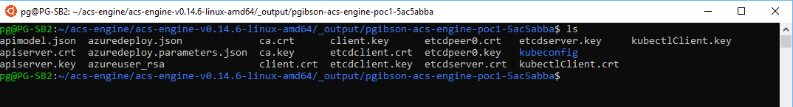
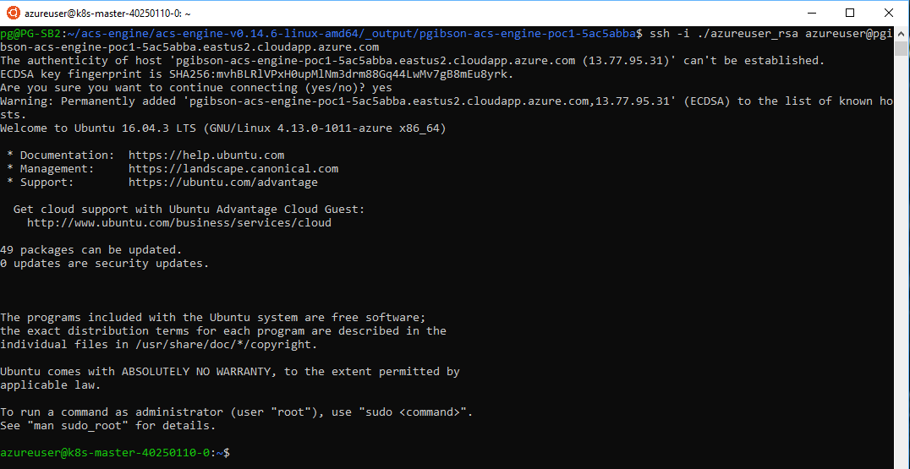

# POC Walkthrough - ACS Engine: Deploy a Kubernetes IaaS Infrastructure

## Introduction
In this walkthrough, we will utilize the Microsoft Azure Container Service Engine to build a IaaS Docker cluster infrastructure using the Kubernetes orchestration. The ACS Engine is an option to customers that have architectural and/or infrastructure requirements that are not currently supported by the managed Azure AKS service. The ACS Engine gives customers a way to flexibly customize and quickly provision the IaaS infrastructure needed.

This walkthrough is a streamlined compilation of the Microsoft Azure Container Service Engine documentation hosted on GitHub [here](https://github.com/Azure/acs-engine), to help facilitate a POC.

## Prerequisites
This POC will utilize the Azure CLI to make the experience as similar as possible whether you are using a Windows or Linux system. For Windows 10 systems, the Microsoft Windows Subsystem for Linux (WSL) will need to be installed. WSL will provide native tools, such as SSH support, and will limit the use of requiring additional tools to interact with the Docker/Kubernetes cluster.
* [Windows Subsystem for Linux](https://docs.microsoft.com/en-us/windows/wsl/install-win10) ( Only if using Windows 10 )
* [Azure CLI 2.0](https://docs.microsoft.com/en-us/cli/azure/install-azure-cli?view=azure-cli-latest) ( If using the Windows Subsystem for Linux, please follow the installation instructions for the Debian/Ubuntu version located [here](https://docs.microsoft.com/en-us/cli/azure/install-azure-cli-apt?view=azure-cli-latest) )
* Install the kubectl binary via curl. Follow the Linux tab on the instructions [here](https://kubernetes.io/docs/tasks/tools/install-kubectl/#install-kubectl-binary-via-curl). 
* [ACS-Engine Binary](https://github.com/Azure/acs-engine/releases/tag/v0.14.6) for your operating system
  * If using the Windows Subsystem for Linux, please do the following in the WSL terminal:
    1. mkdir acs-engine
    2. cd acs-engine
    3. wget https://github.com/Azure/acs-engine/releases/download/v0.14.6/acs-engine-v0.14.6-linux-amd64.zip
    4. uzip acs-engine-v0.14.6-linux-amd64.zip

## Walkthrough
1. In the Linux or WSL terminal, log into Azure using the **az login** command.

   > Note: The **az login** command will provide a code for you to enter at the [microsoft.com/devicelogin](https://microsoft.com/devicelogin) address. Once the code has been entered and accepted, the terminal will be authenticated to your Azure account.
2. Find and set the Azure subcription you will be deploying the Kubernetes cluster to:
   - List out all subscriptions you have access to - **az account list --output table**
   - Once you have identified the subscription name that you will utilize for the Kubernetes cluster, set the terminal session to the Azure account subscription - **az account set --subscription \"<subscription name\>"**
   
     > Note: Also make note of the subscription ID of the subscription name used, as you will need that information when deploying using the acs-engine.
3. Create an Azure resource group to deploy the Kubernetes cluster to - Ex. **az group create --name \"<resource group name\>" --location \"<Azure region\>"**

   > Note: If you are unsure of the Azure region name needed for the location parameter you can use **az account list-locations --output table** to view the Azure region names.
4. Download the Kubernetes api model template json file - wget https://raw.githubusercontent.com/Azure/acs-engine/master/examples/kubernetes.json

   > Note: By default the configuration file will create 1 master node and 3 worker nodes. The master nodes will be deployed in their own availability set, as well as the worker nodes will be deployed in their own availability set. If you would like to change the number of nodes being deployed, make edits to the count property in the configuration file.
   
     **Kubernetes Orchestration Version:** If you would like to deploy a certain version of the Kubernetes orchestration, you will need to edit the kubernetes.json file and add the "orchestratorRelease" property to the file. An example would be
     ```
       {
         "apiVersion": "vlabs",
         "properties": {
           "orchestratorProfile": {
           "orchestratorType": "Kubernetes",
           "orchestratorRelease": "1.9.6"
          },
      ```

5. Run **acs-deploy** with the following arguments:
   ```
   $ ./acs-engine deploy --subscription-id "<your subscription GUID>" \
     --resource-group "<your resource group name>" --location "<your resource group region>" \
     --dns-prefix "<your k8 cluster name>" --auto-suffix \
     --api-model ./kubernetes.json
   ```
      > Note: You may be asked to authenticate your terminal session again back to Azure when running the deployment.

    The acs-engine deploy will automatically create several configuration files and set up several Azure services for hosting the Kubernetes cluster. Key things created are:
    * Azure Service Principle and App ID
    * SSH key to connect to the Kubernetes cluster
    
      > Note: Please make note of the Service Principle and App ID that will be output in the terminial. We will use these IDs for setting up authentication for the Azure Container Registry (ACR) in a later POC walk-through. You can also find the IDs by using **az ad sp list --display-name \"<your k8 cluster name\>"**
    
    The deployment is fairly quick and you should get a succeeded message when completed. 
    
    
    You can verify that all the resources have been created by running the resource list command on the resource group.
    
    **az resource list --resource-group \"<resource group name\>" --output table**
    
    
    
6. Connect to the Kubernetes cluster:
   
   1. Once the deployment is complete, navigate to the **_output** directory of your kubernetes deployment where you will see several files and a kubeconfig directory.
      
   2. View your Kubernetes configuration. The following command will output your Kubernetes endpoints that you will use to connect to the Kubernetes cluster.
      ```
      $ KUBECONFIG=$HOME/acs-engine/acs-engine-v0.14.6-linux-amd64/_output/pgibson-acs-engine-poc1-5ac5abba/kubeconfig/kubeconfig.eastus2.json kubectl cluster-info
      ```
      
      
      
    3. Capture the Kubernetes master FQDN endpoint to SSH. The ACS Engine has created the SSH key that will be used to connect. The SSH key is located in the directory name of your Kubernetes cluster in the **_output** directory and has the name **azureuser_rsa**. Run the following command to connect to the Kubernetes master.
        ```
        ssh -i ./azureuser_rsa azureuser@pgibson-acs-engine-poc1-5ac5abba.eastus2.cloudapp.azure.com 
        ```
      
       

7. Now that you are connected to your Kubernetes cluster, you can begin to issue kubectl commands to look over the cluster such as **kubectl get nodes**, as well as start testing the deployment of containerized applications.  


   

