# POC Scenario Contoso Expenses: Modernizing an Application to Windows Containers 
## Kubernetes on Azure Container Services

* [Introduction](#introduction)
* [Learning Objectives](#learning-objectives)
* [Pre-Requisites](#prerequisites)
* Walkthrough
  * [Open Existing Application with Visual Studio](#open-existing-application-with-visual-studio)
  * [Create the SQL Database](#create-the-sql-database)
    * [Allow Client IP in SQL Database Firewall](#allow-client-ip-in-sql-database-firewall)
    * [Publish the Database into Azure SQL DB](#publish-the-database-into-azure-sql-db)
    * [View the database using Visual Studio Tools](#view-the-database-using-visual-studio-tools)
  * [Create Storage Account](#create-storage-account)
  * [Configure Container Registry](#configure-container-registry)
  * [Create Kubernetes Cluster](#create-kubernetes-cluster)
  * [Migrate Application to Containers](#migrate-application-to-containers)
  * [Push Containers to Registry](#push-containers-to-registry)
  * [Deploy to Kubernetes Cluster](#deploy-to-kubernetes-cluster)
  * [Scale Application Services](#scale-application-services)


## Introduction
The goal of this POC is to walk you through the process of migrating an existing 3 tier application running on-premises to a multi-container application running in a **Azure Container Services with Kubernetes**. You will start with a classic ASP.NET MVC Application, converting its components (frontend and services layers) to containers, deploying them to a registry, and then deploying the application Azure Container Services.

## Learning Objectives
After completing this exercise, you will be able to:
* Create an Azure Container Registry
* Create an Azure Containers Services Kubernetes cluster
* Create an Azure SQL Database
* Wrap an existing application into multiple Containers
* Push the Containers to the Registry
* Deploy to Kubernetes Cluster

## Prerequisites
To complete this POC, you will need
* Access to a Microsoft Azure subscription and permissions to deploy resources
* Visual Studio 2017
* [Docker for Windows](https://www.docker.com/docker-windows)
* [SQL Server Management Studio](https://docs.microsoft.com/en-us/sql/ssms/download-sql-server-management-studio-ssms)
* You will need the [Service Fabric SDK](http://www.microsoft.com/web/handlers/webpi.ashx?command=getinstallerredirect&appid=MicrosoftAzure-ServiceFabric-CoreSDK) installed
* You must download the [Contoso Expenses Demo Application](https://fasttrackforazure.blob.core.windows.net/sourcecode/Contoso.Expenses.zip)

## Open Existing Application with Visual Studio
1. **Extract the Contoso Expenses Demo Application** previously downloaded to a working folder of your choice
2. From the working folder, open Contoso.Expenses.sln

    
3. Validate that there are 4 projects in Visual Studio:
* **Contoso.Expenses.API** - This is a Web API project that provides helper logic to the main web app.
* **Contoso.Expenses.DataAccess** - This is a Class Library that utilizes Entity Framework.
* **Contoso.Expenses.Database** - This is a Database project that contains the SQL to create the Expenses table and SQL to initially seed default data.
* **Contoso.Expenses.Web** - This is the Internal Business Web App.

## Create the SQL Database
1. Log into the [Azure portal](http://portal.azure.com).
2. Click on **+New**, type **Resource Group** in the search area, press **Enter**.
3. Click on **Resource Group** and the click on **Create**.
4.  Enter a descriptive name (e.g. **ContosoExpenses-RG-WE**) as the **Resource group name**.
5. Select your **Subscription**.
6. Select your **Resource Group Location** (e.g. West Europe).
7. Click **Create**.

  

8. Navigate to the resource group **ContosoExpenses-RG-WE**.

  

9. Click **+Add**, type in **SQL Database** in the search area, press **Enter** and click on **SQL Database**.

  

10. Click **Create**.
11. Enter your **database name** (e.g. **contosoexpensesdb**). 
12. For **Resource Group**, select **Use Existing**, then select the **Resource Group** created earlier (e.g. ContosoExpenses-RG-WE).
13. For **Server**, click **Configure required settings**.
14. Click **Create a new Server**.
15. For **Server Name**, your SQL Server Name (e.g. **contosoexpensesdbsrv**).
> Note: The server name needs to be globally unique, so add a number to the end of name.
16. Enter a **Server admin login** and **Password**.
> Note: Save the **Login name** and **Password**, as you’ll need it later.
17. For Location select the same location as before (e.g. **West Europe**).
18. Click **Select** to save the server settings.

  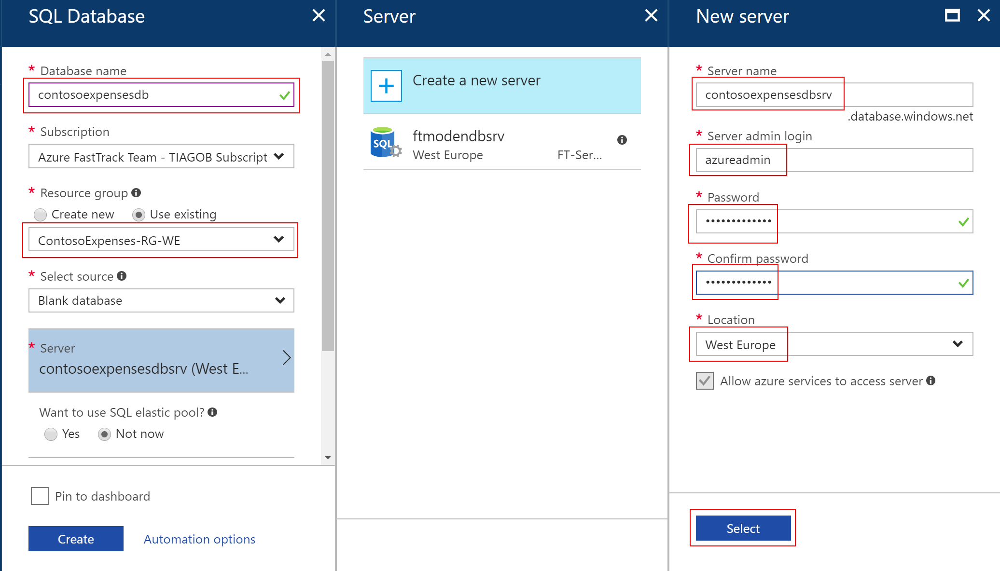

19. Click on **Pricing Tier**.
20. Move the **DTU** slider to **20**.
> Note: DTU's are Database Transaction Units and measure database performance with a blended measure of CPU, memory, I/O.  For more information on DTU's, see [Explaining Database Transaction Units](https://docs.microsoft.com/en-us/azure/sql-database/sql-database-what-is-a-dtu).

21. Move the **Storage** slider to **5GB**.
22. Click **Apply**.

  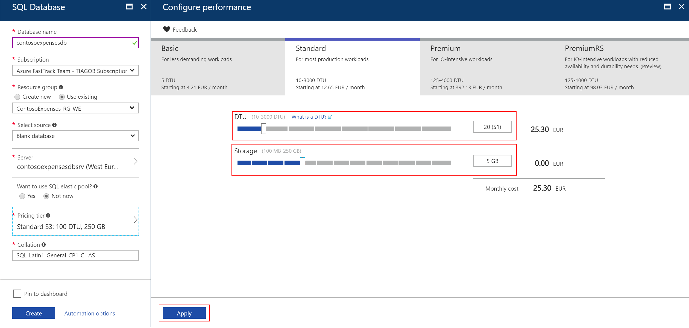

23. Click **Create** to create a new SQL Database Server & Database.

> Note: The Azure alert bell will indicate that the deployment is in progress.

  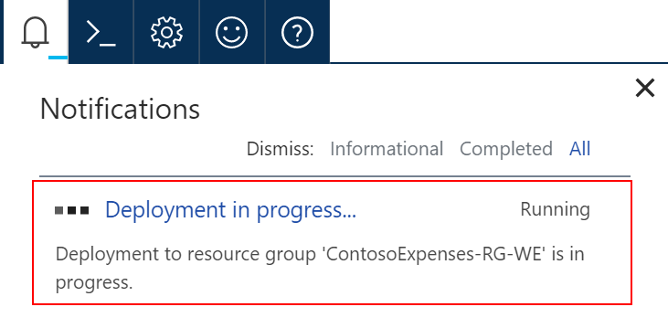

## Allow Client IP in SQL Database Firewall
To add the **IP address** of the client you access the database from, do the following steps:
1. Select the database created previously (e.g. contosoexpensesdb), click on **Set server firewall**.

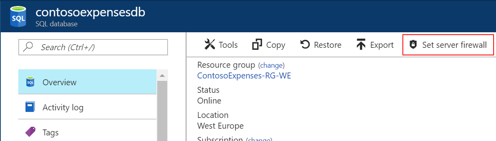

2. Click on **Add client IP** and click **Save**. This will add your current IP as a new rule on the Firewall.

  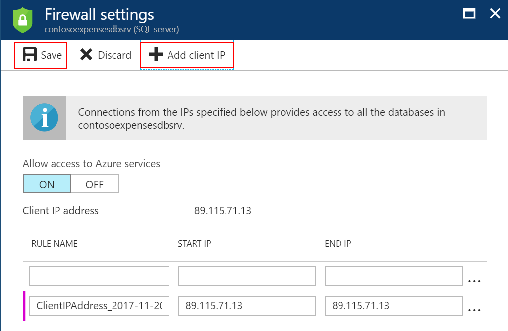

## Publish the Database into Azure SQL DB
1. From Visual Studio, expand the project **Contoso.Expenses.Database**.
2. Click on the **Seed.sql** file under the **Scripts folder**, and look at content in the preview window.
> Note: This file will get executed post-deployment and add test data to the database.

  

3. **Right-click** on the project **Contoso.Expenses.Database** and select **Publish** to publish the database.

  
  
  
4. On **Target database connection** click **Edit**, then click **Browse**.

5. From the list presented, expand **Azure**.
6. Select the **Database** created on the SQL Server in the previous steps.

  

7. For the **Server Name**, confirm or enter the server name previously saved to the clipboard (e.g. **contosoexpensesdbsrv.database.windows.net**).
8. Set **Authentication** to **SQL Server Authentication**.
9. Enter the database server **User Name** and **Password**. Select the checkbox **Remember Password**.
10. Select the database name **contosoexpensesdb**.
11. Click **Test Connection**.
> You may get prompted to add a firewall rule so that your computer is allowed to access the database server. If so, click **Ok** to allow the firewall rule to be created.

12. The result should be **Test connection succeeded**, then click **Ok**.
 Click **Ok** to close the connect window.

13. Click on **Publish** to publish the database to Azure.
 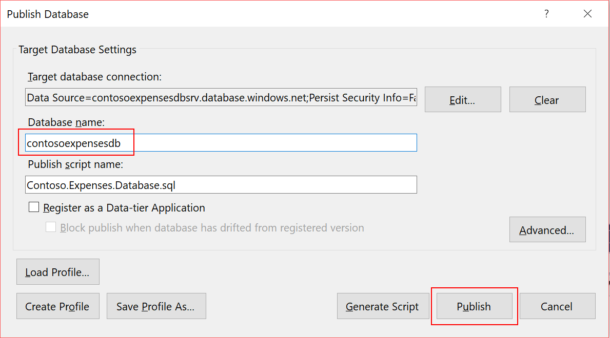

  * The database will be published to Azure and give you the results.
* The status and progress will be displayed in the Data Tools Operations window.

  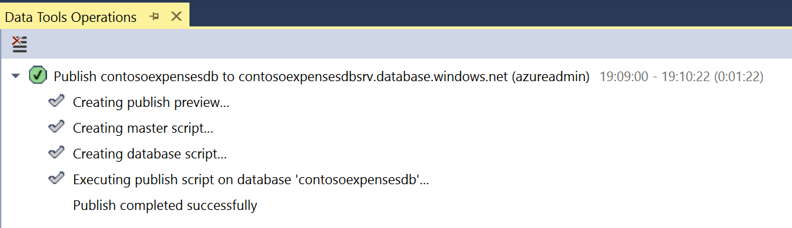

## View the database using Visual Studio Tools
1. From **Visual Studio**, select **View** | **SQL Server Object Explorer**.
2. Expand the **SQL Server** node to view the connection.
3. Expand the connection **contosoexpensesdbsrv.database.windows.net**, and then **Databases | contosoexpensesdb | Tables**. Confirm the existence of the **dbo.Expense** table.

  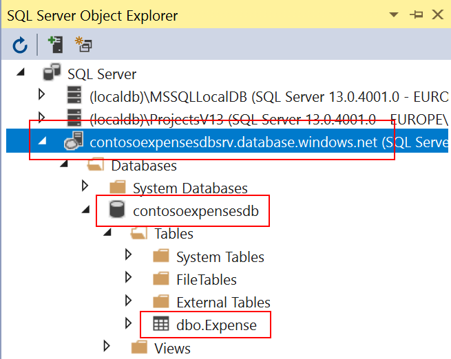

## Create Storage Account
You will create a new Azure Storage Account because the Application uses Azure Storage Queues to persist transactions when the database is not available.

1. Open [Azure Portal](https://portal.azure.com), click in **New** and search for Storage Account. 

  

2. Select that option shown in the image and on the following blade click **Create**.

3. Give a name to your storage account and ensure the storage account is deployed in the same resource group.

  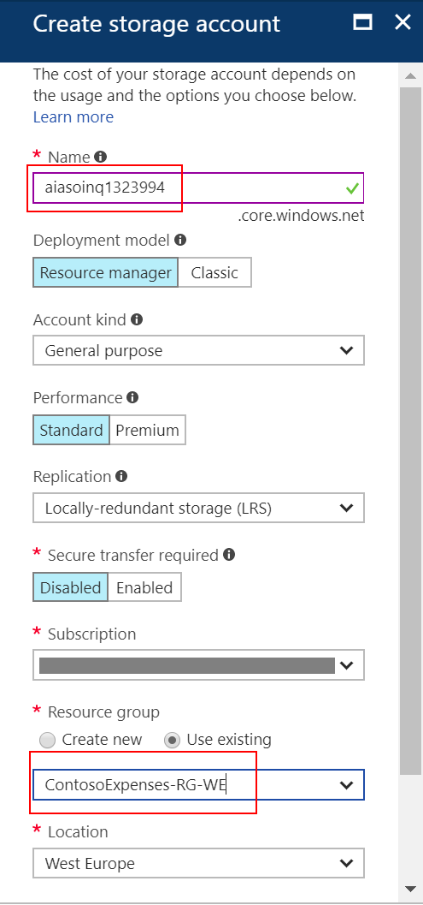

> The storage account name needs to be unique, and only supports lowercase letters and numbers.

4. After the creation of the storage account, navigate to it, click on **Access Keys** and copy the first connection string. We will need it further on.

 

## Configure Container Registry
We will need a place to store the containers that we are creating for this application. For this example we will be creating an Azure Container Registry.

1. Log into the [Azure portal](https://portal.azure.com).
2. Create a new resource and search the marketplace for **Azure Container** and select **Azure Container Registry**.

    

3. Give the registry a name and assign it to a resource group. Click **Create**.
> This name must be unique in the Azure platform.

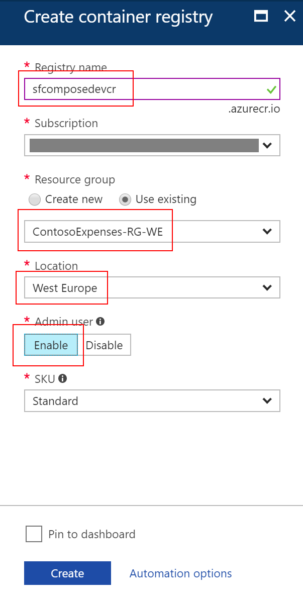

## Create Kubernetes Cluster
In order to run the application now, we will need to create a cluster to deploy to. We will do it by using Azure CLI.

1. In the Azure portal, open Cloud Shell as shown in the image below. Make sure you select **bash** as the default language.
>NOTE: If you have not set up Cloud Shell previously follow [this article](https://docs.microsoft.com/en-us/azure/cloud-shell/overview).


2. Create a Resource Group where your cluster will be hosted.

````bash
az group create --name "k8s-rg" --location "westeurope"
````

3. Create the Azure Container Services - Kubernetes Cluster. Replace *<your_username>* and *<your_password>* with your real username and password.

````bash
az acs create -n k8s -d acs-k8s -g k8s-rg --orchestrator-type kubernetes --windows --admin-username <your_username> --admin-password <your_password>
````
> NOTE: The cluster creation process should take around 20min. 

4. Connect to the cluster.

````bash
az acs kubernetes get-credentials --resource-group=k8s-rg --name=k8s
````
5. Run a basic Kubernetes command to check that everything is up and running.

````kubernetes
$ kubectl get nodes
NAME                    STATUS    ROLES     AGE       VERSION
a454aacs9000            Ready     <none>    1m        v1.7.7-7+e79c96c8ff2d8e
a454aacs9001            Ready     <none>    2m        v1.7.7-7+e79c96c8ff2d8e
a454aacs9002            Ready     <none>    2m        v1.7.7-7+e79c96c8ff2d8e
k8s-master-a454ae19-0   Ready     master    2m        v1.7.7
````

## Migrate Application to Containers
Now that all the infrastructure and dependencies are deployed it's time to start modernizing the application.

1. Open the application downloaded previously (**Contoso.Expenses**) in Visual Studio.
2. Expand project Contoso.Expenses.Web, open Web.Config file and edit the  connection strings **DefaultConnection** and **ContosoExpensesDataEntities** to new SQL Database. Replace **{your_username}** and **{your_password}** by the values specified during the database creation.

````XML
<add name="DefaultConnection" connectionString="Server=tcp:contosoexpensesdbsrv.database.windows.net,1433;Initial Catalog=contosoexpensesdb;Persist Security Info=False;User ID={your_username};Password={your_password};MultipleActiveResultSets=False;Encrypt=True;TrustServerCertificate=False;Connection Timeout=30;" providerName="System.Data.SqlClient" />
<add name="ContosoExpensesDataEntities" connectionString="metadata=res://*/Models.ContosoExpensesModel.csdl|res://*/Models.ContosoExpensesModel.ssdl|res://*/Models.ContosoExpensesModel.msl;provider=System.Data.SqlClient;provider connection string=&quot;data source=tcp:contosoexpensesdbsrv.database.windows.net,1433;Initial Catalog=contosoexpensesdb;Persist Security Info=False;User ID={your_username};Password={your_password};MultipleActiveResultSets=False;App=EntityFramework&quot;" providerName="System.Data.EntityClient" />
    
````
> The connection string for your SQL Database is in the Azure Portal.

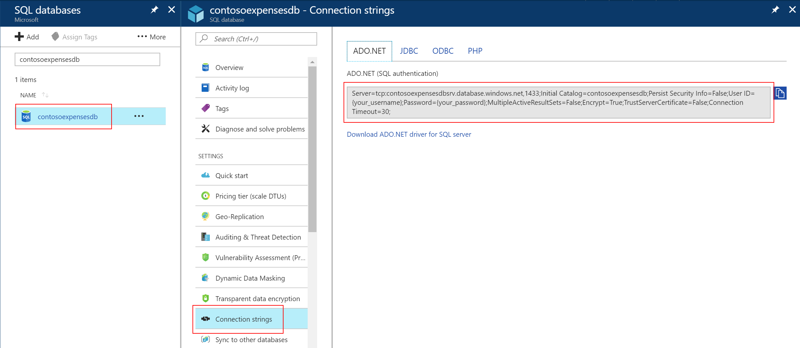

3. In the same Web.Config file update the value for EmployeeApiUri.
````XML
<add key="EmployeeApiUri" value="http://contoso.expenses.api:8123" />
````
> This value should reflect the api **container name** and **node port**. The **node port** will be configured in the compose file.

4. Update the Storage Account Connection String to the value you copied during the Storage Account creation step.

````XML
<add key="StorageConnectionString" value="DefaultEndpointsProtocol=https;AccountName=[ACCOUNT-NAME];AccountKey=[ACCOUNT-KEY];EndpointSuffix=core.windows.net" />
````
> This will add support to Azure Storage Queues to the Contoso.Expenses application.

5. Right-click **Contoso.Expenses.Web** project, select **Add** and then **Docker Support**.

    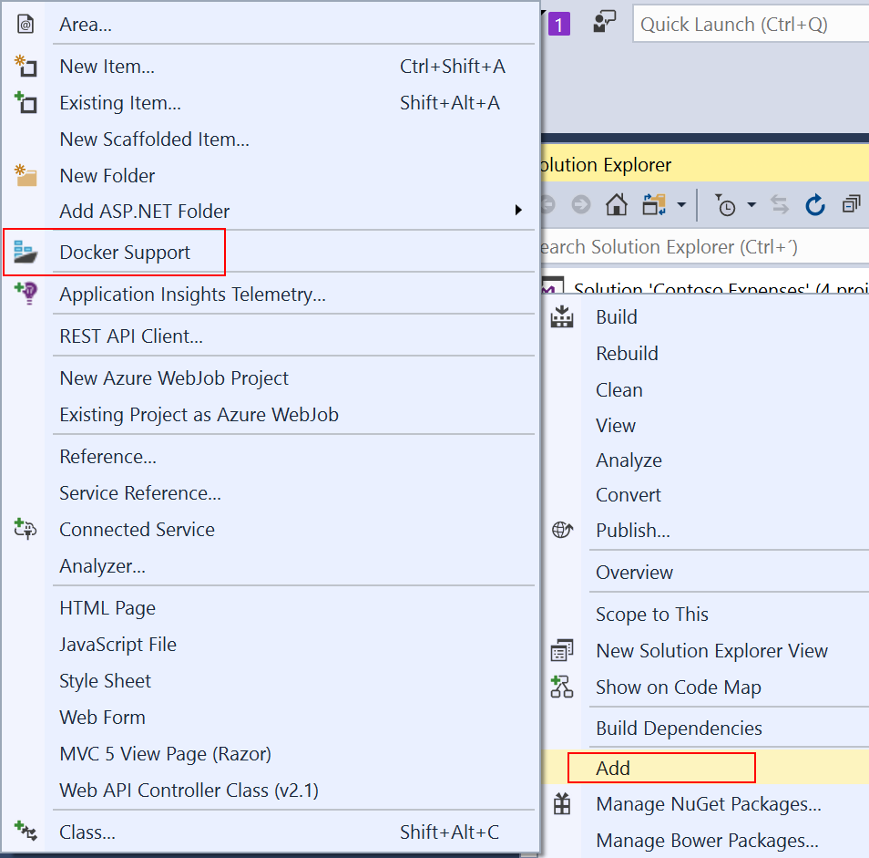

> Visual Studio will automatically create a new project (**[docker-compose](https://docs.docker.com/compose/overview/)**) and a **[Dockerfile](https://docs.docker.com/engine/reference/builder/)** in **Contoso.Expenses.Web** project.

6. Notice the **docker-compose** project and the Dockerfile that were create by Visual Studio.

    


7. Repeat steps 5 and 6 for **Contoso.Expenses.API** project.
8. Check **docker-compose.yml** file in **docker-compose** project. 

````yml
version: '3'

services:
  contoso.expenses.web:
    image: contoso.expenses.web
    build:
      context: .\Contoso.Expenses.Web
      dockerfile: Dockerfile

  contoso.expenses.api:
    image: contoso.expenses.api
    build:
      context: .\Contoso.Expenses.API
      dockerfile: Dockerfile
````
> This file is the declaration of the services that compose our application and how each of them are built. 

9. Right-click your Solution and select **Build Solution**.
> In order to build the solution successfuly you need to make sure you have installed **Docker for Windows** and configured it to run in **Windows Containers**.

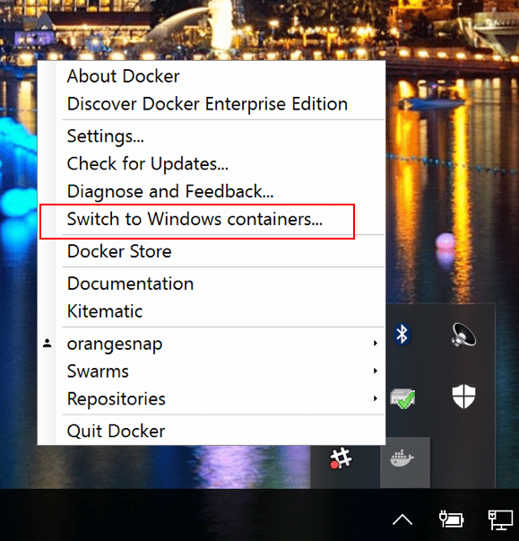

10. Build the container images. **Open a command prompt** in the contoso.expenses.web folder and run the following command

````docker
C:\..\Contoso.Expenses.Web>docker build -t [YOUR-REGISTRY]/contoso.expenses.web:1.0 .
````
> Replace [YOUR-REGISTRY] with your own registry name. This is recommended pattern for images that are pulled from or pushed to external registries. 

11. Repeat step 10 for project **contoso.expenses.api**.

12. List all images available in your local repository. Run the following command and you should see the 2 images built during the last step(contoso.expenses.web and contoso.expenses.api).
````docker
docker images
````
> During the building process of new images some base images may be downloaded (e.g. **microsoft/aspnet:4.7**)

````BASH
C:\..\Contoso.Expenses.Web>docker images
REPOSITORY                                       TAG                 IMAGE ID            CREATED             SIZE
sfcomposedevcr.azurecr.io/contoso.expenses.web   1.0                 9a8606d9e43f        4 minutes ago       12.6GB
sfcomposedevcr.azurecr.io/contoso.expenses.api   1.0                 8030f7171b4f        12 minutes ago      12.6GB
microsoft/aspnet                                 4.7                 eea632769046        6 days ago          12.6GB
````

## Push Containers to Registry
Now that the images have been created it's time to push them to the Registry. 

1. Open [Azure Portal](https://portal.azure.com) and navigate to your **Azure Container Registry**. Copy **Login server**, **Username** and **Password** values.


2. Open a command prompt and login to Azure Container Registry.

````BASH
C:\..\Contoso.Expenses.Web>docker login sfcomposedevcr.azurecr.io
Username: sfcomposedevcr
Password:
Login Succeeded
````

3. Push Contoso.Expenses.Web image to Azure Container Registry. 

````BASH
C:\..\Contoso.Expenses.Web>docker push sfcomposedevcr.azurecr.io/contoso.expenses.web:1.0
The push refers to a repository [sfcomposedevcr.azurecr.io/contoso.expenses.web]
4c48207d1889: Pushing [=================>                                 ]  14.06MB/41.06MB
d9809dd547bc: Pushed
19f2e48542cd: Pushed
7ee0efb2798d: Pushed
79bc218b1820: Pushed
0e496d5cd2c0: Pushing [==================================================>]  54.27kB
6e055ae8920f: Pushing [>                                                  ]  2.764MB/139.3MB
9fcb60aa903e: Pushing [==================================================>]  182.8kB
c4cd858bac1b: Pushing [>                                                  ]  4.345MB/318.6MB
79390eafd4aa: Waiting
6000697d961e: Waiting
ec2e04360e6c: Waiting
f358be10862c: Waiting
````

4. Repeat step 3 for Contoso.Expenses.Api image.

5. Validate in Azure Container Registry that the images have been pushed.


## Deploy to Kubernetes Cluster
At this point the images are already hosted in Azure Container Registry so the next step is to deploy the containers to the Kubernetes Cluster.

> NOTE: To learn more about **kubectl** and all the Kubernetes components use the the [official documentation](https://kubernetes.io/docs/concepts/overview/what-is-kubernetes/).

1. Open the Azure Portal and expand Cloud Shell. We will use it to manage the Cluster.

2. Connect to the Cluster.

````bash
az acs kubernetes get-credentials --resource-group=k8s-rg --name=k8s
````
3. In order to deploy from a private registry, which is our case, we need to create a cluster secret otherwise the image pull action will fail.

````bash
kubectl create secret docker-registry acrsecret --docker-server=<azure-container-registry-server> --docker-username=<username> --docker-password=<password> --docker-email=<email>

````
>NOTE: Replace _**docker-server**_ (e.g. sfcomposedevcr.azurecr.io), _**docker-username**_ (e.g. sfcomposedevcr) and _**docker-password**_ for your ACR values. Although we are not getting the container images from Docker Store the _**docker-email**_ parameter is mandatory since the original support is for docker public and private registries.

4. Create the deployment for the Web Application Contoso.Expenses.Web.

````YAML
$ nano contoso.expenses.web-deployment.yaml

### contoso.expenses.web-deployment.yaml ###
apiVersion: extensions/v1beta1
kind: Deployment
metadata:
  labels:
    io.kompose.service: contosoexpenses-web
  name: contosoexpenses-web
spec:
  replicas: 3
  strategy: {}
  template:
    metadata:
      creationTimestamp: null
      labels:
        io.kompose.service: contosoexpenses-web
    spec:
      containers:
      - image: sfcomposedevcr.azurecr.io/contoso.expenses.web:1.0
        name: contosoexpenses-web
        ports:
        - containerPort: 80
        resources: {}
      restartPolicy: Always
status: {}

### SAVE THE FILE ###

$ kubectl create -f contoso.expenses.web-deployment.yaml
```` 

5. Create the deployment for the API Contoso.Expenses.Api.

````YAML
$ nano contoso.expenses.api-deployment.yaml

### contoso.expenses.api-deployment.yaml ###
apiVersion: extensions/v1beta1
kind: Deployment
metadata:
  labels:
    io.kompose.service: contosoexpenses-api
  name: contosoexpenses-api
spec:
  replicas: 5
  strategy: {}
  template:
    metadata:
      creationTimestamp: null
      labels:
        io.kompose.service: contosoexpenses-api
    spec:
      containers:
      - image: sfcomposedevcr.azurecr.io/contoso.expenses.api:1.0
        name: contosoexpenses-api
        ports:
        - containerPort: 80
        resources: {}
      restartPolicy: Always
status: {}

### SAVE THE FILE ###

$ kubectl create -f contoso.expenses.api-deployment.yaml
```` 

6. Create the Service to expose Contoso.Expenses.Web out to the Internet. In this case we will use Azure Load Balancer to expose the Web Application to the Internet.

````YAML
$ nano contoso.expenses.web-service.yaml

### contoso.expenses.web-service.yaml ###
apiVersion: v1
kind: Service
metadata:
  labels:
    io.kompose.service: contosoexpenses-web
  name: contosoexpenses-web
spec:
  ports:
  - name: "80"
    port: 80
    targetPort: 80
  selector:
    io.kompose.service: contosoexpenses-web
  type: LoadBalancer
status:
  loadBalancer: {}

### SAVE THE FILE ###

$ kubectl create -f contoso.expenses.web-service.yaml
````

7. Create the Service to expose Contoso.Expenses.Api inside the cluster only. In this case we will open a specific port internally to the cluster.

````YAML
$ nano contoso.expenses.api-service.yaml

### contoso.expenses.api-service.yaml ###
apiVersion: v1
kind: Service
metadata:
  labels:
    io.kompose.service: contosoexpenses-api
  name: contosoexpenses-api
spec:
  ports:
  - name: "8123"
    port: 8123
    targetPort: 80
  selector:
    io.kompose.service: contosoexpenses-api
status:
  loadBalancer: {}

### SAVE THE FILE ###

$ kubectl create -f contoso.expenses.api-service.yaml
````

8. Check the deployments went successfuly

````bash
$ kubectl get deploy -o wide
NAME                  DESIRED   CURRENT   UP-TO-DATE   AVAILABLE   AGE       CONTAINERS            IMAGES                                          SELECTOR
contosoexpenses-api   1         1         1            0           33s       contosoexpenses-api   tiagobacr.azurecr.io/contoso.expenses.api:1.0   io.kompose.service=contosoexpenses-api
contosoexpenses-web   1         1         1            0           39s       contosoexpenses-web   tiagobacr.azurecr.io/contoso.expenses.web:1.0   io.kompose.service=contosoexpenses-web
````

9. Check the services were exposed successfuly

````bash
$ kubectl get svc -o wide
NAME                  TYPE           CLUSTER-IP     EXTERNAL-IP   PORT(S)        AGE       SELECTOR
contosoexpenses-api   ClusterIP      10.0.206.92    <none>        8123/TCP       26s       io.kompose.service=contosoexpenses-api
contosoexpenses-web   LoadBalancer   10.0.147.105   <pending>     80:30704/TCP   33s       io.kompose.service=contosoexpenses-web
kubernetes            ClusterIP      10.0.0.1       <none>        443/TCP        2h        <none>
````

> NOTE: The web application requires Azure to generate a new IP Address and assign to the Azure Load Balancer. It is all automated due to ACS integration with Kubernetes but it will take about 1 min to move from the *pending* status to the final IP Address.

10. Once the IP Address get assigned to the service you can open it in your favorite web browser.


> NOTE: Since Windows Container images are usually large it may take a while to download the images to the local registry cache in the node where the container is running. Expect some time before the container starts.

## Scale Application Services
Kubernetes allows you to scale services independently. This way you can scale based on current load in each service manually or you can do it by specifying rules.

In order to scale the Api deployment manually you can run the following command. This will increase the number of replicas behind the Api service.

````bash
kubectl scale deployment contosoexpenses-api --replicas=10
````

If you intend to enable auto-scale based on certain rules (e.g. CPU Percentage) you can run the following command. This will automatically scale in or out the number of instances in your deployment.

````bash
kubectl autoscale deployment contosoexpenses-api --min=2 --max=5 --cpu-percent=80
````