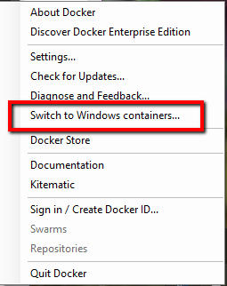
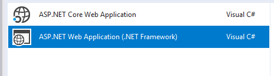
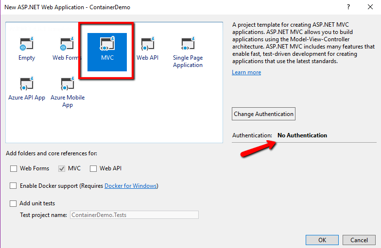
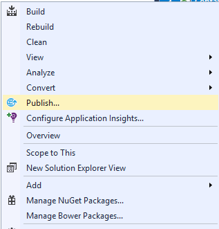
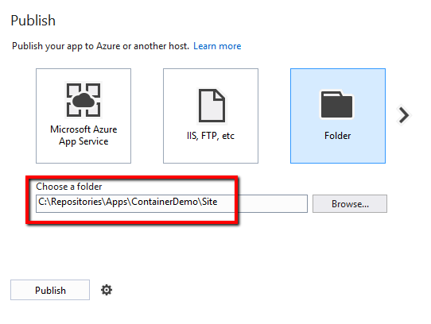
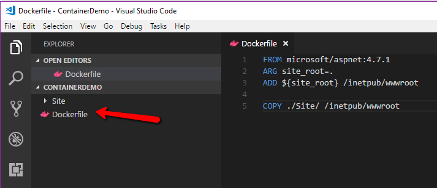
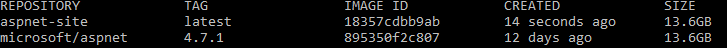
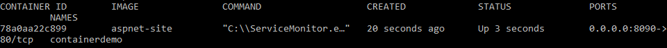

# POC Walkthrough - Run ASP.NET Application on Windows Containers

## Introduction
In this walkthrough, we will go over the basic steps necessary to run an ASP.NET, full framework, application on a Windows Container image.

## Prerequisites
* Visual Studio 2017 with the *ASP.NET and web development* workload selected
* [Docker for Windows](https://www.docker.com/docker-windows)
* Windows 10 or Windows Server
* [.NET Framework 4.7.1](https://www.microsoft.com/net/download/visual-studio-sdks)

## Walkthrough
1. Make sure Docker for Windows is configured to run Windows Containers.
2. In the Windows taskar, right-click the Docker for Windows Icon and select **Switch to Windows Containers**

    

    > Note: This may require additional components to be installed on your machine which will force a reboot.
3. Once switched, open Visual Studio 2017. Create a new ASP.NET Web Application project.
    > Note: We want to ensure we select the full .NET Framework, not .NET Core.
    
    

4. For the application template, select **MVC** and ensure that Authentication is set to **No Authentication**. Click **Ok**.
     
    

5. Once the application is created, right-click the project and click **Publish**.
     
    

6. Select **Folder** in the publish dialog. Keep a note of where the files are being published to. Click **Publish**.
     
    

    > Note: Pay attention to the folder path you are selecting here as this will be important in the next step. In this case, I am saving my site in a folder called **Site**.
7. Open the folder that was just published in a text editor. In that folder, create a file called **Dockerfile**. Add the following contents to the Dockerfile
    ```Dockerfile
    FROM microsoft/aspnet:4.7.1
    ARG site_root=.
    ADD ${site_root} /inetpub/wwwroot

    COPY ./Site/ /inetpub/wwwroot
    ```
    > Note: This file should be at the same directory level of your **Site** folder as this is what will be used in the copy step.
     
    

8. Open a command prompt to the same folder as the Dockerfile. Run the following command to build the Docker image
    ```cmd
    docker build -t aspnet-site --build-arg site_root=/ .
    ```

9. The container will start to download and install and you should see output similar to that below:
    ```
    Sending build context to Docker daemon  24.26MB
    Step 1/4 : FROM microsoft/aspnet:4.7.1
    4.7.1: Pulling from microsoft/aspnet
    3889bb8d808b: Downloading [=>                              ]  82.75MB/4.07GB
    449343c9d7e2: Downloading [===>                            ]  80.05MB/1.304GB
    ccd8f322a2de: Downloading [=====>                          ]  80.54MB/760.6MB
    5358f1f8c04f: Waiting
    27fb1950158d: Waiting
    4447c3ffe068: Waiting
    94eeeaf0d3bd: Waiting
    fe1d276c8d64: Waiting
    25871a4250c9: Waiting
    b53cc298d0b7: Waiting
    ```
    > Note: Docker naming covention is to use reponame/imagename:version, so the command above could be run alternatively as:
    ```cmd
    docker build -t contoso/aspnet-site:1.0 --build-arg site_root=/ .
    ```
10. Once the container is built, you can run `docker images`
    and see that our new aspnet-site container is ready to go along with the base .NET 4.7.1 container we can use in the future.
   
    

11. To run the container, type
    ```cmd
    docker run -d -p 8090:80 --name containerdemo aspnet-site
    ```

12. Run `docker ps`
    to see the container running.
       
    

13. You can get the IP being used by the container through running the following command:
    ```cmd
    docker inspect -f "{{ .NetworkSettings.Networks.nat.IPAddress }}" containerdemo
    ```

14. We can open a brower to this url `http://{IPAddress}` and we should see the site running.
       
    
