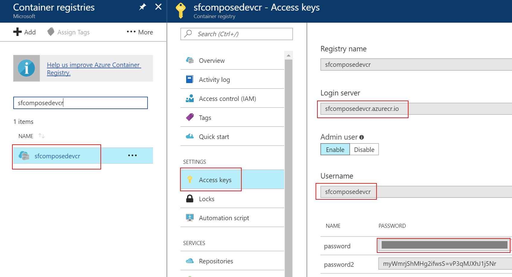
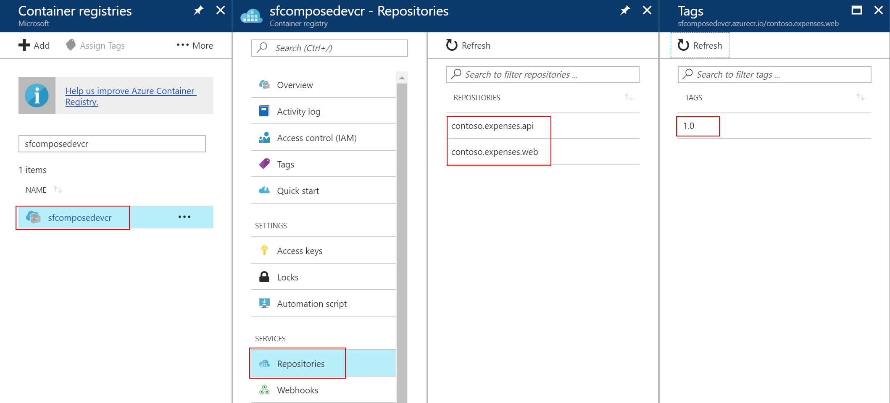

# POC Scenario Contoso Expenses: Modernizing a .NET Full Framework Application to Windows Containers 

* [Introduction](#introduction)
* [Learning Objectives](#learning-objectives)
* [Pre-Requisites](#prerequisites)
* Walkthrough
  * [Open Existing Application with Visual Studio](#open-existing-application-with-visual-studio)
  * [Create the SQL Database](#create-the-sql-database)
    * [Allow Client IP in SQL Database Firewall](#allow-client-ip-in-sql-database-firewall)
    * [Publish the Database into Azure SQL DB](#publish-the-database-into-azure-sql-db)
    * [View the database using Visual Studio Tools](#view-the-database-using-visual-studio-tools)
  * [Create Storage Account](#create-storage-account)
  * [Configure Container Registry](#configure-container-registry)
  * [Migrate Application to Containers](#migrate-application-to-containers)
  * [Run the Application through Containers](#run-the-web-and-api-containers)
  * [Push Containers to Azure Container Registry](#push-containers-to-registry)

## Introduction
The goal of this POC is to walk you through the process of migrating an existing 3 tier application running on-premises to running it as a multi-container application. You will start with a classic ASP.NET MVC Application, converting its components (frontend and services layers) to containers, deploying them to a registry, and then running the application through Windows Containers.

## Learning Objectives
After completing this exercise, you will be able to:
* Create an Azure Container Registry
* Create an Azure SQL Database
* Wrap an existing application into multiple Containers
* Push the Containers to the Registry

## Prerequisites
To complete this POC, you will need
* Access to a Microsoft Azure subscription and permissions to deploy resources
* Visual Studio 2017
* [Docker for Windows](https://www.docker.com/docker-windows)
* [SQL Server Management Studio](https://docs.microsoft.com/en-us/sql/ssms/download-sql-server-management-studio-ssms)
* You must download the [Contoso Expenses Demo Application](https://fasttrackforazure.blob.core.windows.net/sourcecode/Contoso.Expenses.zip)

## Open Existing Application with Visual Studio
1. **Extract the Contoso Expenses Demo Application** previously downloaded to a working folder of your choice
2. From the working folder, open Contoso.Expenses.sln

    
3. Validate that there are 4 projects in Visual Studio:
* **Contoso.Expenses.API** - This is a Web API project that provides helper logic to the main web app.
* **Contoso.Expenses.DataAccess** - This is a Class Library that utilizes Entity Framework.
* **Contoso.Expenses.Database** - This is a Database project that contains the SQL to create the Expenses table and SQL to initially seed default data.
* **Contoso.Expenses.Web** - This is the Internal Business Web App.

## Create the SQL Database
1. Log into the [Azure portal](http://portal.azure.com).
2. Click on **+New**, type **Resource Group** in the search area, press **Enter**.
3. Click on **Resource Group** and the click on **Create**.
4.  Enter a descriptive name (e.g. **ContosoExpenses-RG-WE**) as the **Resource group name**.
5. Select your **Subscription**.
6. Select your **Resource Group Location** (e.g. West Europe).
7. Click **Create**.

  

8. Navigate to the resource group **ContosoExpenses-RG-WE**.

  

9. Click **+Add**, type in **SQL Database** in the search area, press **Enter** and click on **SQL Database**.

  

10. Click **Create**.
11. Enter your **database name** (e.g. **contosoexpensesdb**). 
12. For **Resource Group**, select **Use Existing**, then select the **Resource Group** created earlier (e.g. ContosoExpenses-RG-WE).
13. For **Server**, click **Configure required settings**.
14. Click **Create a new Server**.
15. For **Server Name**, your SQL Server Name (e.g. **contosoexpensesdbsrv**).
> **Note:** The server name needs to be globally unique, so add a number to the end of name.
16. Enter a **Server admin login** and **Password**.
> **Note:** Save the **Login name** and **Password**, as you’ll need it later.
17. For Location select the same location as before (e.g. **West Europe**).
18. Click **Select** to save the server settings.

  

19. Click on **Pricing Tier**.
20. Move the **DTU** slider to **20**.
> **Note:** DTU's are Database Transaction Units and measure database performance with a blended measure of CPU, memory, I/O.  For more information on DTU's, see [Explaining Database Transaction Units](https://docs.microsoft.com/en-us/azure/sql-database/sql-database-what-is-a-dtu).

21. Move the **Storage** slider to **5GB**.
22. Click **Apply**.

  

23. Click **Create** to create a new SQL Database Server & Database.

> **Note:** The Azure alert bell will indicate that the deployment is in progress.

  

## Allow Client IP in SQL Database Firewall
To add the **IP address** of the client you access the database from, do the following steps:
1. Select the database created previously (e.g. contosoexpensesdb), click on **Set server firewall**.


2. Click on **Add client IP** and click **Save**. This will add your current IP as a new rule on the Firewall.

  

## Publish the Database into Azure SQL DB
1. From Visual Studio, expand the project **Contoso.Expenses.Database**.
2. Click on the **Seed.sql** file under the **Scripts folder**, and look at content in the preview window.
> **Note:** This file will get executed post-deployment and add test data to the database.

  

3. **Right-click** on the project **Contoso.Expenses.Database** and select **Publish** to publish the database.

  
  
  
4. On **Target database connection** click **Edit**, then click **Browse**.

5. From the list presented, expand **Azure**.
6. Select the **Database** created on the SQL Server in the previous steps.

  

7. For the **Server Name**, confirm or enter the server name previously saved to the clipboard (e.g. **contosoexpensesdbsrv.database.windows.net**).
8. Set **Authentication** to **SQL Server Authentication**.
9. Enter the database server **User Name** and **Password**. Select the checkbox **Remember Password**.
10. Select the database name **contosoexpensesdb**.
11. Click **Test Connection**.
> **Note:** You may get prompted to add a firewall rule so that your computer is allowed to access the database server. If so, click **Ok** to allow the firewall rule to be created.

12. The result should be **Test connection succeeded**, then click **Ok**.
 Click **Ok** to close the connect window.

13. Click on **Publish** to publish the database to Azure.
 

  * The database will be published to Azure and give you the results.
* The status and progress will be displayed in the Data Tools Operations window.

  

## View the database using Visual Studio Tools
1. From **Visual Studio**, select **View** | **SQL Server Object Explorer**.
2. Expand the **SQL Server** node to view the connection.
3. Expand the connection **contosoexpensesdbsrv.database.windows.net**, and then **Databases | contosoexpensesdb | Tables**. Confirm the existence of the **dbo.Expense** table.

  

## Create Storage Account
You will create a new Azure Storage Account because the Application uses Azure Storage Queues to persist transactions when the database is not available.

1. Open [Azure Portal](https://portal.azure.com), click in **New** and search for Storage Account. 

  

2. Select that option shown in the image and on the following blade click **Create**.

3. Give a name to your storage account and ensure the storage account is deployed in the same resource group.

  

> **Note:** The storage account name needs to be unique, and only supports lowercase letters and numbers.

4. After the creation of the storage account, navigate to it, click on **Access Keys** and copy the first connection string. We will need it further on.

 

## Configure Container Registry
We will need a place to store the containers that we are creating for this application. For this example we will be creating an Azure Container Registry.

1. Log into the [Azure portal](https://portal.azure.com).
2. Create a new resource and search the marketplace for **Azure Container** and select **Azure Container Registry**.

    

3. Give the registry a name and assign it to a resource group. Click **Create**.
> **Note:** This name must be unique in the Azure platform.


## Migrate Application to Containers
Now that all the infrastructure and dependencies are deployed it's time to start modernizing the application.

1. Open the application downloaded previously (**Contoso.Expenses**) in Visual Studio.
2. Expand project Contoso.Expenses.Web, open Web.Config file and edit the  connection strings **DefaultConnection** and **ContosoExpensesDataEntities** to new SQL Database. Replace **{your_username}** and **{your_password}** by the values specified during the database creation.

````XML
<add name="DefaultConnection" connectionString="Server=tcp:contosoexpensesdbsrv.database.windows.net,1433;Initial Catalog=contosoexpensesdb;Persist Security Info=False;User ID={your_username};Password={your_password};MultipleActiveResultSets=False;Encrypt=True;TrustServerCertificate=False;Connection Timeout=30;" providerName="System.Data.SqlClient" />
<add name="ContosoExpensesDataEntities" connectionString="metadata=res://*/Models.ContosoExpensesModel.csdl|res://*/Models.ContosoExpensesModel.ssdl|res://*/Models.ContosoExpensesModel.msl;provider=System.Data.SqlClient;provider connection string=&quot;data source=tcp:contosoexpensesdbsrv.database.windows.net,1433;Initial Catalog=contosoexpensesdb;Persist Security Info=False;User ID={your_username};Password={your_password};MultipleActiveResultSets=False;App=EntityFramework&quot;" providerName="System.Data.EntityClient" />
    
````
> **Note:** The connection string for your SQL Database is in the Azure Portal.


3. In the same Web.Config file update the value for EmployeeApiUri.
````XML
<add key="EmployeeApiUri" value="http://contoso.expenses.api:8123" />
````
> **Note:** This value should reflect the api **container name** and **node port**. The **node port** will be configured in the compose file.

4. Update the Storage Account Connection String to the value you copied during the Storage Account creation step.

````XML
<add key="StorageConnectionString" value="DefaultEndpointsProtocol=https;AccountName=[ACCOUNT-NAME];AccountKey=[ACCOUNT-KEY];EndpointSuffix=core.windows.net" />
````
> **Note:** This will add support to Azure Storage Queues to the Contoso.Expenses application.

5. Right-click **Contoso.Expenses.Web** project, select **Add** and then **Docker Support**.

    

> **Note:** Visual Studio will automatically create a new project (**[docker-compose](https://docs.docker.com/compose/overview/)**) and a **[Dockerfile](https://docs.docker.com/engine/reference/builder/)** in **Contoso.Expenses.Web** project.

6. Notice the **docker-compose** project and the Dockerfile that were create by Visual Studio.

    


7. Repeat steps 5 and 6 for **Contoso.Expenses.API** project.
8. Check **docker-compose.yml** file in **docker-compose** project. 

````yml
version: '3'

services:
  contoso.expenses.web:
    image: contoso.expenses.web
    build:
      context: .\Contoso.Expenses.Web
      dockerfile: Dockerfile

  contoso.expenses.api:
    image: contoso.expenses.api
    build:
      context: .\Contoso.Expenses.API
      dockerfile: Dockerfile
````
> **Note:** This file is the declaration of the services that compose our application and how each of them are built. 

9. Right-click your Solution and select **Build Solution**.
> **Note:** In order to build the solution successfuly you need to make sure you have installed **Docker for Windows** and configured it to run in **Windows Containers**.


> **Note:** If you are running Docker for Windows and you used the Docker Tools in Visual Studio your may get the following error.

```` DOCKER
**Step 5/6 : COPY ${source:-obj/Docker/publish} .
COPY failed: GetFileAttributesEx \\?\C:\Windows\TEMP\docker-builder460102490\obj\Docker\publish: The system cannot find the file specified.**
````

> **Solution:** Update the existing DockerFile (in both Web and API projects) with the following and try to rebuild the solution.
````DOCKERFILE
FROM microsoft/aspnet:4.7
WORKDIR /inetpub/wwwroot
COPY /obj/Docker/publish .
````

10. Build the container images. **Open a command prompt** in the contoso.expenses.web folder and run the following command

````docker
C:\..\Contoso.Expenses.Web>docker build -t [YOUR-REGISTRY]/contoso.expenses.web:1.0 .
````
> **Note:** Replace [YOUR-REGISTRY] with your own registry name (e.g. sfcomposedevcr.azurecr.io). This is recommended pattern for images that are pulled from or pushed to external registries. 

11. Repeat step 10 for project **contoso.expenses.api**.

12. List all images available in your local repository. Run the following command and you should see the 2 images built during the last step(contoso.expenses.web and contoso.expenses.api).
````docker
docker images
````
> **Note:** During the building process of new images some base images may be downloaded (e.g. **microsoft/aspnet:4.7**)

````BASH
C:\..\Contoso.Expenses.Web>docker images
REPOSITORY                                                 TAG                  IMAGE ID            CREATED             SIZE
sfcomposedevcr.azurecr.io/contoso.expenses.api            latest               5a5f18d83e33        2 weeks ago         12.7GB
sfcomposedevcr.azurecr.io/contoso.expenses.web            latest               3b7268086d11        2 weeks ago         12.7GB
aspnet-site                                                latest               d4172c70954f        2 weeks ago         7.44GB
````
## Run the Web and API Containers
```
docker run --name exp-web-container sfcomposedevcr.azurecr.io/contoso.expenses.web:latest

docker run --name exp-api-container sfcomposedevcr.azurecr.io/contoso.expenses.api:latest
```

## Access the application locally
You can access the application locally by typing in http://localhost


## Push Containers to Registry
Optionally, you may push these images to the Azure Container Registry. 

1. Open [Azure Portal](https://portal.azure.com) and navigate to your **Azure Container Registry**. Copy **Login server**, **Username** and **Password** values.



2. Open a command prompt and login to Azure Container Registry.

````BASH
C:\..\Contoso.Expenses.Web>docker login sfcomposedevcr.azurecr.io
Username: sfcomposedevcr
Password:
Login Succeeded
````
3. Push Contoso.Expenses.Web image to Azure Container Registry. 

````BASH
C:\..\Contoso.Expenses.Web>docker push sfcomposedevcr.azurecr.io/contoso.expenses.web:latest
The push refers to a repository [sfcomposedevcr.azurecr.io/contoso.expenses.web]
4c48207d1889: Pushing [=================>                                 ]  14.06MB/41.06MB
d9809dd547bc: Pushed
19f2e48542cd: Pushed
7ee0efb2798d: Pushed
79bc218b1820: Pushed
0e496d5cd2c0: Pushing [==================================================>]  54.27kB
6e055ae8920f: Pushing [>                                                  ]  2.764MB/139.3MB
9fcb60aa903e: Pushing [==================================================>]  182.8kB
c4cd858bac1b: Pushing [>                                                  ]  4.345MB/318.6MB
79390eafd4aa: Waiting
6000697d961e: Waiting
ec2e04360e6c: Waiting
f358be10862c: Waiting
````

4. Repeat step 3 for Contoso.Expenses.Api image.

5. Validate in Azure Container Registry that the images have been pushed.



