# POC Scenario - Containerize a NodeJS Application

* [Introduction](#introduction)
* [Prerequisites](#prerequisites)
* Walkthrough
    * [Jenkins Setup](#jenkins-setup)
    * [Run Application On-Prem](#run-application-on-prem)
    * [Configure Azure Resources](#configure-azure-resources)
    * [Configure Jenkins Build](#configure-jenkins-build)
    * [Migrate MySQL Database to Azure](#migrate-mysql-database-to-azure)

## Introduction
In this walkthrough we will look at building and deploying a NodeJS application into a container on Azure Web Apps. This walkthourgh will take an existing "on-premise" application built on NodeJS / MySQL and do a migration Azure. This migration will convert the application to a Docker container through a build in Jenkins and enable a CI/CD pipeline to push it to Azure. Finally once the application is in place, we will migrate the existing on-premise database to Azure MySQL using MySQL Workbench.

## Prerequisites

### Developer workstation
* Install [MySQL Workbench](https://www.mysql.com/products/workbench/)
* Install [Docker CE](https://store.docker.com/editions/community/docker-ce-desktop-windows)
* Once Docker is installed, run the following command to run a MySQL local cluster.
    ```
    docker run -p 3306:3306 --name demo-mysql -e MYSQL_ROOT_PASSWORD=demo-pw -d mysql:5.7
    ```
    This will run a local MySQL instance with the username / password of *root* / *demo-pw*. This username / password will be used later on.
* [NodeJS](https://nodejs.org)
* A text editor such as [Visual Studio Code](https://code.visualstudio.com)
* Install the [Azure CLI](https://docs.microsoft.com/en-us/cli/azure/install-azure-cli?view=azure-cli-latest) or use the [Azure Cloud Shell](https://shell.azure.com).

### GitHub
* Have an account on GitHub.
* Fork the [repository](https://github.com/masonch/Build2018Demo) into your account and then clone it to your computer.

## Walkthrough

### Jenkins Setup
* Follow the [documentation to create and connect to a Jenkins server](https://docs.microsoft.com/en-us/azure/jenkins/install-jenkins-solution-template) using the image in the Azure Marketplace.

    > Note: In the documentation, you can stop at the *Create your first job* step.
* From the SSH console connected to your Jenkins environment, run the steps to [install](https://docs.docker.com/install/linux/docker-ce/ubuntu/#install-docker-ce) and [configure](https://docs.docker.com/install/linux/linux-postinstall/) Docker on the VM. You may have too restart the server once this is complete.

* Log into the [Jenkins dashboard](http://localhost:8080). From the Jenkins dropdown, select **Manage Jenkins** and then **Manage Plugins**

    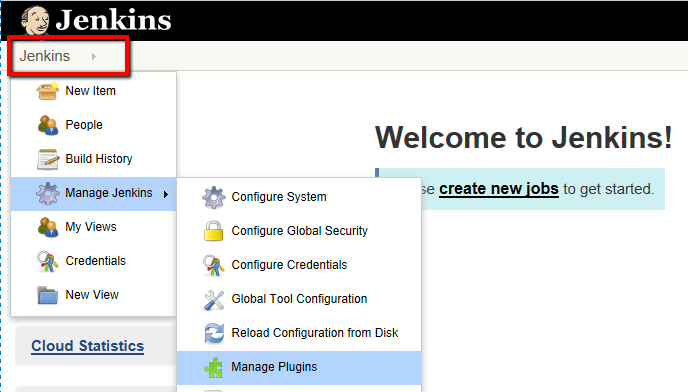

* Select **Available** and then search for **NodeJS**. Click the checkbox to install the plugin and then click **Install without restart**.

    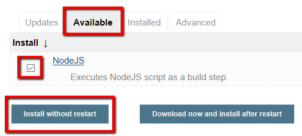

* Once the plugin is installed, from the Jenkins dropdown, select **Manage Jenkins** and then **Global Tool Configuration**.

* In the **NodeJS** area, click **Add NodeJS**. Provide a name e.g. *nodeinstall* and leave all options the same. Click **Save**.

    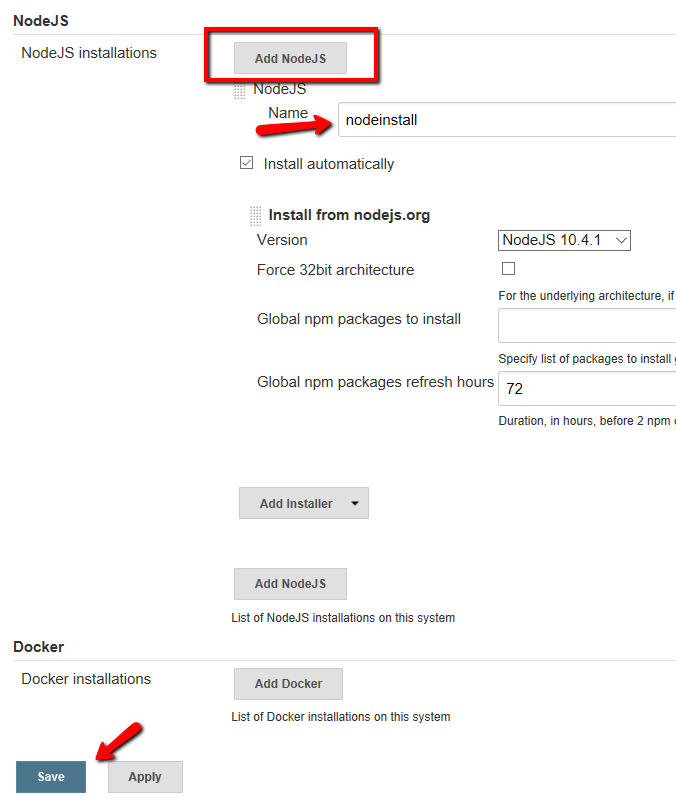

### Run Application On-Prem

* Open the cloned source directory on your computer in your editor (assuming VS Code). Open the `.vscode\launch.json` file and modify the following values:
    * MYSQLUSER: root
    * MYSQLPASSWORD: demo-pw (this is the value used in the docker run statement above)
    * MYSQLSERVER: localhost

* Open a command prompt to the `{repository}\app` folder. Type the following commands:
    ```cmd
    npm install
    npm run build
    ```
* In VS Code, hit *F5* on your keyboard to start debugging.

* In the browser, navigate to http://localhost:3000 and you should see your app running with an icon indicating to **add an item**.

    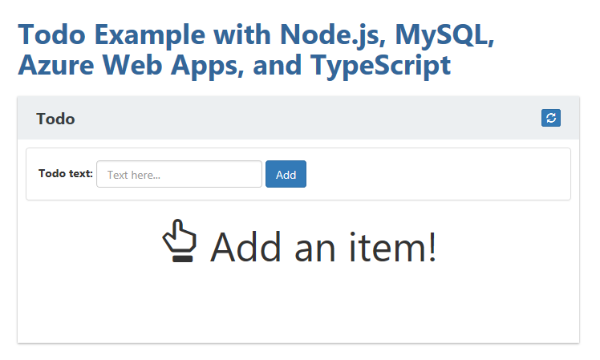

* Add a couple of items to the list, set some as completed to validate the saving to the database.

* Return to VS Code and stop debugging. In the `app` folder, add a new file called ``Dockerfile``. Add the following contents
    ```Dockerfile
    FROM node:6-alpine

    ENV APPDIR=/usr/src/app

    RUN apk add --update git && \
        rm -rf /tmp/* /var/cache/apk/*

    COPY package.json /tmp/package.json
    RUN cd /tmp && npm install --production
    RUN mkdir -p "${APPDIR}" && cp -a /tmp/node_modules "${APPDIR}"

    COPY package.json "${APPDIR}"
    COPY lib /usr/src/app/lib
    COPY client/dist /usr/src/app/client/dist

    WORKDIR /usr/src/app
    COPY bin bin

    EXPOSE 3000
    CMD ["npm", "start"]
    ```

* Save the file, commit the change to Git and push to your repository.

### Configure Azure Resources
* Open a command prompt with the Azure CLI installed or open a browser to the [Azure Cloud Shell](https://shell.azure.com)

* Type the following commands in your CLI environment

    Login to Azure if using local CLI
    ```cmd
    az login

    # If required to select a subscription otherwise ignore.
    az account set --subscription "<Subscription Name>"
    ```

    Create resource group
    ```cmd
    az group create --name fta-node-app-rg --location westus
    ```

    Create MySQL instance
    ```cmd
    az mysql server create --resource-group fta-node-app-rg --name ftanodedemomysql --location westus --admin-user myadmin --admin-password Pass@word1 --sku-name GP_Gen4_2 --version 5.7
    ```

    Create Azure Container Registry
    ```cmd
    az acr create --name ftanodejenkinsregistry --resource-group fta-node-app-rg --sku Basic --admin-enabled
    ```

    Create and Configure the Azure Web App
    ```cmd
    az appservice plan create --is-linux --name fta-node-demo-asp --resource-group fta-node-app-rg

    az webapp create --name ftanodemysqlapp --resource-group fta-node-app-rg --plan fta-node-demo-asp --runtime "node|8.1"

    az webapp config container set -c ftanodejenkinsregistry/webapp --resource-group fta-node-app-rg --name ftanodemysqlapp

    az webapp config appsettings set --resource-group fta-node-app-rg --name ftanodemysqlapp --settings MYSQLUSER=myadmin@ftanodedemomysql
    az webapp config appsettings set --resource-group fta-node-app-rg --name ftanodemysqlapp --settings MYSQLPASSWORD=Pass@word1
    az webapp config appsettings set --resource-group fta-node-app-rg --name ftanodemysqlapp --settings MYSQLDATABASE=todos
    az webapp config appsettings set --resource-group fta-node-app-rg --name ftanodemysqlapp --settings MYSQLSERVER=ftanodedemomysql.mysql.database.azure.com
    ```

    Create a service principal for use by Jenkins
    ```cmd
    az ad sp create-for-rbac --name jenkins-demo-sp --password Pass@word1
    ```

    Copy the value from the output of the service principal creation
    ```json
    {
      "appId": "BBBBBBBB-BBBB-BBBB-BBBB-BBBBBBBBBBB",
      "displayName": "jenkins-demo-sp",
      "name": "http://jenkins-demo-sp",
      "password": "Pass@word1",
      "tenant": "CCCCCCCC-CCCC-CCCC-CCCCCCCCCCC"
    }
    ```

    Run the command
    ```cmd
    az account show
    ```
    and copy the values from the outputs
    ```json
    {
        "cloudName": "AzureCloud",
        "id": "AAAAAAAA-AAAA-AAAA-AAAA-AAAAAAAAAAAA",
        "isDefault": true,
        "name": "Visual Studio Enterprise",
        "state": "Enabled",
        "tenantId": "CCCCCCCC-CCCC-CCCC-CCCC-CCCCCCCCCCC",
        "user": {
            "name": "user@fabrikam.com",
            "type": "user"
        }
    }
    ```

    > Note: Keep track of these AAAA*, BBBB*, etc. values as these will be used when configuring Jenkins.

* Open the Azure portal and navigate to the resource group you created. Open the MySQL resource and navigate to **Connection security**. Make the following changes to the firewall rules:
    * Enable **Allow access to Azure services**
    * Click **Add my IP**
    * Disable **SSL Required**

    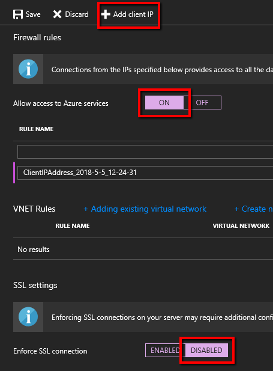

    Click **Save**

### Configure Jenkins Build
* Return to the Jenkins dashboard, click **create new jobs**.

    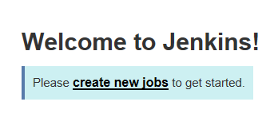

* Select **Freestyle project** and give it an appropriate name e.g. **NodeApp**. Click **Ok**.

    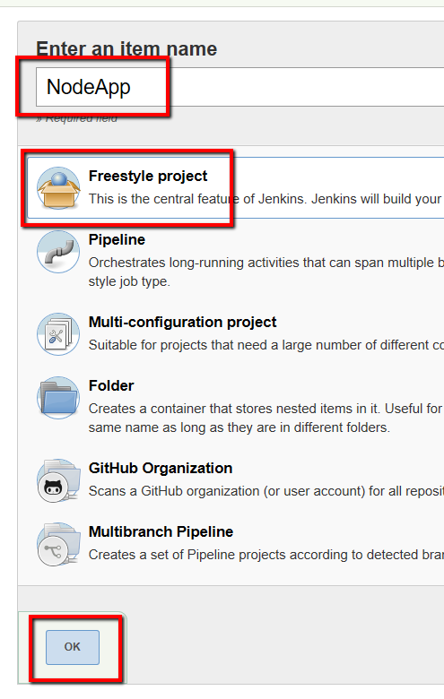

* In the **General** section, select **Github project** and provide the url to your Github URL: e.g. https://github.com/username/project.

    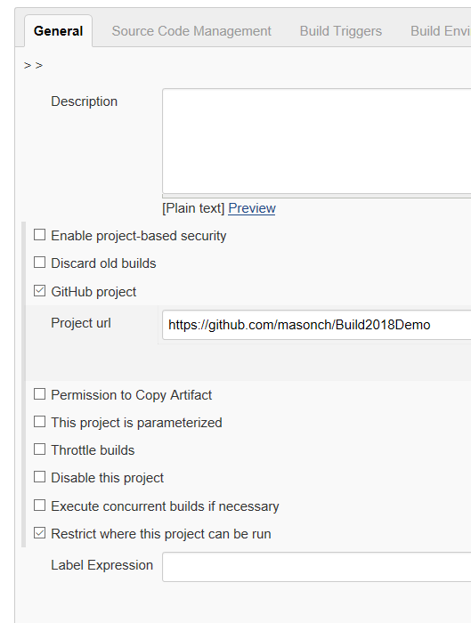

* In the **Source Control Management** section, select **Git** and put the full url of your git repository (including the .git path) e.g. https://github.com/username/project.git

    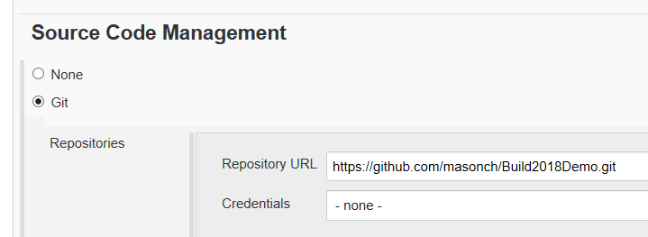

* In the **Build triggers** section, check **GitHub hook trigger for GITScm polling**.

    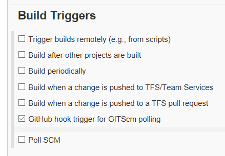

* In the **Build environment** section, check **Provide Node & npm bin/ folder to PATH** and select the node configuration created earlier.

    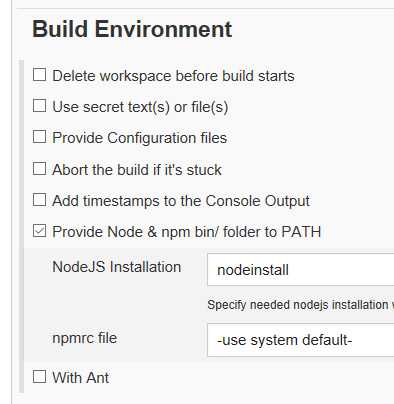

* In the **Build** section, click **add build step** and select **execute shell**
  * In the command section, add the following lines
    ```cmd
    cd app
    npm install
    npm run build
    ```

    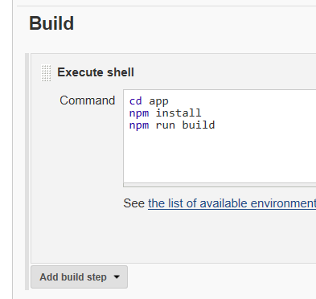

* In the **Post-Build actions** section, click **add post build action** and select **Publish an Azure web app**
    * For Azure credentials, click **Add** then **Jenkins**. Change the type to **Azure Service Principal**. From the values saved earlier, fill these in:
        * Subscription ID: AAAAAAAA-AAAA-AAAA-AAAA-AAAAAAAAAAAA
        * Client ID: BBBBBBBB-BBBB-BBBB-BBBB-BBBBBBBBBBB
        * Client Secret: (password of serivce principal - *Pass@word1* in the above script)
        * Tenant ID: CCCCCCCC-CCCC-CCCC-CCCCCCCCCCC
    * Click **Verify service principal**
    * Click **Add**
    * Change the Azure credentials to the service principal just created

    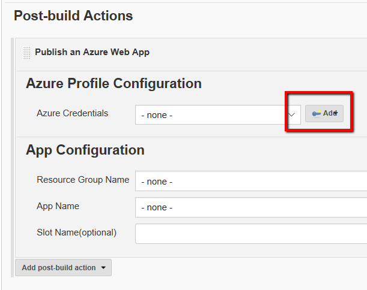

    

    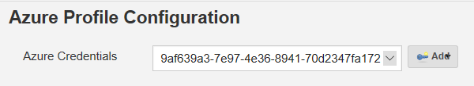

    * Under **App Configuration**, select the resource group you created in the script above e.g. *fta-node-app-rg* and the app name chosen e.g. *ftanodemysqlapp*.

    * Select the option that says **Publish via Docker** and make the following changes
        * Dockerfile path: **app/Dockerfile**
        * Docker registry URL: **ftanodejenkinsregistry.azurecr.io**
        * Registry credentials: click **Add** the **Jenkins**
            * From the Azure CLI or Azure Shell, run the command
            ```cmd
            az acr credential show --name ftanodejenkinsregistry --resource-group fta-node-app-rg
            ```
            to get the credentials to log into the container registry.
            * Click **Add**
        * Change the credentials dropdown to use the ones just added.
    
    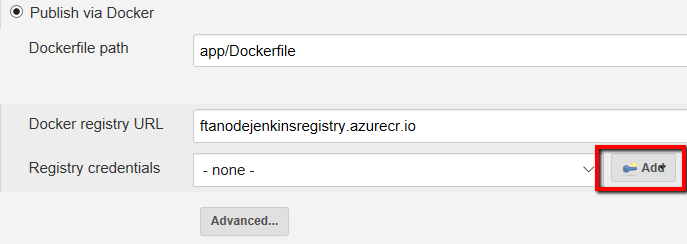

    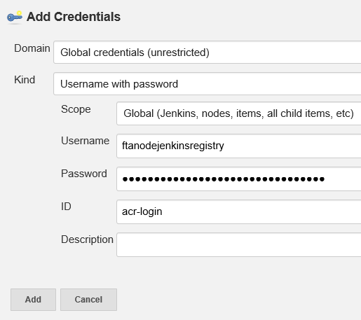

* Click **Save**

* Click **Build now** to start the build of the Node application and deploy it to the container registry. This process will take a few minutes.

* Once the app has been deployed, navigate to the URL of the web app and you should see the application running.

### Migrate MySQL Database to Azure
* In order to migrate the existing data we had running in the local environment to Azure, we will use MySQL Workbench.

* Once MySQL Workbench has been launched, click the new connection icon.

    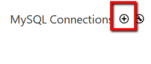

* Fill out the connection information for the on-premise database:
    * Connection Name: **on-prem**
    * Hostname: **127.0.0.1**
    * Port: **3306**
    * Username: **root**
    * Password:
        * Click **Store in Vault** and type the password the database is using e.g. **demo-pw**.
        * Click **Ok**
    * Click **Test Connection** to validate and then say **Ok**.

* Create a new connection for the database in Azure:
    * Connection Name: **Azure**
    * Hostname: **127.0.0.1**
    * Port: **3306**
    * Username: **root**
    * Password:
        * Click **Store in Vault** and type the password the database is using e.g. **demo-pw**.
        * Click **Ok**
    * Click **Test Connection** to validate and then say **Ok**.

    

* In MySQL Workbench click **Database** and then **Migration Wizard**.
    * On the overview screen, click **Start Migration**.
    * In the **Source Selection** screen, in the **Stored Connection** box, select **on-prem**. Click **Next**.
    
    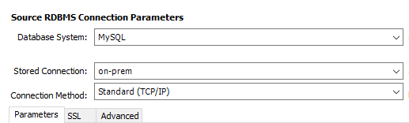
    
    * In the **Target Selection** screen, in the **Stored Connection** box, select **Azure**. Click **Next**.
    
    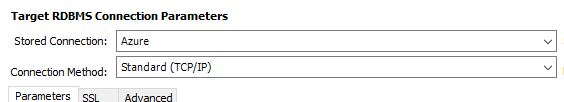
    
    * Once the fetch schema list operation completes, click **Next**.
    * In the **Schemas Selection** screen, choose the **todos** schema and click **Next**.
    * Click **Next** in the **Reverse Engineer Source** screen.
    * Click **Next** in the **Source Objects** screen.
    * Click **Next** in the **Migration** screen.
    * Click **Next** in the **Manual Editing** screen.
    * Click **Next** in the **Target Creation Options** screen.
    * Click **Yes** in the **Create Schemas** screen and then click **Next**.
    * Click **Next** in the **Create Target Results** screen.
    * Click **Next** in the **Data Transfer Setup** screen.
    * Click **Next** in the **Bulk Data Transfer** screen.
    * Click **Finish** in the **Migration Report** screen.

* Once the migration is complete, you should be able to return to your application and your existing on-premise data should have been migrated over.