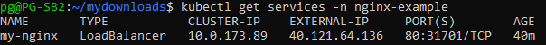
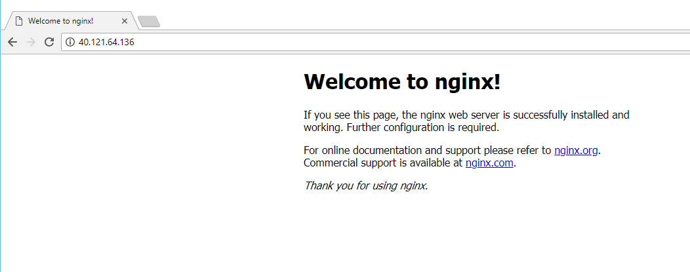
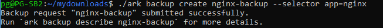
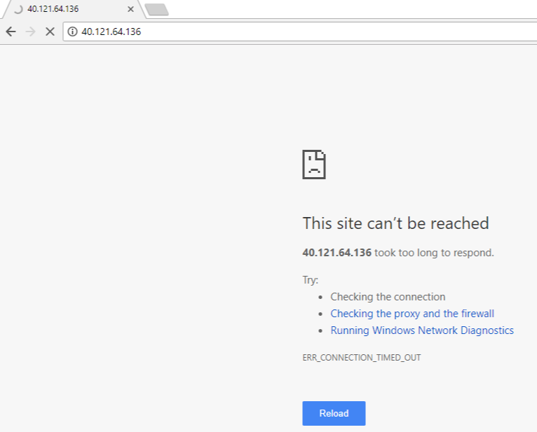
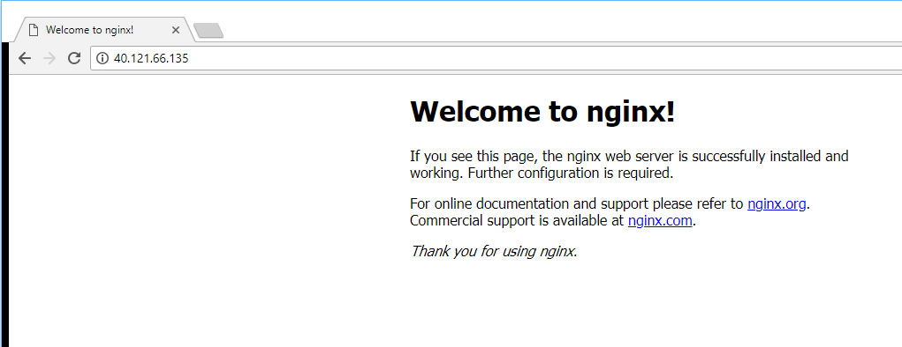

# POC Walkthrough - Heptio Ark: Setting up Backup and Restore for a Kubernetes Cluster - Part II

## Introduction
In this Part II walkthrough, we will download the Heptio Ark client and create sample Kubernetes objects, such as a Deployment, Pods, and a Service to simulate a disaster event (deletion) of the Kubernetes objects. We will showcase Heptio Ark's ability to backup and restore all of the lost Kubernetes objects.

This walkthrough leverages and references Heptio's own Ark documentation for Azure hosted on GitHub [here](https://heptio.github.io/ark/v0.8.1/index.html), to help facilitate a POC. The walkthrough will also build on this with other Azure services.

## Prerequisites
This POC will utilize the Azure CLI to make the experience as similar as possible whether you are using a Windows or Linux system. For Windows 10 systems, the Microsoft Windows Subsystem for Linux (WSL) will need to be installed. 
* [Windows Subsystem for Linux](https://docs.microsoft.com/en-us/windows/wsl/install-win10) ( Only if using Windows 10 )
* [Azure CLI 2.0](https://docs.microsoft.com/en-us/cli/azure/install-azure-cli?view=azure-cli-latest) ( If using the Windows Subsystem for Linux, please follow the installation instructions for the Debian/Ubuntu version located [here](https://docs.microsoft.com/en-us/cli/azure/install-azure-cli-apt?view=azure-cli-latest) )
* An existing Kubernetes cluster running in Azure. You can find the instruction for setting up the AKS managed service [here](https://github.com/Azure/fta-internalbusinessapps/blob/master/appmodernization/containers/articles/acs-aks-managed-deployment.md)
* Completion of the POC Walkthrough - Heptio Ark: Setting up Backup and Restore for a Kubernetes Cluster - Part I located [here](https://github.com/Azure/fta-internalbusinessapps/blob/master/appmodernization/containers/articles/heptio-ark-kubernestes-setup.md)
* Ensure that kubectl has the correct Kubernetes cluster config context of the cluster you will backup and restore objects for.


## Walkthrough
1. In the Linux or WSL terminal, log into Azure using the **az login** command.

   > Note: The **az login** command will provide a code for you to enter at the [microsoft.com/devicelogin](https://microsoft.com/devicelogin) address. Once the code has been entered and accepted, the terminal will be authenticated to your Azure account.
2. Clone the Heptio Ark repository 
   ```
      git clone https://github.com/heptio/ark      
   ```
3. Download the latest Heptio Ark client. 
   ```
      wget https://github.com/heptio/ark/releases/download/v0.8.2/ark-v0.8.2-linux-amd64.tar.gz
   ```
4. Unzip the Heptio Ark client file using the following tar command
   ```
      tar -xvzf ark-v0.8.2-linux-amd64.tar.gz
   ```
   You should now see the "ark" utility listed in the directory.
5. Navigate back to the GitHub Ark root directory and deploy the sample nginx application
   ```
      kubectl apply -f examples/nginx-app/base.yaml
   ```
   The deployment creates a namespace for the nginx application. You can verify the deployment using the following command
   ```
      kubectl get deployments --namespace=nginx-example
   ```
   You can also view the service the deployment makes and use your browser to open the nginx web page from the public IP address
   ```
      kubectl get services -n nginx-example
   ```
   
   
   Now that we have the public IP address, we can open our browser and view the sample nginx web page and see that the deployment is running. Please keep this browser available when we simulate a disaster.
   
6. Next we will use Heptio Ark to create a backup of the nginx sample deployment. From the directory where the Ark client file was unpacked, execute the following command to create a backup of the deployment with the name **nginx-backup**
   ```
      ./ark backup create nginx-backup --selector app=nginx
   ```
   
   
   You can view and verify information about the backup with the following commands
   ```
      ./ark backup describe nginx-backup
      ./ark get backups
   ```
7. Now let's simulate a disaster/failure of the nginx sample deployment by deleting the entire namespace the deployment is in. We do that with the following command
   ```
      kubectl delete namespace nginx-example
   ```
   We can verify that the deployment, service, and namespace associated with the nginx sample no longer exist using the following commands
   ```
      kubectl get deployments --namespace=nginx-example
      kubectl get services --namespace=nginx-example
      kubectl get namespace/nginx-example
   ```
   We can also go back to the browser to refresh the page and see that the nginx site is no longer available
   
8. To restore the deployment, simply provide the backup name created earlier to the Ark restore create command
   ```
      ./ark restore create --from-backup nginx-backup
   ```
   This will restore the namespace, deployment, and service that was associated with the nginx deployment. You can then verify that all Kubernetes objects have been restored.
   ```
      kubectl get deployments --namespace=nginx-example
      kubectl get services --namespace=nginx-example
      kubectl get namespace/nginx-example
   ```
   
   > **Note:** Whenever a new service type LoadBalancer is provisioned for AKS, Azure will most likely provide a new public IP address. Azure services such as Azure DNS and Traffic Manager can be utilized to provide a static endpoint.
   
   You should now be able to browse to the new service public IP address
   
 
## Troubleshooting
For any reason the Heptio Ark service is not working, check the log output with the following command
```
   kubectl -n heptio-ark logs deploy/ark
```
For backup and restore issues, you can do both a describe command for each to get further information about the objects
```
   ./ark backup describe <backup name>
   
   ./ark restore describe <restore name>
```
   
   
   
      
