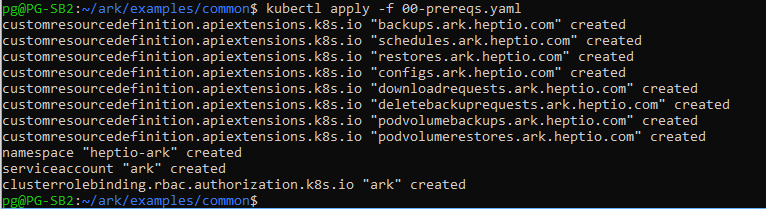
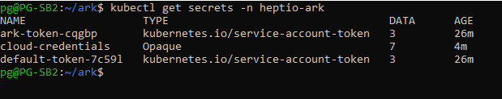

# POC Walkthrough - Heptio Ark: Setting up Backup and Restore for a Kubernetes Cluster - Part I

## Introduction
In this Part I walkthrough, we will setup Heptio Ark to configure backups of Kubernetes objects, such as Deployments and Pods, for the ability to restore them in case of a Kubernetes cluster failure. Heptio Ark assists with the BCDR strategy of customers moving critical workloads to a container infrastructure using the Kubernetes orchestration.

This walkthrough leverages and references Heptio's own Ark documentation for Azure hosted on GitHub [here](https://heptio.github.io/ark/v0.8.1/azure-config), to help facilitate a POC. The walkthrough will also build on this with other Azure services.

## Prerequisites
This POC will utilize the Azure CLI to make the experience as similar as possible whether you are using a Windows or Linux system. For Windows 10 systems, the Microsoft Windows Subsystem for Linux (WSL) will need to be installed. 
* [Windows Subsystem for Linux](https://docs.microsoft.com/en-us/windows/wsl/install-win10) ( Only if using Windows 10 )
* [Azure CLI 2.0](https://docs.microsoft.com/en-us/cli/azure/install-azure-cli?view=azure-cli-latest) ( If using the Windows Subsystem for Linux, please follow the installation instructions for the Debian/Ubuntu version located [here](https://docs.microsoft.com/en-us/cli/azure/install-azure-cli-apt?view=azure-cli-latest) )
* An existing Kubernetes cluster running in Azure. You can find the instruction for setting up the AKS managed service [here](https://github.com/Azure/fta-internalbusinessapps/blob/master/appmodernization/containers/articles/acs-aks-managed-deployment.md)
* Ensure that you have the resource group name that the Kubernetes cluster is in.

## Walkthrough
1. In the Linux or WSL terminal, log into Azure using the **az login** command.

   > Note: The **az login** command will provide a code for you to enter at the [microsoft.com/devicelogin](https://microsoft.com/devicelogin) address. Once the code has been entered and accepted, the terminal will be authenticated to your Azure account.
2. Clone the Heptio Ark repository 
   ```
      git clone https://github.com/heptio/ark      
   ```
3. Create an Azure resource group for the storage account Heptio Ark will use. 
   ```
      AZURE_BACKUP_RESOURCE_GROUP=K8ArkBackups
      az group create --name $AZURE_BACKUP_RESOURCE_GROUP --location EastUS
   ```
   > Note: If you are unsure of the Azure region name needed for the location parameter you can use **az account list-locations --output table** to view the Azure region names.
4. Create the Azure storage account Heptio Ark will use. 
   ```
      AZURE_STORAGE_ACCOUNT_ID="ark`cat /proc/sys/kernel/random/uuid | cut -d '-' -f5`"
      az storage account create \
    --name $AZURE_STORAGE_ACCOUNT_ID \
    --resource-group $AZURE_BACKUP_RESOURCE_GROUP \
    --sku Standard_GRS \
    --encryption-services blob \
    --https-only true \
    --kind BlobStorage \
    --access-tier Hot 
   ```
5. Create the blob container for the storage account. 
     > Note: The default name is "ark". If you choose a different name for the blob container, you will need to update the "backupStorageProvider" value in the Ark config file.
   ```
      az storage container create --name ark --public-access off --account-name $AZURE_STORAGE_ACCOUNT_ID   
   ```
6. Get the storage key for the storage account.
   ```
      AZURE_STORAGE_KEY=`az storage account keys list \
    --account-name $AZURE_STORAGE_ACCOUNT_ID \
    --resource-group $AZURE_BACKUP_RESOURCE_GROUP \
    --query [0].value \
    -o tsv` 
   ```

7. Create a service principle for Heptio Ark to integrate with Azure and the Kubernetes cluster. The following commands capture the service principle secret (password), and the service principle appID.
   ```
      AZURE_CLIENT_SECRET=`az ad sp create-for-rbac --name "K8ArkBackups" --role "Contributor" --query 'password' -o tsv`
      
      AZURE_CLIENT_ID=`az ad sp list --display-name "K8ArkBackups" --query '[0].appId' -o tsv`
   ```
8. Add a terminal variable for the existing Kubernetes cluster Azure resource group name
   > Note: This is the resource group that contains the AKS managed service.
   ```
      AZURE_RESOURCE_GROUP=<NAME_OF_AKS_RESOURCE_GROUP>
   ```
9. Add terminal variables for the Azure Account Subcription and Tenant ID
   ```
      AZURE_SUBSCRIPTION_ID=`az account list --query '[?isDefault].id' -o tsv`
      
      AZURE_TENANT_ID=`az account list --query '[?isDefault].tenantId' -o tsv`
   ```
10. From the Ark root directory cloned from GitHub, navigate to the examples/common directory and apply the prereqs manifest to first set up namespaces, RBAC, and other scaffolding.
   ```
      kubectl apply -f examples/common/00-prereqs.yaml
   ```
   You should see an output like below
         
   
   
11. Create a Kubernetes cluster secret for all seven environment variables created
   > Note: Make sure you are entering the correct namespace. The default is "heptio-ark"
   ```
      kubectl create secret generic cloud-credentials \
      --namespace "heptio-ark" \
      --from-literal AZURE_SUBSCRIPTION_ID=${AZURE_SUBSCRIPTION_ID} \
      --from-literal AZURE_TENANT_ID=${AZURE_TENANT_ID} \
      --from-literal AZURE_RESOURCE_GROUP=${AZURE_RESOURCE_GROUP} \
      --from-literal AZURE_CLIENT_ID=${AZURE_CLIENT_ID} \
      --from-literal AZURE_CLIENT_SECRET=${AZURE_CLIENT_SECRET} \
      --from-literal AZURE_STORAGE_ACCOUNT_ID=${AZURE_STORAGE_ACCOUNT_ID} \
      --from-literal AZURE_STORAGE_KEY=${AZURE_STORAGE_KEY}
   ```
   
   You can check the config of the secrets using the command
   ```
   kubectl get secrets -n heptio-ark
   ```
   
   You should see an output like below
   
   
   
12. Before we start to deploy the Heptio Ark services to run on the Kubernetes cluster, we have to ensure that the **10-ark-config.yaml** located in the examples/azure directory of the Ark GitHub clone has the Azure storage account container variable and the timeout variable set. Open the manifest and replace the place holders <YOUR_BUCKET> and <YOUR_TIMEOUT>. The file with the default settings should look like this
   ```
      apiVersion: ark.heptio.com/v1
      kind: Config
      metadata:
        namespace: heptio-ark
        name: default
      persistentVolumeProvider:
        name: azure
        config:
          apiTimeout: 15m
      backupStorageProvider:
        name: azure
        bucket: ark
      backupSyncPeriod: 30m
      gcSyncPeriod: 30m
      scheduleSyncPeriod: 1m
      restoreOnlyMode: false
   ```

13. Finally you can start the Heptio Ark server by applying the following commands. From the root of the ark directory, run the following
   ```
      kubectl apply -f examples/common/00-prereqs.yaml
      kubectl apply -f examples/minio/
      kubectl apply -f examples/azure/
   ```
   
In Part II, we will demonstrate backing up and restoring Kubernetes objects.


   


