# CI/CD with Visual Studio Team Services (VSTS) and Kubernetes

* [Introduction](#introduction)
* [Learning Objectives](#learning-objectives)
* [Pre-Requisites](#prerequisites)
* [Create a Project in VSTS](#create-a-project-in-vsts)
* [Push existing source code to VSTS](#push-existing-source-code-to-vsts)
* [Create Build Definition for Container Project](#create-build-definition-for-container-project)
* [Create Release Definition for Kubernetes](#create-release-definition-for-kubernetes)
* [Validate Deployment](#validate-deployment)

## Introduction
The goal of this POC is to walk you through the process of implementing CI/CD in VSTS for Kubernetes. In this specific scenario we will use a Kubernetes cluster with Windows Container support but the steps are fully reproducible in Linux Container clusters.

## Learning Objectives
After completing this exercise, you will be able to:
* Create a project in VSTS
* Push Code to project
* Connect a Kubernetes Cluster to VSTS
* Create a Build Definition for Kubernetes
* Create a Release Definition for Kubernetes

## Prerequisites
To complete this POC, you will need
* Access to a Microsoft Azure subscription and permissions to deploy resources
* [Install Git Tools](https://git-scm.com/downloads)
* You must complete [this walkthrough](https://github.com/Azure/fta-internalbusinessapps/blob/master/appmodernization/containers/articles/acs-with-kubernetes.md) to move Contoso.Expenses application to containers first
* Configure VSTS Hosted Agent
    * Provision VM in Azure with: 
        * Windows Server 2016 Datacenter with Containers
        * Visual Studio 2017
        * [Docker for Windows](https://www.docker.com/docker-windows)
        * [VSTS Agent](https://docs.microsoft.com/en-us/vsts/build-release/actions/agents/v2-windows?view=vsts) 


## Create a Project in VSTS
In this steps we will create a VSTS project to host the application and the CI/CD process.

> Note: If you don't have a VSTS account yet please follow [this link](https://docs.microsoft.com/en-us/vsts/accounts/create-account-msa-or-work-student?view=vsts) to create one.

1. Sign in to your VSTS Account
2. Press the **New Project** button on the top-right corner

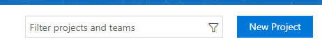

3. Fill in the Project Name (e.g. **ContosoExpenses**)
4. Leave Version Control as **Git**
5. Select your prefered Work Item Process - it is not relevant for the objective of this POC

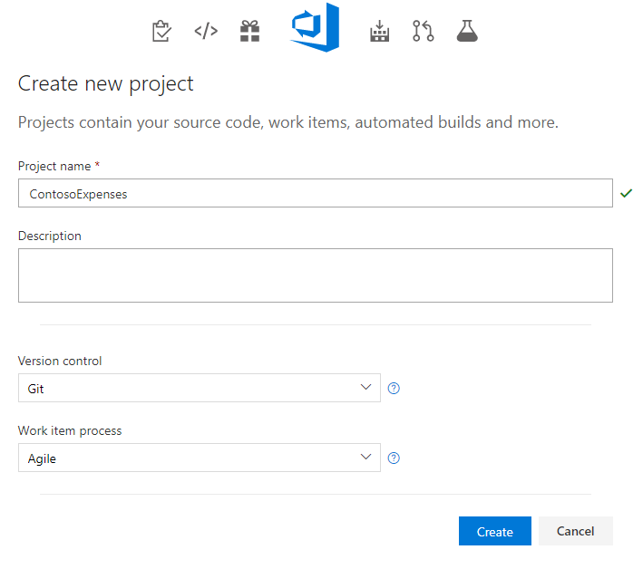

## Push existing source code to VSTS
In this step we will get the necessary code and deployment scripts into VSTS so we can then implement Build and Release definitions.

1. From the project's main page copy the clone URL to clipboard


2. Create local folder in your machine (e.g. **c:\vstsdemo**)
3. Open Command Prompt in folder created in previous step
4. Clone the repository to your machine

````git
git clone https://tiagob.visualstudio.com/DefaultCollection/_git/ContosoExpenses
````

> NOTE: You will be asked for credentials. If for reason the interactive login fails you need to press the Generate Git Credentials button shown in the image above to generate alternate credentials so you can signin.

5. Now that we have an empty repository connected to VSTS we need to put the ContosoExpense code in there.
One of the requirements for this POC was to do a previous POC where you would move the ContosoExpenses app to containers. **Copy that same solution and all its contents and place it inside this folder.**

6. Now we need to create the deployment scripts for Kubernetes in the specific projects (Contoso.Expenses.web and Contoso.Expenses.Api).

    1. Create a folder strutucture inside the **Web project** (e.g. Contoso.Expenses.Web/Deploy/k8s)
    2. Create a file called **_contoso.expenses.web-deployment.yaml_** and update it's content to the following code
    ````yaml
    apiVersion: extensions/v1beta1
    kind: Deployment
    metadata:
      labels:
        io.kompose.service: contosoexpenses-web
      name: contosoexpenses-web
    spec:
      replicas: 3
      strategy: {}
      template:
        metadata:
          labels:
            io.kompose.service: contosoexpenses-web
        spec:
          containers:
          - image: cedevopscr.azurecr.io/contoso.expenses.web:__tag__
            name: contosoexpenses-web
            ports:
            - containerPort: 80
            resources: {}
          restartPolicy: Always
    status: {}
    ----
    apiVersion: v1
    kind: Service
    metadata:
      labels:
        io.kompose.service: contosoexpenses-web
      name: contosoexpenses-web
    spec:
      ports:
      - name: "80"
        port: 80
        targetPort: 80
      selector:
        io.kompose.service: contosoexpenses-web
      type: LoadBalancer
    status:
      loadBalancer: {}
    ````

    > NOTE: Notice the \_\_tag\_\_ element in the yaml file. This will allow us during the release phase to replace this tag with the correct build version.

    3. Create a folder strutucture inside the **Api project** (e.g. Contoso.Expenses.Web/Deploy/k8s)
    4. Create a file called **_contoso.expenses.api-deployment.yaml_** and update it's content to the following code
    ````yaml
    apiVersion: extensions/v1beta1
    kind: Deployment
    metadata:  
      labels:
        io.kompose.service: contosoexpenses-api
      name: contosoexpenses-api
    spec:
      replicas: 2
      strategy: {}
      template:
        metadata:
          labels:
            io.kompose.service: contosoexpenses-api
        spec:
          containers:
          - image: cedevopscr.azurecr.io/contoso.expenses.api:__tag__
            name: contosoexpenses-api
            ports:
            - containerPort: 80
            resources: {}
          restartPolicy: Always
    status: {}
    ----
    apiVersion: v1
    kind: Service
    metadata:
      labels:
        io.kompose.service: contosoexpenses-api
      name: contosoexpenses-api
    spec:
      ports:
      - name: "8123"
        port: 8123
        targetPort: 80
      selector:
        io.kompose.service: contosoexpenses-api
    status:
      loadBalancer: {}
    ````

    > NOTE: Notice the \_\_tag\_\_ element in the yaml file. This will allow us during the release phase to replace this tag with the correct build version.

7. Now we have all the code and necessary changes to support the CI/CD process.

    Run the following commands in Command Prompt.

    ````git
    C:\vstsdemo> cd ContosoExpenses #MOVE TO SOLUTION FOLDER
    C:\vstsdemo> git add . #ADD ALL FILES AS CHANGES
    C:\vstsdemo> git commit -m "This is my first commit to this repository"
    C:\vstsdemo> git push
    ````

## Create Build Definition for Container Project
In this step we will create a Build Definition that will build the ASP.NET Applications, use Docker Compose to create the container images, apply specific BuildId tags to the images and push them to an Azure Container Registry.

1. Select the **_Build and Release_** option for the top menu
2. Make sure **_Builds_** are selected and then press the **_+New_** button on the top right to create a new Build Definition.

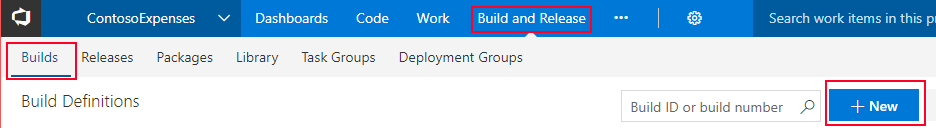

3. Select a source.

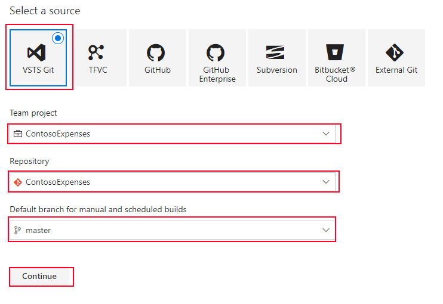

4. Select the **ASP.NET with Containers** template from the template list.

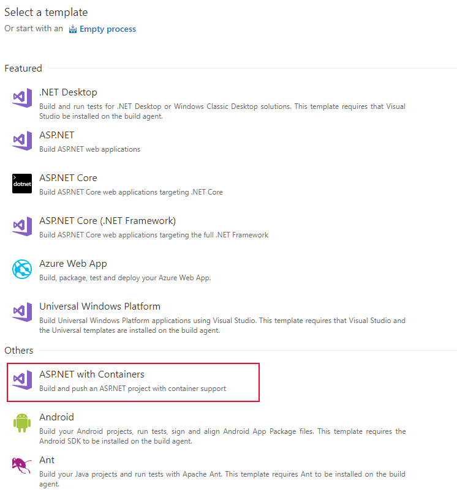

5. Name your build definition and select the hosted agent that you created as part of the pre-requirements for this POC. 

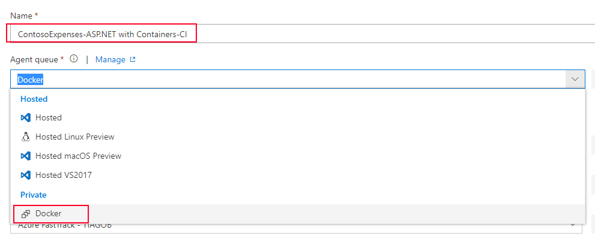

6. Select the Azure Subscription and Azure Container Registry created in the previous POC from the drop-down.

> NOTE: If you don't have your Azure Subscription to VSTS yet, click on the Manage link and you will be redirected to the instructions on how to do so.

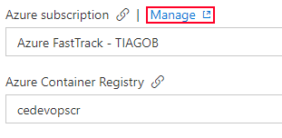

7. Copy the Kubernetes deployment files to the drop folder. Add the following line in the **Copy Files Task**.

````bash
**/Deploy/k8s/contoso.expenses.*-deployment.yaml
````
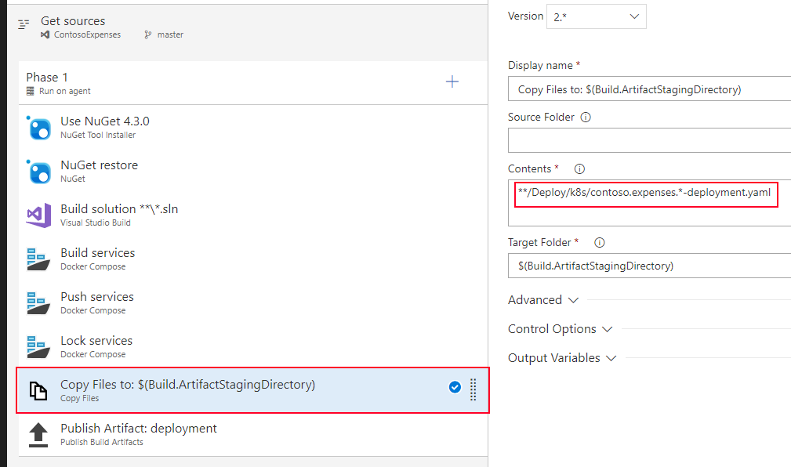

8. Notice in **Build Services**, **Push Services** and **Lock Services** Tasks that we are tagging the images we are building with the **_BuildId_**. We will replace this value in the deployment files in the release step.

10. Enable Continuous Integration in the Triggers section. This will start a new build every time there is a new commit to the master repository.

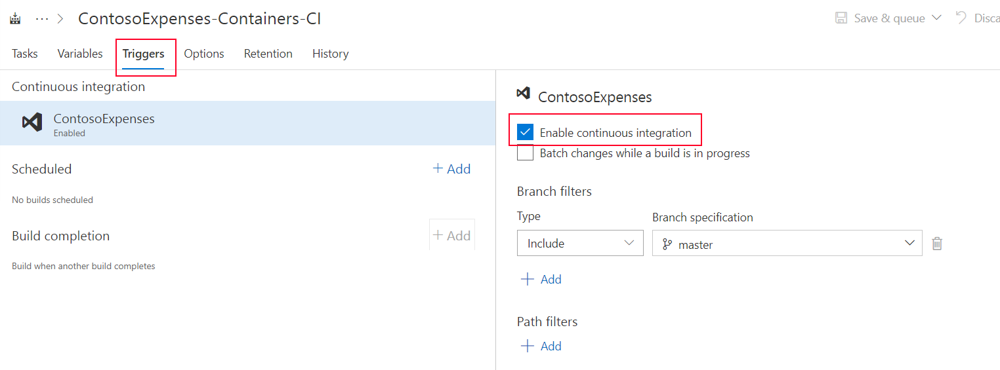

9. Click the **Save & Queue** button in the top-right corner. If the build succeeds as expect you should see a similar screen.

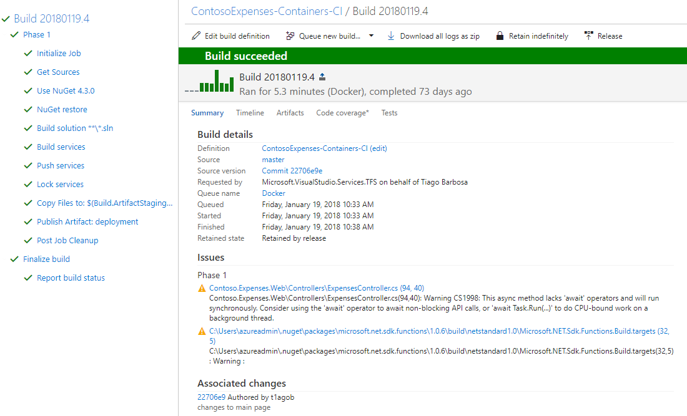

## Create Release Definition for Kubernetes
In this step we will create the Release Definition that will allow us to deploy our applications to an existing Kubernetes Cluster.

1. Select the **_Releases_** option in the top menu and click on the **Create Release Definition** button.

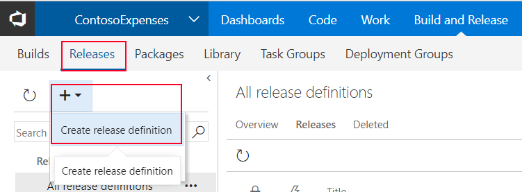

2. Search the template list for **Deploy to Kubernetes cluster** and click the **Apply** button.


3. Name your environment (e.g Kubernetes Cluster).

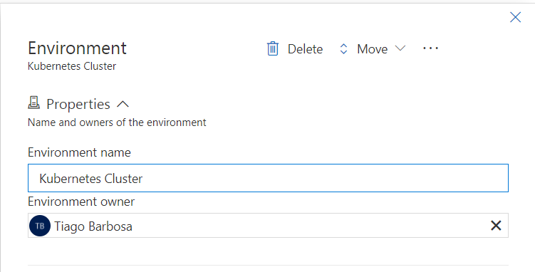

4. In the main pipeline dashboard click the **Add artifact** button to associate the Build Definition with this Release definition. 


5. In the source build definition field, select the Build Definition created earlier and click **Add**.

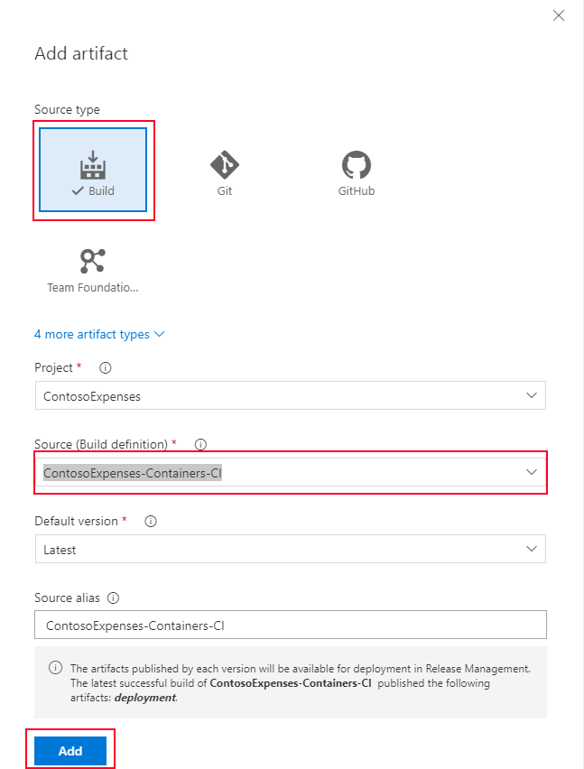

6. Enable continuous deployment by clicking the lightning icon on the top-right corner of the added artifact.

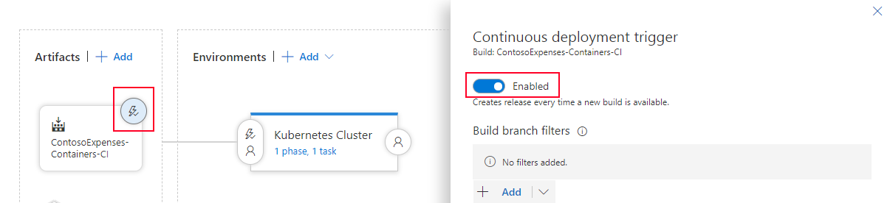

7. Click on the **Kubernetes Cluster** environment to edit it. 


8. Validate that we only have one Task for Kubernetes. We will need to add a second task to deploy to Kubernetes since we have two different applications. We will also need to add two additional tasks to replace the container image tags in both deployment yaml files.

9. Add an environment variable to the Release Definition. This tag will be searched and replaced in the yaml files used for deployment.

    **name:** tag    
    **value:** $(Build.BuildId)

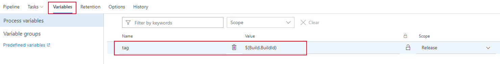

10. Add a new Task by searching for **replace tokens** and click the **Add** button. 

> NOTE: If you don't have it installed in your VSTS Account please install it from the same screen.

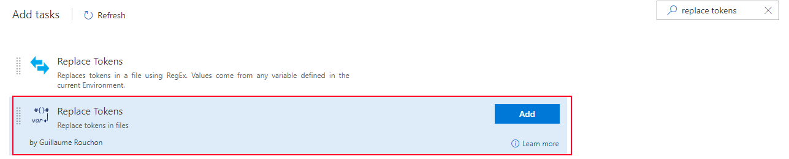

11. **Update the name** of this task to _Replace tokens for API deployment_ and **set the Root Directory** of this task to the folder where you placed the yaml files for the API project. **Set the name of the target files** to the name of the api deployment file.

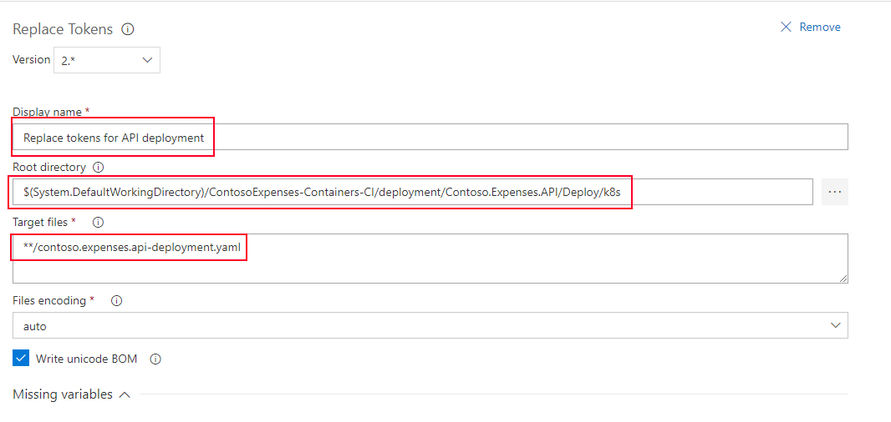

12. Clone this task and repeat the previous step for the WEB project this time.

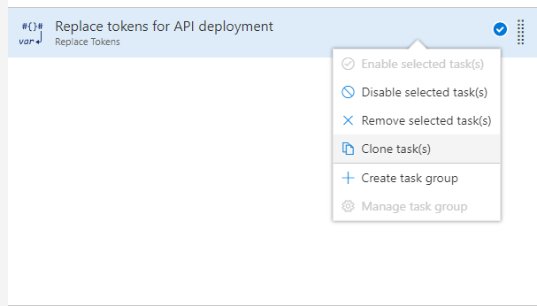

13. Update the existing Kubernetes task by changing its Name (e.g. Create Web Deployment) and pointing to the right Kubernetes Service Connection.

> NOTE: If you haven't created the Kubernetes Service Endpoint before this step please click on the Manage button and follow all the steps. This works for any Kubernetes cluster that VSTS has access to. For additional help refer to [this link](https://marketplace.visualstudio.com/items?itemName=tsuyoshiushio.k8s-endpoint).

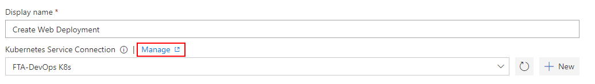

14. Change the configuration file location to point to your yaml file.

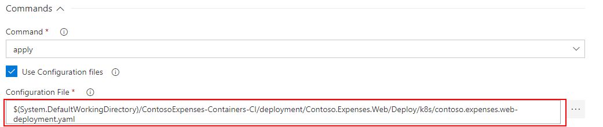

15. Clone this task and repeat the 2 last steps for the API Project.
    **Display Name:** Create API Deployment  
    **Kubernetes Service Connection:** _Your k8s service endpoint_
    **Configuration File:** _Location of your yaml deployment file_

16. You should end up with 4 tasks in your release definition. 

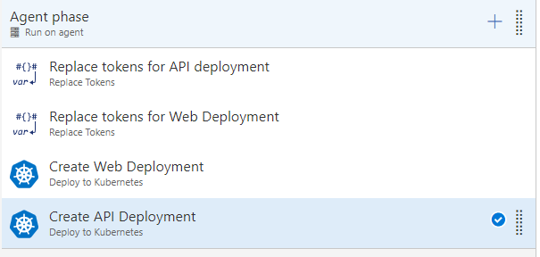

17. Click the **Save** button and then **Release**.

> NOTE: Assuming that you have followed the steps in the previous POC and the cluster already as the credentials for your Azure Container Registry. Everything should work as expected.

## Validate Deployment
In this step we will validate the deployment succeeded and the application is running as expected.

1. Navigate to the Azure Portal and open Cloud Shell (Bash).

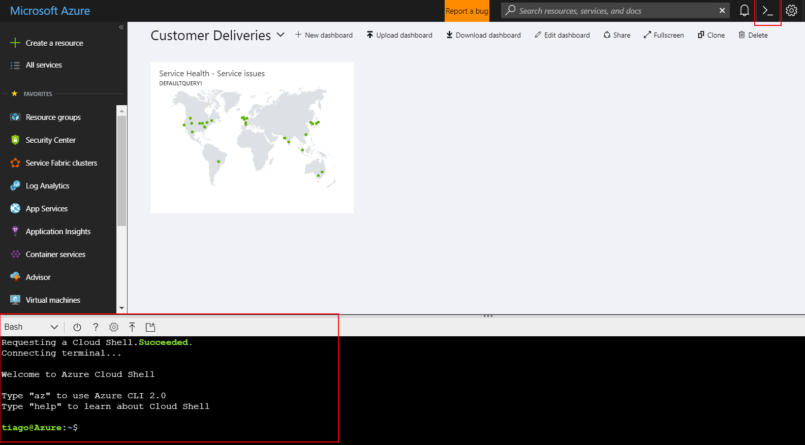

2. Connect to the cluster

````bash
az acs kubernetes get-credentials --resource-group=YOUR_RESOURCE_GROUP_NAME --name=YOUR_CLUSTER_NAME
````
3. List services running in your cluster.

````bash
tiago@Azure:~$ kubectl get svc
NAME                  TYPE           CLUSTER-IP     EXTERNAL-IP      PORT(S)   
contosoexpenses-api   ClusterIP      10.0.240.120   <none>           8123/TCP       
contosoexpenses-web   LoadBalancer   10.0.29.87     52.174.139.119   80:30239/TCP   
kubernetes            ClusterIP      10.0.0.1       <none>           443/TCP       
````

4. Copy the external IP of the contosoexpenses-web service and see if the application is running successfully.

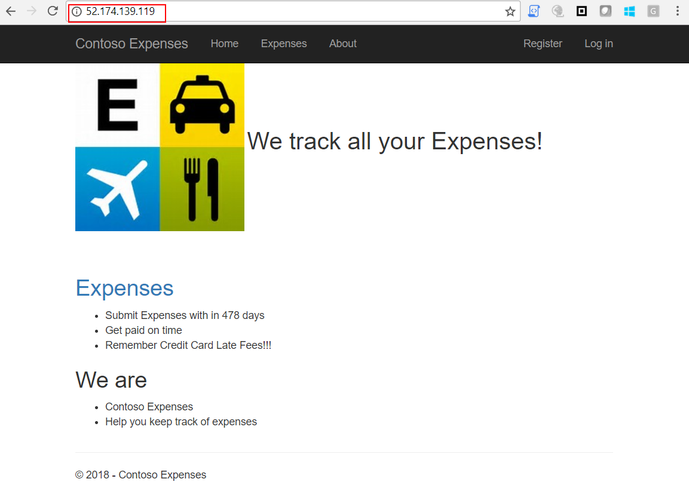


